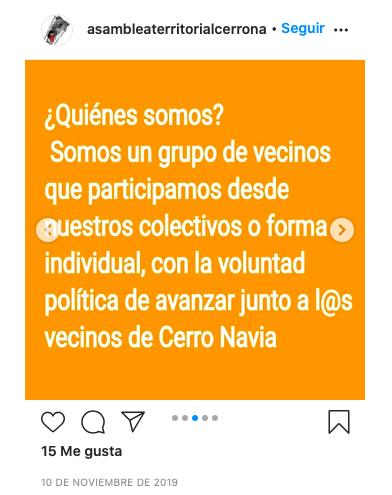
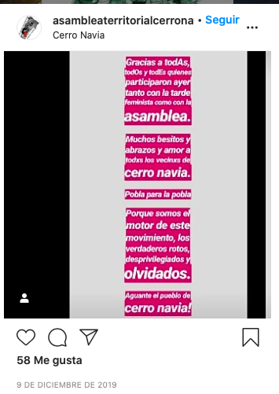
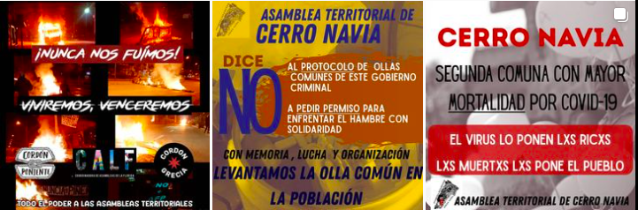
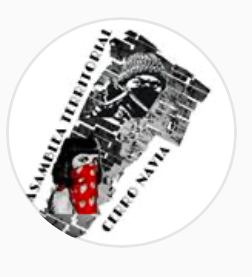

#### FOLIO: CNA1
# Asamblea Territorial Cerro Navia

[instagram](https://www.instagram.com/asambleaterritorialcerronavia/)
[facebook](https://www.facebook.com/Asamblea-Territorial-Cerro-Navia-100812204708110/)
---

### Representantes
#### No señalan tener representantes.

---
### Interacciones frecuentes
#### 
* Cordón poniente
* Cordón grecia
* Red de ollas comunes en resistencia
* Asamblea CN Feminista

### Redes sociales
#### ¿Para qué se utiliza la red social?
| Instagram | Facebook |  
|---|---|
|Difusión de actividades e informacion|Difusión de actividades, información y videos en vivo|

### **Instagram**
| seguidores | seguidos | publicaciones | hashtag 
|---|---|---|---|
|1696|846|57| 0

---

* **Actividad:**   
* Primera Publicación IG: 10/11/2019
Receso de actividad en febrero

---
### Frecuencia de publicación.

Publicaciones: Mensual (3 veces por mes)
Actividades: Calendario mensual

---
### Ubicación
* Mapocho / huelen Frente felix bulnes

---
### Describir temas de interés y/o trabajo
* Colaboración y organizacion vecinal
* Apoyo mutuo
* Contrainformación
* Feminismo

---
### Describir la imagen ideal por la cual se trabaja.
#### (El horizonte hacia el cual se quiere avanzar.)
> Ser escuchados, entendidos desde nuestra realidad local, nuestras necesidades, nuestras cerencias y nuestras expectativas de un mejor vivir en la comuna
[Link](https://www.instagram.com/p/B4s7pWLnFfn/)

---
### ¿Que se hace?
#### (Manifestaciones, marchas, intervenciones, actividades culturales, conversatorios, intercambio de saberes, actividades solidarias o de apoyo mutuo, abastecimiento, contra información, emplazamiento a autoridades etc.)
* Manifestaciones
    * Cacerolazos
    * cicletadas
    * velatones
    * marchas territoriales
    * barricadas
* Asambleas territoriales
    * Creacion de pancartas
    * Reuniones vecinales
* Actividades conmemorativas
* Difusion de videos de persecucion policial es su población [link](https://www.instagram.com/p/B4w-E1nHZj3/)
* Difusión de iniciativas de apoyo mutuo
* Difusión de manifestaciones
* Actividades solidarias
    * Tallarinata solidaria
    * Difusión ollas comunes CN
* Jornadas de agitación en el territorio

---
### Describir y distinguir demandas más reivindicativas de espacios sin relación con lo contencioso o con lo político mas prefigurativo
#### (lo contencioso; demanda al Estado, a alguna autoridad, privados, etc), (prefigurativo, transformación desde lo cotidiano, etc.).
* Hacia los vecinos desde espacios de organizacion popular, demandas vecinales.

* Hacia las autoridades locales y nacionales, a los medios hegemonicos y empresarios.

---
### Tipo de organización interna.
#### 
Asambleismo y horizontalidad.

---
### Describir los temas / imágenes- iconos / conceptos mas habitualmente presentes en sus publicaciones. Describir cambios/ transformaciones en los contenidos desde Octubre.
El contenido se ha ajustado a la actualidad nacional. Han tenido menos frecuencia de publicaciones pero siempre están informando a los vecinos desde las historias de instagram.

**Iconos:**

**Diseño estético:**
No tienen un diseño estetico fijo, suben infografias propias y de otras organizaciones con las que trabajan. También suben videos e imagenes de actividades o de contrainformación.

---
### Percepciones que se tiene del Estado
#### (Aparato burocrático)
> Gobierno criminal. El gobierno los deja sin trabajo. 

| Declaraciones | infografía | 
|---|---|
|Anotar los comunicados |  |

---
### Percepciones que se tiene de las Fuerzas de Orden
#### (Aparato represivo)
> Policia asesina y complice del gobierno.

| Declaraciones | infografía | 
|---|---|
|Anotar los comunicados |  |

---
### Incorporar aca notas, citas textuales, links, etc. extra a los ya incorporados, que sean de interés para comprender tanto la forma como los contenidos asociados a la organización.
