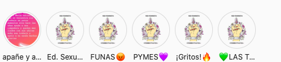

#### FOLIO: CNA2
# Asamblea Cerro Navia Feminista

[instagram](https://www.instagram.com/cerronavia_feminista/)
[pag web](https://lnk.bio/rQFE)

---

### Representantes
#### 
No señalan tener representantes.

---
### Interacciones frecuentes
#### 
* asamblea territorial cerro navia
* cordon vicuña
* Mujeres y disidencias zona poniente

### Redes sociales
#### ¿Para qué se utiliza la red social?
| Instagram | Pag web | 
|---|---|
|Difusion de informacion y actividades |Difusión de material para la lectura y conversatorios|

### **Instagram**
| seguidores | seguidos | publicaciones | hashtag 
|---|---|---|---|
|1875|158|118| 0

---

* **Actividad:**   

* Primera Publicación IG: 01/12/2019

---
### Frecuencia de publicación.
Publicaciones: Semanal (1/2 veces)
Actividades: Mensual

---
### Ubicación
* Mapocho / huelen Frente felix bulnes

---
### Describir temas de interés y/o trabajo
* Feminismo
* Sociedad antipatriarcal
* Colaboración y apoyo entre mujeres del territorio

---
### Describir la imagen ideal por la cual se trabaja.
#### 
> Desde la población caerá el patriarcado opresor
* Unidxs venceremos al capital y al patriarcado

---
### ¿Que se hace?
#### (Manifestaciones, marchas, intervenciones, actividades culturales, conversatorios, intercambio de saberes, actividades solidarias o de apoyo mutuo, abastecimiento, contra información, emplazamiento a autoridades etc.)
* Manifestaciones
    * Cacerolazos
    * Velatones
    * Marchas territoriales
* Funas hacia hombres violentos/violadores
* Apoyo mutuo entre mujeres
    * Acopio de viveres 
    * Acopio de utiles de aseo
* Reuniones y encuentros feministas
* Escuela de formación feminista
    * Material educativo para niñes
    * Material de pedagogia feminista
* Jornadas de autoformación
* Actividades conmemorativas
    * Semana de la mujer mapuche
* Intervencion *el violador eres tú*
* Comunicados sobre el dia del femicidio
* Jornadas de panfleteo y difusión feminista

---
### Describir y distinguir demandas más reivindicativas de espacios sin relación con lo contencioso o con lo político mas prefigurativo
#### 
* Se dirigen a las mujeres y disidencias desde la transformacion de lo cotidiano para vivir en seguridad e igualdad
* Apoyo mutuo entre mujeres y disidencias, en todo ambito 

* Emplaza a las autoridades por la violencia y asesinato de mujeres

---
### Tipo de organización interna.
#### 
Asambleismo y horizontalidad.

---
### Describir los temas / imágenes- iconos / conceptos mas habitualmente presentes en sus publicaciones. Describir cambios/ transformaciones en los contenidos desde Octubre.
Su contenido se ha mantenido similar. Se han manifestado por hechos de violencia patriarcal ocurridos durante el 2020. Tambien han realizado campañas de apoyo mutuo y de recomendaciones para la cuarentena.

**Iconos:**

**Diseño estético:**
No tienen un diseño estetico fijo. Sin embargo, siempre utilizan los colores morados en las publciaciones informativas.

---
### Percepciones que se tiene del Estado
#### (Aparato burocrático)
> Las canastas que entrega el Estado no contempla estas necesidades, ni menos piensan en promover una vida sexual sana entre la población. Por eso, es necesario apoyarnos entre nosotres. Piñera crimical.

| Declaraciones | infografía | 
|---|---|
|Anotar los comunicados |  |

---
### Percepciones que se tiene de las Fuerzas de Orden
#### (Aparato represivo)
> No hay proteccion hacia las mujeres pobres. Represión en la población. 

| Declaraciones | infografía | 
|---|---|
|Represion 14/07/2020 |[link](https://www.instagram.com/p/CCpIIo3J0uH/) |

---
### Incorporar aca notas, citas textuales, links, etc. extra a los ya incorporados, que sean de interés para comprender tanto la forma como los contenidos asociados a la organización.
