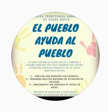

#### FOLIO: CNA3
# Asamblea Territorial Neptuno Barrancas

[whatsapp](+56973787397)

---

### Representantes
#### 
No señalan tener representantes.

---
### Interacciones frecuentes
####
* Asamblea territorial barrancas de cerro navia
* asamblea territorial cerro neptuno

### Redes sociales
#### ¿Para qué se utiliza la red social?
| Instagram | 
|---|
|Difusión de informacion y activ|idades

### **Instagram**
| seguidores | seguidos | publicaciones | hashtag 
|---|---|---|---|
|555|83|28| 0

---

* **Actividad:**   
* Primera Publicación IG: 18/11/2019

---
### Frecuencia de publicación. 
DISCONTINUA SALTAN DE DIC 2019 A FEBRERO 2020.

* Publicaciones: mensuales (3 x mes)
* Actividades: Mensual (1 x mes)

---
### Ubicación
* San pablo / Neptuno

---
### Describir temas de interés y/o trabajo
* Organizacion territorial
* Apoyo mutuo
> todo el pder a las asambleas, conscientes y combatientes
* Dignidad y justicia social

---
### Describir la imagen ideal por la cual se trabaja.
#### (El horizonte hacia el cual se quiere avanzar.)
* Dignidad para la vida
* Apoyo territorial entre vecinos

---
### ¿Que se hace?
#### (Manifestaciones, marchas, intervenciones, actividades culturales, conversatorios, intercambio de saberes, actividades solidarias o de apoyo mutuo, abastecimiento, contra información, emplazamiento a autoridades etc.)
* Difusión de ollas comunes
* Campañas solidarias *solo el pueblo ayuda al pueblo*
* Cronograma de manifestaciones y actividades
    * Exposiciones fotograficas
    * Protesta
* Manifestaciones
    * Cacerolazos
    * Velatones
    * Barricadas
    * Concentraciones en plazas
    * Marchas territoriales
* Infografías sobre el avance del covid19 en la comuna
* Difusión de contrainformación
* Acopio solidario
* Conversatorios constituyentes
* Asambleas vecinales
* Desayunos comunitarios

---
### Describir y distinguir demandas más reivindicativas de espacios sin relación con lo contencioso o con lo político mas prefigurativo
#### (lo contencioso; demanda al Estado, a alguna autoridad, privados, etc), (prefigurativo, transformación desde lo cotidiano, etc.).
* Hacia los vecinos
* Hacia las autoridades, las emplaza a hacerse cargo de la crisis sociosanitaria y economica que vive el pueblo. 

---
### Tipo de organización interna.
#### 
Asambleismo y horizontalidad.

---
### Describir los temas / imágenes- iconos / conceptos mas habitualmente presentes en sus publicaciones. Describir cambios/ transformaciones en los contenidos desde Octubre.
Desde el 2020 bajan la intensidad de publicaciones. Su contenido se enmarca en la actualidad nacional.

**Iconos:**
No tienen logo.

**Diseño estético:**
No tienen diseño estetico fijo, su contenido se basa en infografías propias, de otras organizaciones y videos.

---
### Percepciones que se tiene del Estado
#### (Aparato burocrático)
> No se preocupan del pueblo. Gobierno complice y asesino.

| Declaraciones | infografía | 
|---|---|
|Anotar los comunicados |  |

---
### Percepciones que se tiene de las Fuerzas de Orden
#### (Aparato represivo)
> Carabineros reprime sus llamados a manifestacion. Viven la represion dia a dia independiente de que la convocatoria sea pacifica.

| Declaraciones | infografía | 
|---|---|
|Anotar los comunicados |  |

---
### Incorporar aca notas, citas textuales, links, etc. extra a los ya incorporados, que sean de interés para comprender tanto la forma como los contenidos asociados a la organización.
