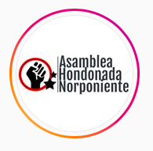
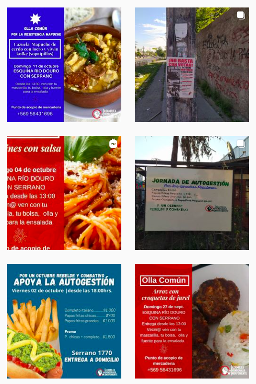
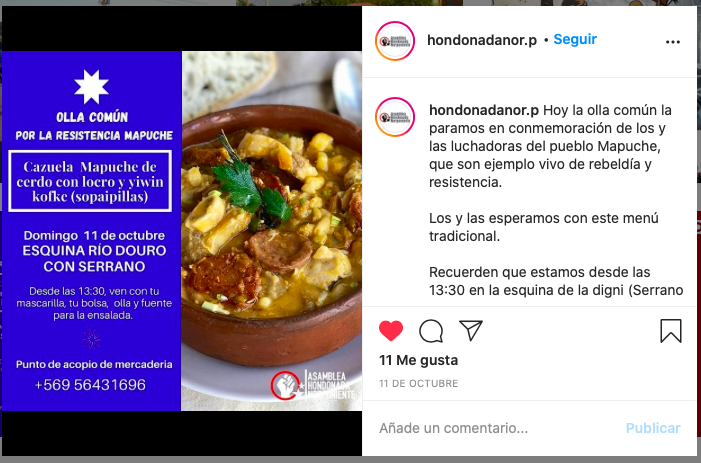

#### FOLIO: CNA4
# Asamblea Hondonada Norponiente

[instagram](https://www.instagram.com/hondonadanor.p/)

---

### Representantes
#### 
No tienen representantes pero tienen una persona encarga del acopio su numero es +56956431696

---
### Interacciones frecuentes
#### 
* Asamblea territorial cerro navia
* asamblea feminista cerro navia
* colectivo la chispa

### Redes sociales
#### ¿Para qué se utiliza la red social?
| Instagram | 
|---|
|Difusión de informacion y actividades|

### **Instagram**
| seguidores | seguidos | publicaciones | hashtag 
|---|---|---|---|
|827|971|160| 0

---

* **Actividad:**   
* Primera Publicación IG: 02/12/2019

---
### Frecuencia de publicación.

* Publicaciones: semanalmente (2/3 veces)
* Actividades: semanalmente

---
### Ubicación
* Serrano con Río Douro

---
### Describir temas de interés y/o trabajo
* Organización y lucha popular
* Alimentación

---
### Describir la imagen ideal por la cual se trabaja.
#### (El horizonte hacia el cual se quiere avanzar.)
* Colaboracion y apoyo mutuo entre vecinos
> Nuestro camino es la lucha y la organización popular. Solo en el pueblo confiamos.

---
### ¿Que se hace?
#### (Manifestaciones, marchas, intervenciones, actividades culturales, conversatorios, intercambio de saberes, actividades solidarias o de apoyo mutuo, abastecimiento, contra información, emplazamiento a autoridades etc.)
* Manifestaciones
    * cacerolazos
    * velatones
    * marchas territoriales
    * barricadas
    * corte de calle
* Olla común
    * Acopio de alimentos
    * Actividades de autpogestion para la olla
    * Sopaipilladas solidarias
    * Entrega y preparación de alimentos
* Campañas solidarias por la lluvia
* Compras colectivas
* Celebración we tripantu
* Difusión de contrainformación
* Actividades conmemorativas
* Reuniones y asamblea de vecinos
* Jornadas de propaganda y difusión
* Operativos medicos, psicologicos y juridicos
* Emplazamiento a autoridades
* Escuela de futbol popular
* Navdad popular

---
### Describir y distinguir demandas más reivindicativas de espacios sin relación con lo contencioso o con lo político mas prefigurativo
#### 
* Se dirige directamente a los vecinos, tambien los interpela de que no caigan en el juego de los politicos que solo quieren sacar aprovechamiento de la situación que viven. 

---
### Tipo de organización interna.
#### 
Asambleismo y horizontalidad.

---
### Describir los temas / imágenes- iconos / conceptos mas habitualmente presentes en sus publicaciones. Describir cambios/ transformaciones en los contenidos desde Octubre.
Su contenido se ha ajustado a la crisis sociosanitaria, actualmente la asamblea tiene un rol de olla común relevante en el territorio. Se manifiestan y emplazan autoridades por los acontecimientos de relevancia nacional.

**Iconos:**

**Diseño estético:**
No tienen diseño estetico fijo. Suben fotografías, videos e inforgrafias. El unico diseño fijo que logran tener es el menú de la olla común.

---
### Percepciones que se tiene del Estado
#### (Aparato burocrático)
> Renuncia Piñera. No les interesan los trabajadores, sino la economia. Gobierno criminal. V.oladores de ddhh 

| Declaraciones | infografía | 
|---|---|
|Exigen cuarentena | [Link](https://www.instagram.com/p/B_imjPKJmST/) |

---
### Percepciones que se tiene de las Fuerzas de Orden
#### (Aparato represivo)
> Abuso de la fuerza y el poder. Complices del estado, reprimer a matar.

| Declaraciones | infografía | 
|---|---|
|Desalojo toma macarena valdes| [Link](https://www.instagram.com/p/B6T7AXEJGoU/) |

---
### Incorporar aca notas, citas textuales, links, etc. extra a los ya incorporados, que sean de interés para comprender tanto la forma como los contenidos asociados a la organización.

* Tuvieron un menú especial en la olla común territorial para el 12/10, prepararon comida mapuche

