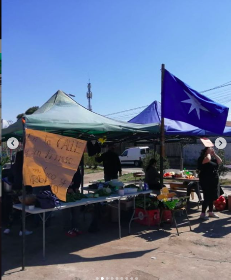

#### FOLIO: CNA5
# Olla comun cabrxs de mierda

[instagram](https://www.instagram.com/cabrxsdemierda/)

---

### Representantes
#### 
No tienen representantes pero hay un numero de contacto de la olla +56986818989

---
### Interacciones frecuentes
####
* Asamblea feminista CN
* Ollas CN 

### Redes sociales
#### ¿Para qué se utiliza la red social?
| Instagram | 
|---|
|Difusión de informacion y actividades|

### **Instagram**
| seguidores | seguidos | publicaciones | hashtag 
|---|---|---|---|
|317|392|49| 

---

* **Actividad:**   
* Primera Publicación IG: 17/06/2020

---
### Frecuencia de publicación.
Publicaciones: Semanalmente (1/2 veces por semana)
Actividades: Semanalmente

---
### Ubicación
* Villa Juan Araya y Herminda de la Victoria

---
### Describir temas de interés y/o trabajo
* Alimentación
* Colaboración y organización entre vecinos
* Apoyo mutuo
* Apropiación del espacio publico

---
### Describir la imagen ideal por la cual se trabaja.
#### (El horizonte hacia el cual se quiere avanzar.)
> Pa q' lxs politicxs no nos vendan la pescá, hagamos politica en comunidá
> Miremas el futuro con el impetud de la juventud rebelde , esa que estalló con un monton de sueños y q esta enquistada en la memoria de nuestra historia.

---
### ¿Que se hace?
#### (Manifestaciones, marchas, intervenciones, actividades culturales, conversatorios, intercambio de saberes, actividades solidarias o de apoyo mutuo, abastecimiento, contra información, emplazamiento a autoridades etc.)
* Olla común
    * Entrega y preparación de alimentos
    * Acopio de donaciones
    * Donaciones externas
    * Menú lunes, miercoles y viernes

* Jornadas muralistas
* Jornadas de talleres para NNA
* Construccion de huerta comunitaria
* Aniversario toma violeta parra
* Reuniones de trabajo
* Difusión de ollas comunes de la comuna
* Jornadas de protesta social comunitaria
    * Comparsas
    * Pasacalle

---
### Describir y distinguir demandas más reivindicativas de espacios sin relación con lo contencioso o con lo político mas prefigurativo
#### (lo contencioso; demanda al Estado, a alguna autoridad, privados, etc), (prefigurativo, transformación desde lo cotidiano, etc.).
* Hacia los vecinos
    > Hacer comunidad es lo que nos llena el piwke

---
### Tipo de organización interna.
#### 
Asambleismo y horizontalidad.

---
### Describir los temas / imágenes- iconos / conceptos mas habitualmente presentes en sus publicaciones. Describir cambios/ transformaciones en los contenidos desde Octubre.

**Iconos:**

**Banderas:**
* Siempre está la bandera mapuche en sus fotografías y donde hacen la comida. También escriben mensajes en mapudungun.

**Diseño estético:**
No tienen un diseño estetico fijo, la mayoria de sus publicaciones son fotografías de lo que realizan.

---
### Percepciones que se tiene del Estado
#### (Aparato burocrático)
> Gobierno criminal que no se preocupa por los pobladores.

| Declaraciones | infografía | 
|---|---|
|Anotar los comunicados |  |

---
### Percepciones que se tiene de las Fuerzas de Orden
#### (Aparato represivo)
> Pacos asesinos y complices del estado criminal.

| Declaraciones | infografía | 
|---|---|
|Anotar los comunicados |  |

---
### Incorporar aca notas, citas textuales, links, etc. extra a los ya incorporados, que sean de interés para comprender tanto la forma como los contenidos asociados a la organización.
* Son mayoritariamente personas jovenes, tuvieron conflictos con organizaciones más antiguas que "avalan a los politicos" segun sus declaraciones [Link](https://www.instagram.com/p/CEPbAEkpKcd/)

