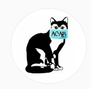
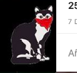
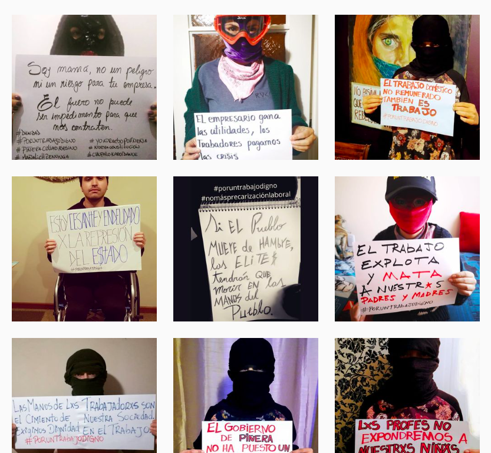

#### FOLIO: COL1
# COLECTIVE GATILLO

[instagram](https://www.instagram.com/colective.gatillo/)
---

### Representantes
#### 
No señala tener representantes.

---
### Interacciones frecuentes
#### 
* Las perras violetas
* brigadistas colina
* colina feminista
* rio colina

### Redes sociales
#### ¿Para qué se utiliza la red social?
| Instagram | 
|---|
| difusion de informaciones y actividades. tambien contrainformación|

### **Instagram**
| seguidores | seguidos | publicaciones | hashtag 
|---|---|---|---|
|1415|420|297| 0

---

* **Actividad:**   

* Primera Publicación IG: 22/03/2020

---
### Frecuencia de publicación.

* Publicaciones: semanal (2/3)
* Actividades: mensuales (2)

---
### Ubicación
* Entre Gatica y Astudillo, colina

---
### Describir temas de interés y/o trabajo
* derechos humanos
* justicia por las personas con trauma ocular
* empleo / trabajo

---
### Describir la imagen ideal por la cual se trabaja.
#### (El horizonte hacia el cual se quiere avanzar.)
> Organización territorial contra la opresión de clase, raza y género.
> no habra paz hasta que se haga justicia por los multilados y torturados en el regimen de Piñera

---
### ¿Que se hace?
#### (Manifestaciones, marchas, intervenciones, actividades culturales, conversatorios, intercambio de saberes, actividades solidarias o de apoyo mutuo, abastecimiento, contra información, emplazamiento a autoridades etc.)
* Manifestaciones
    * Cacerolazos
    * velatones
    * marchas territoriales
    * muralismo
    * banderazos
* Asambleas abiertas 
* actividades conmemorativas
* emplazamiento a las autoridades
* Jornadas de visibilizacion de la vulneracion a los ddhh 
* contrainformación
* campañas solidarias de acopio de alimentos
* difusión de ollas comunes
* talleres feministas
* rifa ssolidarias
* intervenciones politico culturales en las calles del barrio

---
### Describir y distinguir demandas más reivindicativas de espacios sin relación con lo contencioso o con lo político mas prefigurativo
#### (lo contencioso; demanda al Estado, a alguna autoridad, privados, etc), (prefigurativo, transformación desde lo cotidiano, etc.).
* Hacia los vecinos para que se organicen y colaboren entre elles. Por la justicia por gustavo gatica y carlos astudillo
* Hacia las autoridades emplazandolas por las victimas de trauma ocular, violencia del estado

---
### Tipo de organización interna.
#### 
Vocerías asambleismo.

---
### Describir los temas / imágenes- iconos / conceptos mas habitualmente presentes en sus publicaciones. Describir cambios/ transformaciones en los contenidos desde Octubre.
* Su contenido transversalmente se refiere a derechos humanos, justicia para las victimas de trauma ocular, sobre el trabajo y colaboracion vecinal.

**Iconos:**

Tienen un logo de gato que usan en todas las publicaciones

**Diseño estético:**
No tienen un diseño estetico fijo. Suben imagenes de todo tipo, sumado a infografias de actividades.

---
### Percepciones que se tiene del Estado
#### (Aparato burocrático)
> gobierno criminal que no se preocupa por el pueblo, solo por el empresariado. violadores de derechos humanos, sin dar justicia a las victimas. #renunciapiñera

| Declaraciones | infografía | 
|---|---|
|Jornada de protesta contra el gobierno | [Link](https://www.instagram.com/p/CA3tTA7h85u/) |

---
### Percepciones que se tiene de las Fuerzas de Orden
#### (Aparato represivo)
> Policia criminal y complice del gobierno.

| Declaraciones | infografía | 
|---|---|
|Policia criminal| [Link](https://www.instagram.com/p/CA5wePrh0CM/) |

---
### Incorporar aca notas, citas textuales, links, etc. extra a los ya incorporados, que sean de interés para comprender tanto la forma como los contenidos asociados a la organización.
* Tienen una perspectiva de clase muy potente en su contenido. Se manifiestan con frases que van directamente al empresariado.

* Parten posterior al estallido social, ya cuando comienza la crisis sociosanitaria. Más que nada nacen como organizacion para dar a conocer injusticias contra quien trabaja y quien se manifiesta, independiente del género.

Cabe señalar que tienen una fotografia que dice "25 de enero asamblea en la petit" [link](https://www.instagram.com/p/B_dMZ3zhoo4/)
