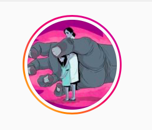

#### FOLIO: COL2
# Colectiva Separatista Colina LAS PERRAS VIOLETAS

[instagram](https://www.instagram.com/las.perras.violetas/)

---

### Representantes
#### 
No señalan tener representantes.

---
### Interacciones frecuentes
#### 
* Colina feminista
* Feministas autoconvocadas colina

### Redes sociales
#### ¿Para qué se utiliza la red social?
| Instagram | 
|---|
|Difusión de información y actividades|

### **Instagram**
| seguidores | seguidos | publicaciones | hashtag 
|---|---|---|---|
|10100|1466|729| 0

---

* **Actividad:**   

* Primera Publicación IG: 19/02/2020

---
### Frecuencia de publicación.

* Publicaciones: semanal (2/3)
* Actividades:mensual (2 aprx)

---
### Ubicación
* Plaza de colina

---
### Describir temas de interés y/o trabajo
* Feminismo
* Organizacion entre mujeres

---
### Describir la imagen ideal por la cual se trabaja.
#### (El horizonte hacia el cual se quiere avanzar.)
* Sociedad feminista

---
### ¿Que se hace?
#### (Manifestaciones, marchas, intervenciones, actividades culturales, conversatorios, intercambio de saberes, actividades solidarias o de apoyo mutuo, abastecimiento, contra información, emplazamiento a autoridades etc.)
* Difusión de información de otras organizaciones
* Contrainformación
* Manifestaciones
    * velatones
    * marchas territoriales
    * intervenciones
    * cacerolazos
    * concentraciones
* difusion de emprendimientos
* talleres feministas autoeducacion
* campañas solidarias *solo el pueblo ayuda al pueblo* 
    * acopio solidario
    * rifas
* asambleas territoriales con diversas organizaciones feministas de colina

---
### Describir y distinguir demandas más reivindicativas de espacios sin relación con lo contencioso o con lo político mas prefigurativo
#### (lo contencioso; demanda al Estado, a alguna autoridad, privados, etc), (prefigurativo, transformación desde lo cotidiano, etc.).
* Hacia las mujeres para que se organicen contra la violencia 
* hacia las autoridades para que actuen a favor de las mujeres

---
### Tipo de organización interna.
#### 
Horizontalidad.

---
### Describir los temas / imágenes- iconos / conceptos mas habitualmente presentes en sus publicaciones. Describir cambios/ transformaciones en los contenidos desde Octubre.
Su contenido siempre ha sido de mucha difusion de información. La cuarentena las llevo a publicar mucho sobre noticias e iniciativas solidarias.

**Iconos:**

**Diseño estético:**
No tienen un diseño estetico fijo.

---
### Percepciones que se tiene del Estado
#### (Aparato burocrático)
> Estado no protege a las mujeres. Reprimen al pueblo y no se hace cargo de su bienestar

| Declaraciones | infografía | 
|---|---|
|Anotar los comunicados | [Link]() |

---
### Percepciones que se tiene de las Fuerzas de Orden
#### (Aparato represivo)
> Complices del estado. asesinos y criminales. no protegen a las mujeres que sufren violencia de género

| Declaraciones | infografía | 
|---|---|
|Anotar los comunicados | [Link]() |

---
### Incorporar aca notas, citas textuales, links, etc. extra a los ya incorporados, que sean de interés para comprender tanto la forma como los contenidos asociados a la organización.
