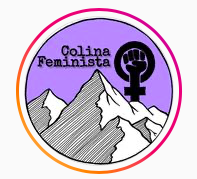

#### FOLIO: COL3
# Colina Feminista

[instagram](https://www.instagram.com/colinafeminista/)
---

### Representantes
#### 
No señala tener representantes.

---
### Interacciones frecuentes
#### 
* Colina LGTBI
* Motadima colina
* Con las amigas y en colina

### Redes sociales
#### ¿Para qué se utiliza la red social?
| Instagram |
|---|
|Difusión informaciones y actividades|

### **Instagram**
| seguidores | seguidos | publicaciones | hashtag 
|---|---|---|---|
|4175|116|444| 0

---

* **Actividad:**   

* Primera Publicación IG: 29/11/2019

---
### Frecuencia de publicación.

* Publicaciones: Semanal (2/3)
* Actividades: Mensual

---
### Ubicación
* Plaza de colina

---
### Describir temas de interés y/o trabajo
* Feminismo
* Colaboracion y apoyo mutuo feminista

---
### Describir la imagen ideal por la cual se trabaja.
#### (El horizonte hacia el cual se quiere avanzar.)
* Sociedad feminista

---
### ¿Que se hace?
#### (Manifestaciones, marchas, intervenciones, actividades culturales, conversatorios, intercambio de saberes, actividades solidarias o de apoyo mutuo, abastecimiento, contra información, emplazamiento a autoridades etc.)
* Manifestaciones
    * marchas territoriales
    * muralismo
    * panfletadas
    * intervenciones publicas
* Contrainformación
* Infografias con tematicas de violencia de género
* funas
* talleres y clases de tematicas feministas
* Acopio solidario y rifas solidarias
* Actividades conmemorativas

---
### Describir y distinguir demandas más reivindicativas de espacios sin relación con lo contencioso o con lo político mas prefigurativo
#### (lo contencioso; demanda al Estado, a alguna autoridad, privados, etc), (prefigurativo, transformación desde lo cotidiano, etc.).
* Hacia las mujeres de colina
* HAcia las autoridades para que protejan y garanticen una vida libre de violencia hacia las mujeres

---
### Tipo de organización interna.
#### 
Asambleismo.

---
### Describir los temas / imágenes- iconos / conceptos mas habitualmente presentes en sus publicaciones. Describir cambios/ transformaciones en los contenidos desde Octubre.
Su contenido se ha mantenido similar durante el tiempo. Suman actividades e informaciones sobre campañas solidarias y actualizacion del registro social de hogares para las familias.

**Iconos:**

**Diseño estético:**
No tienen un diseño estetico fijo.

---
### Percepciones que se tiene del Estado
#### (Aparato burocrático)
> Estado complice de la violencia

| Declaraciones | infografía | 
|---|---|
|Anotar los comunicados | [Link]() |

---
### Percepciones que se tiene de las Fuerzas de Orden
#### (Aparato represivo)
> No cuidan ni protegen a las mujeres. 

| Declaraciones | infografía | 
|---|---|
|Anotar los comunicados | [Link]() |

---
### Incorporar aca notas, citas textuales, links, etc. extra a los ya incorporados, que sean de interés para comprender tanto la forma como los contenidos asociados a la organización.
