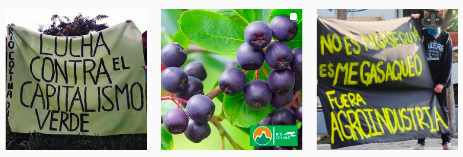
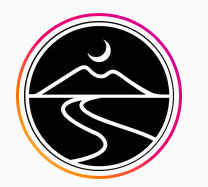

#### FOLIO: COL4
# Río Colina

[instagram](https://www.instagram.com/rio.colina/)
[facebook](https://www.facebook.com/riocolinaong/)
<riocolina2019@gmail.com>
---

### Representantes
#### 
No señalan tener representantes

---
### Interacciones frecuentes
#### 
* Las perras violetas
* Modatima colina
* Colina unida
* Colina feminista

### Redes sociales
#### ¿Para qué se utiliza la red social?
| Instagram | Facebook | 
|---|---|
|Difusión de actividades e informaciones|Difusión de actividades, informaciones y videos en vivo|

### **Instagram**
| seguidores | seguidos | publicaciones | hashtag 
|---|---|---|---|
|2034|1513|203| 0

---

* **Actividad:**   

* Primera Publicación IG: Tienen data previa al 18/10/2019 pero se activan como asamblea socioambiental el 22/10/2019

---
### Frecuencia de publicación.

* Publicaciones: semanal (2/3)
* Actividades: semanal

---
### Ubicación
* Plaza de colina

---
### Describir temas de interés y/o trabajo
* Medioambiente
* Conservacion y valoración del cajón río colina

---
### Describir la imagen ideal por la cual se trabaja.
#### (El horizonte hacia el cual se quiere avanzar.)
> Fuera el extractivismo del río colina

---
### ¿Que se hace?
#### (Manifestaciones, marchas, intervenciones, actividades culturales, conversatorios, intercambio de saberes, actividades solidarias o de apoyo mutuo, abastecimiento, contra información, emplazamiento a autoridades etc.)
* Infografías y conscientización
* Manifestaciones
    * Marchas territoriales
    * Ciclietadas
    * Intervenciones publicas
* Asambleas informativas
* Jornadas de limpieza del rio colina
* Infografias conmemorativas
* Podcast *compodcast*
* Fanzine *esclerófilo*

---
### Describir y distinguir demandas más reivindicativas de espacios sin relación con lo contencioso o con lo político mas prefigurativo
#### (lo contencioso; demanda al Estado, a alguna autoridad, privados, etc), (prefigurativo, transformación desde lo cotidiano, etc.).
* Se dirige hacia los vecinos para conscientizar
* Se dirige a las autoridades para que protejan el sector del cajón del río colina

---
### Tipo de organización interna.
#### 
Asambleismo y horizontalidad.

---
### Describir los temas / imágenes- iconos / conceptos mas habitualmente presentes en sus publicaciones. Describir cambios/ transformaciones en los contenidos desde Octubre.
Pasa de ser una organizacion que solo se focalizaba en la salvaguarda del rio colina a una que cuestiona el modelo en general y lo vincula con la situacion de extractivismo en Colina.

**Iconos:**

**Diseño estético:**
Tienen un diseño estetico similar entre imagenes. Su contenido tiene muchas inforgrafias e imagenes del entorno verde y manifestaciones.

---
### Percepciones que se tiene del Estado
#### (Aparato burocrático)
> Renuncia Piñera

| Declaraciones | infografía | 
|---|---|
|Anotar los comunicados | [Link]() |

---
### Percepciones que se tiene de las Fuerzas de Orden
#### (Aparato represivo)
> Milicos complices de la violencia. Los milicos no son pueblo. Arriendan terrenos para el extractivismo.

| Declaraciones | infografía | 
|---|---|
|Ejecito arrienda terrenos| [Link](https://www.instagram.com/p/B4F-XR9BVtY/) |

---
### Incorporar aca notas, citas textuales, links, etc. extra a los ya incorporados, que sean de interés para comprender tanto la forma como los contenidos asociados a la organización.
* Tienen un fanzine [link](https://issuu.com/esclerofilo_riocolina/docs/escler_filo_6ta_edicion)