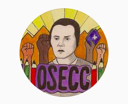

#### FOLIO: COL5
# Organización Secundaria Elena Caffarena Colina

[instagram](https://www.instagram.com/osec.colina/)

---

### Representantes
#### 
No señalan tener representantes

---
### Interacciones frecuentes
#### 
* Organizaciones secundarias colina

### Redes sociales
#### ¿Para qué se utiliza la red social?
| Instagram | 
|---|
|Difusion de videos, actividades e informacion|

### **Instagram**
| seguidores | seguidos | publicaciones | hashtag 
|---|---|---|---|
|718|442|16| 0

---

* **Actividad:**   

* Primera Publicación IG: 28/10/2019 (inactiva)

---
### Frecuencia de publicación.

* Publicaciones: Mensual (1 por mes)
* Actividades: Cada dos meses

---
### Ubicación
* Colina

---
### Describir temas de interés y/o trabajo
* Organizacion secundaria
* Feminismo

---
### Describir la imagen ideal por la cual se trabaja.
#### (El horizonte hacia el cual se quiere avanzar.)
* Reconocimiento de las mujeres en su rol de lucha
* Sin organizacion no hay futuro

---
### ¿Que se hace?
#### (Manifestaciones, marchas, intervenciones, actividades culturales, conversatorios, intercambio de saberes, actividades solidarias o de apoyo mutuo, abastecimiento, contra información, emplazamiento a autoridades etc.)
* Asambleas abiertas
* Concentraciones
* Infografías de mujeres importantes en la historia
* Reflexiones en torno a la crisis social
* Manifestaciones en los colegios

---
### Describir y distinguir demandas más reivindicativas de espacios sin relación con lo contencioso o con lo político mas prefigurativo
#### (lo contencioso; demanda al Estado, a alguna autoridad, privados, etc), (prefigurativo, transformación desde lo cotidiano, etc.).
* Hacia los estudiantes para que se organicen y se manifiesten.

---
### Tipo de organización interna.
#### 
Asambleismo.

---
### Describir los temas / imágenes- iconos / conceptos mas habitualmente presentes en sus publicaciones. Describir cambios/ transformaciones en los contenidos desde Octubre.
Parte como una organizacion de un colegio especifico de Quilicura y termina expandiendose a nivel comunal. 

**Iconos:**

**Diseño estético:**
No tienen diseño estetico fijo.

---
### Percepciones que se tiene del Estado
#### (Aparato burocrático)
> Gobierno privilegia a los empresarios que a los trabajadores. Morir de hambre por culpa de no asegurar la alimentacion.

| Declaraciones | infografía | 
|---|---|
|Cuarentena COVID19 | [Link](https://www.instagram.com/p/CA6sG-WBylV/) |

---
### Percepciones que se tiene de las Fuerzas de Orden
#### (Aparato represivo)
No hay postura.

| Declaraciones | infografía | 
|---|---|
|Anotar los comunicados | [Link]() |

---
### Incorporar aca notas, citas textuales, links, etc. extra a los ya incorporados, que sean de interés para comprender tanto la forma como los contenidos asociados a la organización.
