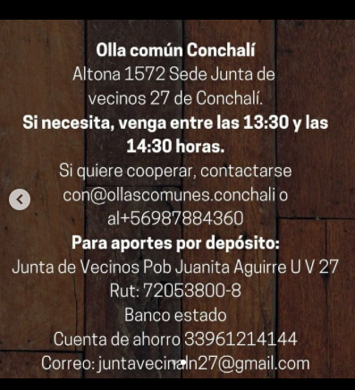
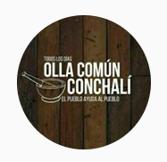
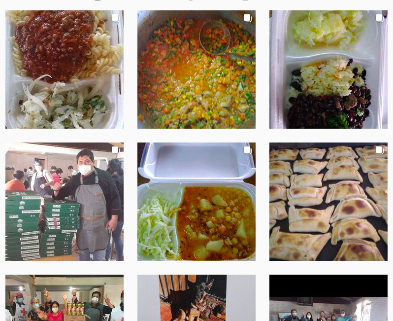

#### FOLIO: CCH1
# Olla Común Conchalí

[instagram](https://www.instagram.com/ollascomunes.conchali/)
[facebook](https://www.facebook.com/Olla-Común-Conchal%C3%AD-El-pueblo-ayuda-al-pueblo-en-la-27-100506795033260)
[whatsapp](+56987884360)
<juntavecinaln27@gmail.com>
---

### Representantes
#### 
No señalan tener representantes, sin embargo, el numero de whatsapp debe ser de algun integrante de la organización.

---
### Interacciones frecuentes
#### 
* Núcleo humanitario
* Cruz roja independencia

### Redes sociales
#### ¿Para qué se utiliza la red social?
| Instagram | Whatsapp | 
|---|---|
|Difusion de informacion y actividades|Contacto para donar|

### **Instagram**
| seguidores | seguidos | publicaciones | hashtag 
|---|---|---|---|
|1730|1759|191| 0

---

* **Actividad:**   
* Primera Publicación IG: 19/05/2020

---
### Frecuencia de publicación.

* Publicaciones: Semanalmente (2/3 veces)
* Actividades: Semanalmente (funcionamiento de la olla)

---
### Ubicación
* Calle Altona 

---
### Describir temas de interés y/o trabajo
* Alimentación
* Apoyo mutuo y colaboración comunitaria vecinal

---
### Describir la imagen ideal por la cual se trabaja.
#### (El horizonte hacia el cual se quiere avanzar.)
* Ayuda mutua entre vecinos, "si tu vecino tiene hambre, debes ayudarlo"

---
### ¿Que se hace?
#### (Manifestaciones, marchas, intervenciones, actividades culturales, conversatorios, intercambio de saberes, actividades solidarias o de apoyo mutuo, abastecimiento, contra información, emplazamiento a autoridades etc.)
* Olla común
    * Preparación y entrega de alimentos
    * Donaciones externas de alimentos
* Rifas solidarias para la olla comun
* Difusión de alimentos que cocinan
* Difusión de donaciones que reciben
* Jornadas de tramites con una trabajadora social

---
### Describir y distinguir demandas más reivindicativas de espacios sin relación con lo contencioso o con lo político mas prefigurativo
#### (lo contencioso; demanda al Estado, a alguna autoridad, privados, etc), (prefigurativo, transformación desde lo cotidiano, etc.).
* Hacia los vecinos, apoyo y colaboración mutua en tiempos de crisis. 
> El pueblo ayuda al pueblo
> Que el hambre nunca te sea indiferente

---
### Tipo de organización interna.
#### 
Vocerías. Trabajan al alero de la JJVV Juanita Aguirre 27. No hay mayores detalles.

---
### Describir los temas / imágenes- iconos / conceptos mas habitualmente presentes en sus publicaciones. Describir cambios/ transformaciones en los contenidos desde Octubre.
La Olla común comienza a funcionar a fines de marzo, esta nace desde una junta de vecinos. Su contenido no varia, siempre es similar y apunta a la alimentación en base a lo que cocinan y las donaciones que reciben. A veces realizan actividades solidarias para comprar insumos para la olla.

**Iconos:**

**Diseño estético:**
No tienen un diseño estetico fijo puesto que no suben infografias ni informaciones en imagenes, sin embargo, su contenido es "similar" siempre, suben comidas y donaciones.

---
### Percepciones que se tiene del Estado
#### (Aparato burocrático)
>  El Estado chileno no está cubriendo los derechos básicos de sus ciudadanos, en Chile hay mucha gente con hambre, si HAMBRE! Las cosas tienen que cambiar, pero mientras tanto, solo recurrimos a la solidaridad de los vecinos y reafirmamos que SOLO EL PUEBLO AYUDA AL PUEBLO! 

| Declaraciones | infografía | 
|---|---|
|Declaracion olla comun | [Link](https://www.instagram.com/p/CAofqyIHn-D/) |

---
### Percepciones que se tiene de las Fuerzas de Orden
#### (Aparato represivo)
> No tienen postura.

| Declaraciones | infografía | 
|---|---|
|Anotar los comunicados | [Link]() |

---
### Incorporar aca notas, citas textuales, links, etc. extra a los ya incorporados, que sean de interés para comprender tanto la forma como los contenidos asociados a la organización.
