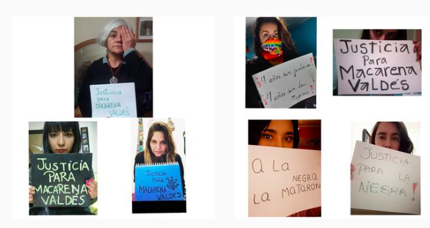
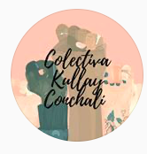

#### FOLIO: CCH2
# Colectiva Feminista Kullay Conchalí

[instagram](https://www.instagram.com/colectivakullay/)
<colectivakullayc@gmail.com>
---

### Representantes
#### 
No señalan tener representantes.

---
### Interacciones frecuentes
#### 
* coordinadora de organizaciones populares de conchali
* coordinadora 8m zona norte
* ollas comunes del sector juanita aguirre

### Redes sociales
#### ¿Para qué se utiliza la red social?
| Instagram | 
|---|
|Difusion de informacion y actividades|

### **Instagram**
| seguidores | seguidos | publicaciones | hashtag 
|---|---|---|---|
|833|183|69| 0

---

* **Actividad:**   

* Primera Publicación IG: 22/12/2019

---
### Frecuencia de publicación.

* Publicaciones: Mensual (3/4 veces)
* Actividades: Mensuales

---
### Ubicación
* Plaza La Palmilla

---
### Describir temas de interés y/o trabajo
* Feminismo
* Colaboracion entre mujeres y disidencias

---
### Describir la imagen ideal por la cual se trabaja.
#### (El horizonte hacia el cual se quiere avanzar.)
* Hacia una sociedad feminista donde las mujeres y disidencias vivan sin miedo y libres

---
### ¿Que se hace?
#### (Manifestaciones, marchas, intervenciones, actividades culturales, conversatorios, intercambio de saberes, actividades solidarias o de apoyo mutuo, abastecimiento, contra información, emplazamiento a autoridades etc.)
* Manifestaciones
    * Cacerolazos
    * Marchas
    * Concentraciones
* Intervenciones politicas culturales
    * Las tesis
    * dia contra el femicidio
    * por las mujeres asesinadas de conchalí
* Campaña solidarias para ollas comunes
* Campañas de apoyo a campamentos
* Asambleas y jornadas de reflexion
* Creacion de lienzos
* Muralismo
* Actividades conmemorativas
* Funas
* Jornadas de agitacion feminista
* Intervenciones virtuales

---
### Describir y distinguir demandas más reivindicativas de espacios sin relación con lo contencioso o con lo político mas prefigurativo
#### (lo contencioso; demanda al Estado, a alguna autoridad, privados, etc), (prefigurativo, transformación desde lo cotidiano, etc.).
* Hacia las vecinas, hacia el apoyo y colaboracion entre mujeres
> Nos queremos, pero nos queremos vivas. 

---
### Tipo de organización interna.
#### 
Asambleismo y horizontalidad.

---
### Describir los temas / imágenes- iconos / conceptos mas habitualmente presentes en sus publicaciones. Describir cambios/ transformaciones en los contenidos desde Octubre.
Sus contenidos se enmarcan en la actualidad nacional, tambien se han focalizado en el apoyo y colaboracion a vecinxs y ollas comunes.

**Iconos:**

**Diseño estético:**
No tienen diseño estetico fijo. 

---
### Percepciones que se tiene del Estado
#### (Aparato burocrático)
> Contra la violencia de este gobierno fascista retorcido e indolente. Convocamos al pueblo a salir y poner límites a la dictadura Y a la impunidad del aparato estatal.

| Declaraciones | infografía | 
|---|---|
|Anotar los comunicados | [Link]() |

---
### Percepciones que se tiene de las Fuerzas de Orden
#### (Aparato represivo)
> Nosotres no olvidamos que nos mataron, abusaron, sacaron los ojos, nos violaron. 

| Declaraciones | infografía | 
|---|---|
|CONTRA LA IMPUNIDAD DEL OPRESOR | [Link](https://www.instagram.com/p/B_fMOflJQJe/) |

---
### Incorporar aca notas, citas textuales, links, etc. extra a los ya incorporados, que sean de interés para comprender tanto la forma como los contenidos asociados a la organización.
