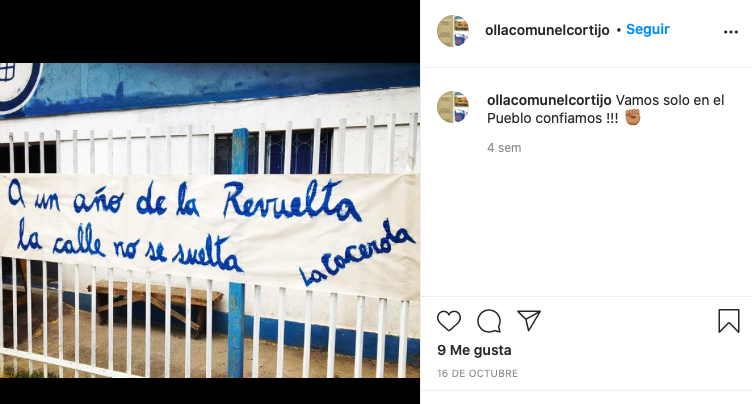
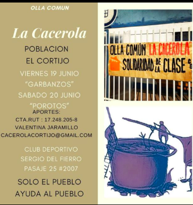
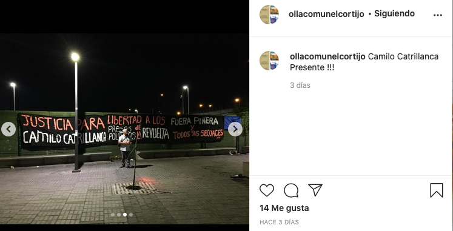

#### FOLIO: CCH3
# Olla común la Cacerola

[instagram](https://www.instagram.com/ollacomunelcortijo/)
<cacerolacortijo@gmail.com>
---

### Representantes
#### 
No señalan tener representantes pero Valentina Jaramillo es quien recibe las donaciones monetarias.

---
### Interacciones frecuentes
#### 
* Apoyo Mutuo CAT

### Redes sociales
#### ¿Para qué se utiliza la red social?
| Instagram | 
|---|
|Difusion de informaciones y actividades|

### **Instagram**
| seguidores | seguidos | publicaciones | hashtag 
|---|---|---|---|
|78|74|38| 0

---

* **Actividad:**   

* Primera Publicación IG: 25/06/2020
En el [video](https://www.instagram.com/p/CB7W6QHpYBE/) señalan que comenzaron la olla el 30/05/2020.

---
### Frecuencia de publicación.

* Publicaciones: Mensualmente (4 veces por mes)
* Actividades: Semanalmente 

---
### Ubicación
* Pasaje 25 poblacion el cortijo

---
### Describir temas de interés y/o trabajo
* Alimentación
* Organizacion popular

---
### Describir la imagen ideal por la cual se trabaja.
#### (El horizonte hacia el cual se quiere avanzar.)
* Solidaridad de la clase
> Organizacion popular para pelear el problema de alm¡imentacion desde el pueblo para el pueblo

---
### ¿Que se hace?
#### (Manifestaciones, marchas, intervenciones, actividades culturales, conversatorios, intercambio de saberes, actividades solidarias o de apoyo mutuo, abastecimiento, contra información, emplazamiento a autoridades etc.)
* Intervenciones conmemorativas
    * Aniversario 18O
    * Conmemoracion 11S
    * Aniversario 50 años toma el cortijo
    * Conmemoracion asesinato Camilo Catrillanca

* Creacion de pancartas
* Olla común
    * Preparacion y entrega de alimentos
* Difusión de aportes monetarios
* Emplazamiento a autoridades comunales
* Participación en conversatorios sobre el *apoyo mutuo* 

---
### Describir y distinguir demandas más reivindicativas de espacios sin relación con lo contencioso o con lo político mas prefigurativo
#### (lo contencioso; demanda al Estado, a alguna autoridad, privados, etc), (prefigurativo, transformación desde lo cotidiano, etc.).
* A los vecinos a que participen en la olla y no tengan verguenza de solicitar alimentos
* A las autoridades counales quienes quieren utilizar el hambre del pueblo para levantar imagenes politicas [link](https://www.instagram.com/p/CCWuKVFJQvy/)

---
### Tipo de organización interna.
#### 
Horizontalidad. No señalan asambleismo, sin embargo, deben tener voceria que participen en actividades externas.

---
### Describir los temas / imágenes- iconos / conceptos mas habitualmente presentes en sus publicaciones. Describir cambios/ transformaciones en los contenidos desde Octubre.
Comenzaron su trabajo en Mayo, su contenido no ha variado pero tienen claramente una postura politica respecto al rol que realizan como olla común.

**Iconos:**

**Diseño estético:**
No tienen un diseño estetioc fijo, suben fotos de los alimentos. Se nota cuando suben imagenes externas que pertenecen a la CAT porque tienen un diseño estetico similar.

---
### Percepciones que se tiene del Estado
#### (Aparato burocrático)
> Han profundizado el neoliberalismo, dejando a las personas sin trabajo y con necesidad de acudir a ollas comunes.

Fuera piñera y sus secuaces

---
### Percepciones que se tiene de las Fuerzas de Orden
#### (Aparato represivo)
> No señalan postura.

| Declaraciones | infografía | 
|---|---|
|Anotar los comunicados | [Link]() |

---
### Incorporar aca notas, citas textuales, links, etc. extra a los ya incorporados, que sean de interés para comprender tanto la forma como los contenidos asociados a la organización.
