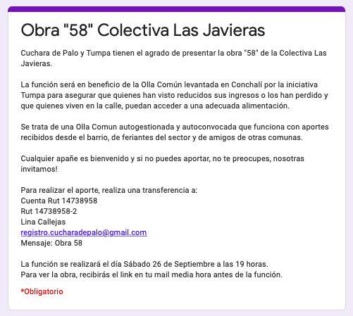
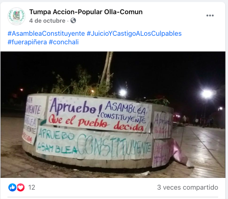
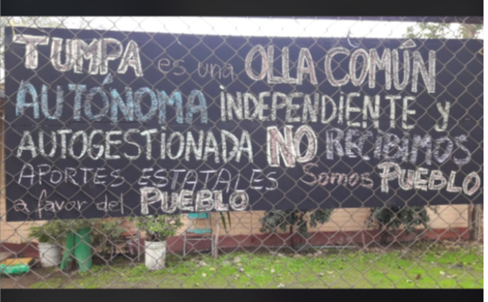
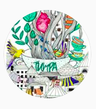
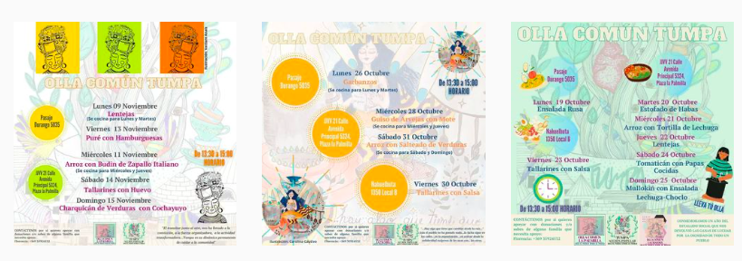

#### FOLIO: CCH4
# Olla Común TUMPA

[instagram]()
[facebook](https://www.facebook.com/tumpa.accion.popular)
[whatsapp](+56935924532)

---

### Representantes
#### 
No señalan tener representantes, sin embargo, el contacto con la olla es con Florencia.

---
### Interacciones frecuentes
#### 
* Olla común la palmilla
* JJVV La palmilla
* Apoyo mutuo CAT
* Olla comun la cacerola

### Redes sociales
#### ¿Para qué se utiliza la red social?
| Instagram | Facebook | whatsapp |
|---|---|---|
|Difusión de actividades e informaciones|Difusión de actividades e informaciones|Contacto|

Cabe señalar que utilizan más el facebook para subir informaciones.

### **Instagram**
| seguidores | seguidos | publicaciones | hashtag 
|---|---|---|---|
|189|64|34| 0

---

* **Actividad:**   
* Primera Publicación IG: 17/06/2020

---
### Frecuencia de publicación.

* Publicaciones: Semanalmente (2/3 veces)
* Actividades: Semanalmente

---
### Ubicación
* Pasaje durango
* Plaza la Palmilla
* Calle nahuelbuta

---
### Describir temas de interés y/o trabajo
* Alimentación
* Apoyo mutuo
* Organizacion vecinal y territorial

---
### Describir la imagen ideal por la cual se trabaja.
#### (El horizonte hacia el cual se quiere avanzar.)
* Organizacion para y por los vecinos para superar las crisis en conjunto

---
### ¿Que se hace?
#### (Manifestaciones, marchas, intervenciones, actividades culturales, conversatorios, intercambio de saberes, actividades solidarias o de apoyo mutuo, abastecimiento, contra información, emplazamiento a autoridades etc.)
* Olla común
    * Entrega de alimentos
    * Preparacion de alimentos
    * Reciben donaciones
* Difusión actividades y menus semanales
* Actividades conmemorativas
* Conversatorios y actividades de apoyo mutuo
* Recaudación de fondos para le olla común
    * Teatro abierto por donacion monetaria

* Acciones por el proceso constituyente 
    * Campaña por el apruebo
    * Conversatorios sobre *asamblea constituyente*

---
### Describir y distinguir demandas más reivindicativas de espacios sin relación con lo contencioso o con lo político mas prefigurativo
#### (lo contencioso; demanda al Estado, a alguna autoridad, privados, etc), (prefigurativo, transformación desde lo cotidiano, etc.).
* A los vecinos, sumandose a la lucha desde la autodeterminación y autigestión.

* A las autoridades locales y estatales quienes quieren aprovecharse de la crisis socioalimentaria qe viven miles de vecinos y vecinas.

---
### Tipo de organización interna.
#### 
Horizontalidad. Deben funcionar por comisiones, cocinan en tres lugares diferentes casi todas las semanas. Tienen una *encargada* de las donaciones y el contacto.

---
### Describir los temas / imágenes- iconos / conceptos mas habitualmente presentes en sus publicaciones. Describir cambios/ transformaciones en los contenidos desde Octubre.
Su contenido en instagram apunta a la alimentación, su contenido en facebook apunta también a actividades sociopoliticas que se vinculan a la actualidad nacional.

**Iconos:**

**Diseño estético:**
No tienen un diseño estetico muy fijo pero si siguen un patrón. Tambien se evidencia en su instagram cuando suben infografias que no les pertenecen porque se salen totalmente del diseño estetico que han querido sostener.

---
### Percepciones que se tiene del Estado
#### (Aparato burocrático)
> Gobierno criminal

| Declaraciones | infografía | 
|---|---|
|Anotar los comunicados | [Link]() |

---
### Percepciones que se tiene de las Fuerzas de Orden
#### (Aparato represivo)
> Asesinos y complices del Estado

| Declaraciones | infografía | 
|---|---|
|Anotar los comunicados | [Link]() |

---
### Incorporar aca notas, citas textuales, links, etc. extra a los ya incorporados, que sean de interés para comprender tanto la forma como los contenidos asociados a la organización.
