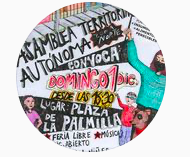
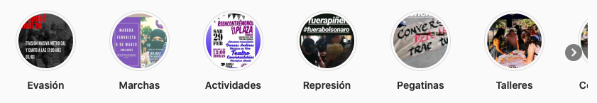
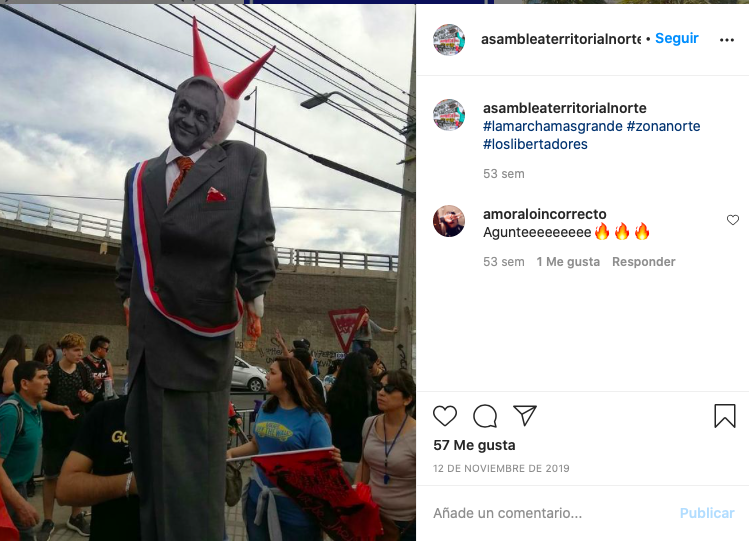

#### FOLIO: CCH5
# Asamblea Territorial Autonoma Zona Norte

[instagram](https://www.instagram.com/asambleaterritorialnorte/)

---

### Representantes
#### 
No señalan tener representantes.

---
### Interacciones frecuentes
#### 
No señalan tener interacciones con otras organizaciones.

### Redes sociales
#### ¿Para qué se utiliza la red social?
| Instagram | 
|---|
|Difusión de informacion y actividades|

### **Instagram**
| seguidores | seguidos | publicaciones | hashtag 
|---|---|---|---|
|613|519|53| 0

---

* **Actividad:**   
* Primera Publicación IG: 17/11/2019 
ESTAN INACTIVOS DESDE EL **30/03/2020**

---
### Frecuencia de publicación.

* Publicaciones: Mensual (4 veces por mes)
* Actividades: Mensual

---
### Ubicación
* Plaza La Palmilla / metro cardenal caro

---
### Describir temas de interés y/o trabajo
* Autoformación
* Vinculación territorial y vecinal

---
### Describir la imagen ideal por la cual se trabaja.
#### (El horizonte hacia el cual se quiere avanzar.)
> Seguiremos luchando en nuestros territorios por una vida más digna

---
### ¿Que se hace?
#### (Manifestaciones, marchas, intervenciones, actividades culturales, conversatorios, intercambio de saberes, actividades solidarias o de apoyo mutuo, abastecimiento, contra información, emplazamiento a autoridades etc.)
* Manifestaciones
    * Cacerolazos
    * Marchas territoriales
    * Concentraciones
    * Velatones
    * Barricadas
* Actividades y jornadas culturales familiares
    * Talleres de verano para niñes
    * Festivales vecinales
    * Jornadas de talleres en la plaza
* Jornadas de agitacion y propaganda
* Conversatorios sobre el proceso constituyente
* Conversatorios sobre tematicas relevantes para el país
* Llamados a marchas feministas
* Asambleas y onces comunitarias

---
### Describir y distinguir demandas más reivindicativas de espacios sin relación con lo contencioso o con lo político mas prefigurativo
#### (lo contencioso; demanda al Estado, a alguna autoridad, privados, etc), (prefigurativo, transformación desde lo cotidiano, etc.).
* Hacia los vecinos, participen y "formen comunidad".

---
### Tipo de organización interna.
#### 
Funcionan como cabildo, tienen muchas actividades autoeducativas y familiares. Deben tener alguna comisión que organice los conversatorios.

---
### Describir los temas / imágenes- iconos / conceptos mas habitualmente presentes en sus publicaciones. Describir cambios/ transformaciones en los contenidos desde Octubre.
El contenido fue constante, siempre invitando a la manifestación y organizacion territorial. También se llamó a aportar en otros territorios para colaborar.

**Iconos:**

**Diseño estético:**
No tienen un diseño estetico fijo, su instagram se compone entre imagenes y infografias. Sin embargo, utilizan las historias destacadas para ordenar las actividades que han realizado.

---
### Percepciones que se tiene del Estado
#### (Aparato burocrático)

---
### Percepciones que se tiene de las Fuerzas de Orden
#### (Aparato represivo)
> Basta de abusos, asesinatos, torturas, mutilaciones por parte de los pacos asesinos.

| Declaraciones | infografía | 
|---|---|
|Anotar los comunicados | [Link]() |

---
### Incorporar aca notas, citas textuales, links, etc. extra a los ya incorporados, que sean de interés para comprender tanto la forma como los contenidos asociados a la organización.
