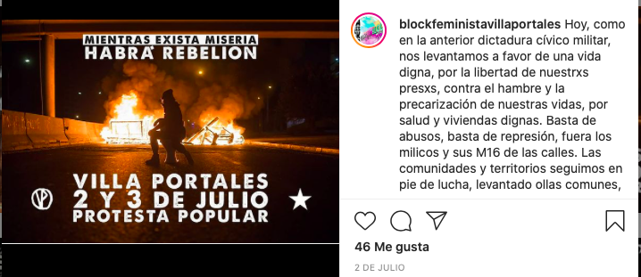
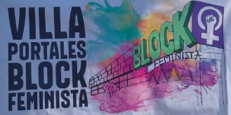

#### FOLIO: ESC1
# Block Feminista Villa Portales

[instagram](https://www.instagram.com/blockfeministavillaportales/)
[whatsapp](+56976018443)
<correo@correo.cl>
---

### Representantes
#### 
No señala tener representantes.

---
### Interacciones frecuentes
#### 
* Asamblea Villa Portales
* Radio 31 de enero
* Coordinadora de organizaciones sociales villa portales
* Coordinadora 18 de octubre

### Redes sociales
#### ¿Para qué se utiliza la red social?
| Instagram | 
|---|
| Difusión de información y actividades|

### **Instagram**
| seguidores | seguidos | publicaciones | hashtag 
|---|---|---|---|
|788|300|100| 0

---
* **Actividad:**   
* Primera Publicación IG: 29/03/2020

---
### Frecuencia de publicación.
* Publicaciones: semanal (1/2 veces)
* Actividades: semanal

---
### Ubicación
* Villa portales

---
### Describir temas de interés y/o trabajo
* Feminismo
* Colaboración mutua entre mujeres

---
### Describir la imagen ideal por la cual se trabaja.
#### (El horizonte hacia el cual se quiere avanzar.)
* Las mujeres del territorio nos levantamos contra toda violencia patriarcal [link](https://www.instagram.com/p/CIFI02Hp4RJ/)

---
### ¿Que se hace?
#### (Manifestaciones, marchas, intervenciones, actividades culturales, conversatorios, intercambio de saberes, actividades solidarias o de apoyo mutuo, abastecimiento, contra información, emplazamiento a autoridades etc.)
* Manifestaciones
    * Barricadas
    * Cacerolazos
    * Marchas territoriales
    * Velatones
* Actividades conmemorativas
    * Día de la joven combatiente
    * 18 octubre
    * Día contra las violencias 
* Intervenciones publicas y virtuales
    * Quema de representaciones de autoridades
    * Muralismo y propaganda
    * Un violador en tu camino
* Olla común villa portales [link](https://www.instagram.com/p/CA71tiaJGlU/)
* Circulos de luna llena
* Campañas solidarias
    * Encomiendas solidarias para la carcel
    * Punto de acopio solidario para presos politicos
    * Convocatoria profesionales a disposicion del pueblo [link](https://www.instagram.com/p/B_u9tmLJ_rh/)
* En red nos cuidamos
    * Mapeo colectivo violencia de género
    * Difusión redes de apoyo
* Difusión de contrainformación
* Creando memorias desde la ventana

* Programa de radio *la insurreccion del bloque*
* Jornadas de protesta popular

---
### Describir y distinguir demandas más reivindicativas de espacios sin relación con lo contencioso o con lo político mas prefigurativo
#### (lo contencioso; demanda al Estado, a alguna autoridad, privados, etc), (prefigurativo, transformación desde lo cotidiano, etc.).
* Hacia las vecinas mujeres para que se mantengan en contacto estrecho y establezcan redes de apoyo y colaboración

* Hacia las autoridades, emplazandolas por las condiciones de vida del pueblo y la violencia de género vividas por las mujeres 

---
### Tipo de organización interna.
#### 
Asambleismo y horizontalidad

---
### Describir los temas / imágenes- iconos / conceptos mas habitualmente presentes en sus publicaciones. Describir cambios/ transformaciones en los contenidos desde Octubre.
El contenido varia según acontecimientos nacionales como dias conmemorativos y contingencia. Todo su contenido se cruza desde el feminismo y el activismo combatiente en contra la violencia de género. 

**Iconos:**

**Diseño estético:**
No hay diseño estetico fijo, utilizan colores negro y morado principalmente. Comparten imagenes propias, sumadas a fotografias/videos e informaciones de otras organizaciones.

---
### Percepciones que se tiene del Estado
#### (Aparato burocrático)
> Gobierno asesino y criminal.

| Declaraciones | infografía | 
|---|---|
|Anotar los comunicados | [Link]() |

---
### Percepciones que se tiene de las Fuerzas de Orden
#### (Aparato represivo)
> *un día para asesinxs, violadorxs y torturadorxs*

| Declaraciones | infografía | 
|---|---|
|Anotar los comunicados | [Link]() |

---
### Incorporar aca notas, citas textuales, links, etc. extra a los ya incorporados, que sean de interés para comprender tanto la forma como los contenidos asociados a la organización.
* Mapeo colectiva: Violencias de género en el territorio [link](https://docs.google.com/forms/d/e/1FAIpQLSeyuhevSoS327z537BJdGU6rKhDacDnPhEYDrFc3qcF6tYClA/viewform)

* Particiopan de la radio 31 de enero [link](https://radio31deenero.org)

* *Manteniendo el fuego encendido* [link](https://www.instagram.com/p/B-lUBDgJghX/)