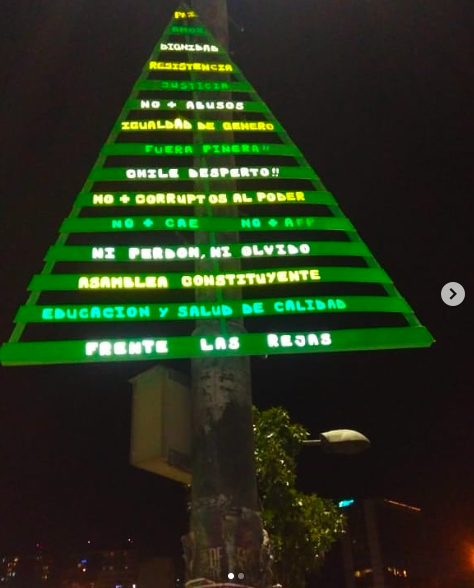
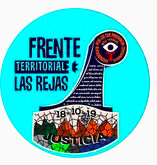
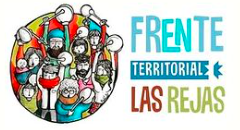
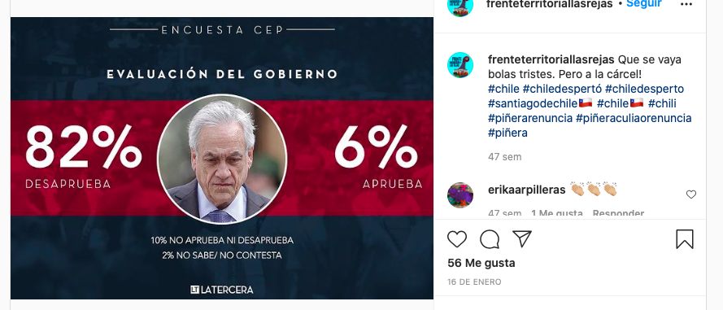
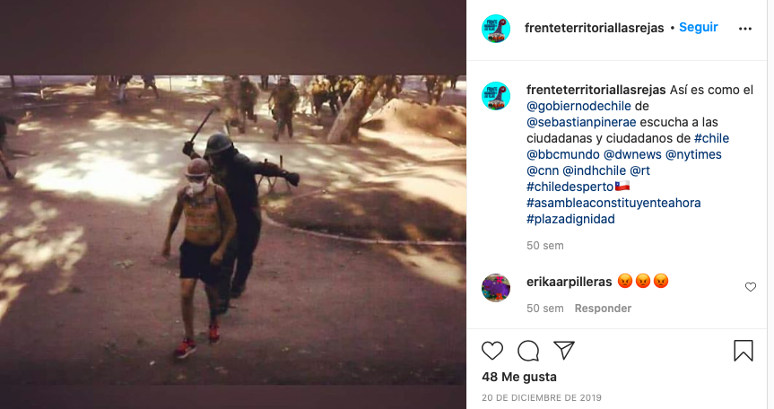

#### FOLIO: ESC2
# Frente Territorial Las Rejas

[instagram](https://www.instagram.com/frenteterritoriallasrejas/)
[facebook](https://www.facebook.com/Frente-Territorial-Las-Rejas-106460637799058/)

---

### Representantes
#### 
No señalan tener representantes.

---
### Interacciones frecuentes
#### 
* JJVV Las Rejas
* Patrimonio las rejas

### Redes sociales
#### ¿Para qué se utiliza la red social?
| Instagram | Facebook | Twitter | Otra 
|---|---|---|---|
|0|0|0| 0|

### **Instagram**
| seguidores | seguidos | publicaciones | hashtag 
|---|---|---|---|
|1830|515|209| 0

---
* **Actividad:**   
* Primera Publicación IG: 28/11/2019

---
### Frecuencia de publicación.
* Publicaciones: semanal (2/3)
* Actividades: semanal

---
### Ubicación
* sector parque alameda / varsovia 65A

---
### Describir temas de interés y/o trabajo
* Colaboracion y apoyo mutuo vecinal
* Organizacion territorial
* ALimentación

---
### Describir la imagen ideal por la cual se trabaja.
#### (El horizonte hacia el cual se quiere avanzar.)
> Nacimos por la semilla de la revuelta social, buscamos el empoderamiento del territorio y seguimos en constante lucha x la dignidad.

---
### ¿Que se hace?
#### (Manifestaciones, marchas, intervenciones, actividades culturales, conversatorios, intercambio de saberes, actividades solidarias o de apoyo mutuo, abastecimiento, contra información, emplazamiento a autoridades etc.)
* Olla común
    * Preparación y entrega de alimentos
    * Acopio de alimentos no percecibles
* Once solidaria
* Campañas de acopio para cajas famimliares
* Jornadas de protesta *por el pan, salud, pensiones y trabajo*
    * Cicletadas
    * Cacerolazos
    * Marchas territoriales
    * Cicletadas
    * Intervenciones publicas
* Actividades conmemorativas
* Acciones por el proceso constituyente
* Difusión de infografias sobre elproceso constituyente
* Jornadas culturales y familiares
    * Pasacalles
    * Feria dignidad (6 versiones)
    * Viernes musicales
* Contrainformación
* Emplazamiento a autoridades
    * Covid
    * Situacion pueblo
* Huerto comunitario
* Asambleas y reuniones presenciales
* Intervencion navideña

* Talleres de primeros auxilios (5 jornadas)
* Apoyo y manifestacion causas mapuche

---
### Describir y distinguir demandas más reivindicativas de espacios sin relación con lo contencioso o con lo político mas prefigurativo
#### (lo contencioso; demanda al Estado, a alguna autoridad, privados, etc), (prefigurativo, transformación desde lo cotidiano, etc.).
* Hacia los vecinos para que se organicen y participen, se presentan como una organizacion de colaboracion y apoyo para su comunidad.

* Hacia las autoridades, las emplaza para que realicen acciones que favorezcan al pueblo.

---
### Tipo de organización interna.
#### 
Asambleismo y horizontalidad. Deben trabajar en comisiones de olla común, diseño, etc.

---
### Describir los temas / imágenes- iconos / conceptos mas habitualmente presentes en sus publicaciones. Describir cambios/ transformaciones en los contenidos desde Octubre.
Su contenido comienza con actividades vinculadas al reconocimiento de la comunidad y la apropiación del espacio publico. Cuando llega la crisis sociosanitaria su contenido se enfoca en la alimentación comenzando acciones como ollas comunes, acopio de alimentos y campañas solidarias. También se posicionan en una constante critica hacia el gobierno y su actuar. No publican desde el 28/11/2020.

**Iconos:**
Tienen un logo de icono y otro para sus imagenes.

**Diseño estético:**
No tienen un diseño estético fijo pero utilizan imagenes que le pertenecen a la organizacion tanto en diseño como fotos sacadas. lo más probable es que utilicen alguna plataforma para hacerlas.

También tienen ordenadas algunas actividades en sus historias destacadas.

---
### Percepciones que se tiene del Estado
#### (Aparato burocrático)
> resumen de lo encontrado

---
### Percepciones que se tiene de las Fuerzas de Orden
#### (Aparato represivo)
> resumen de lo encontrado

---
### Incorporar aca notas, citas textuales, links, etc. extra a los ya incorporados, que sean de interés para comprender tanto la forma como los contenidos asociados a la organización.
* Comunicado para solicitar donaciones para la olla común [link](https://www.instagram.com/p/CFTEfy0JG9c/)

* Esta organizacion es **intracomunal** y engloba las comunas de Quinta Normal, Lo Prado y Estación Central.

* Cuadernillo del FRENTE LAS REJAS. En este expresan sus prinicipios y sus objetivos.
[link](https://www.instagram.com/p/CIE6UR6Jdq6/)

* La olla común funciona los miercoles y las onces solidarias se realizan los sabados.