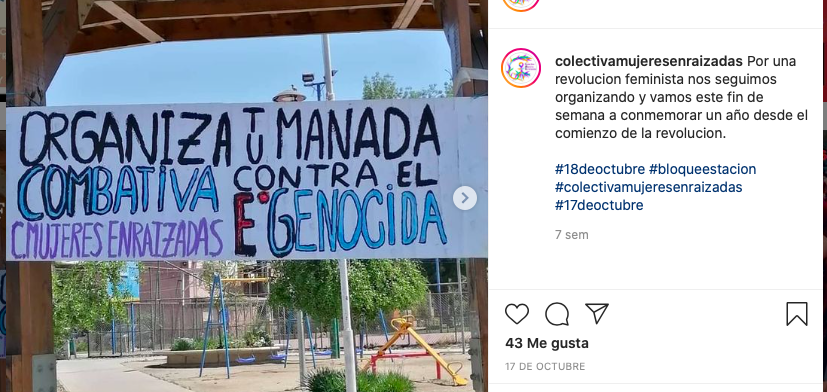
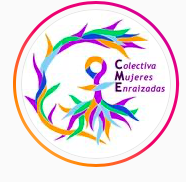

#### FOLIO:
# Colectiva Mujeres Enraizadas

[instagram](https://www.instagram.com/colectivamujeresenraizadas/)

---

### Representantes
#### 
No señalan tener representantes

---
### Interacciones frecuentes
#### 
* Bloque estacion central
* asamblea alessandri

### Redes sociales
#### ¿Para qué se utiliza la red social?
| Instagram | 
|---|
|Difusión de información y actividades|

### **Instagram**
| seguidores | seguidos | publicaciones | hashtag 
|---|---|---|---|
|1250|1148|83| 0

---

* **Actividad:**   
* Primera Publicación IG: 05/06/2020

---
### Frecuencia de publicación.
* Publicaciones: semanal (2/3)
* Actividades: semanal

---
### Ubicación
* JJVV plaza pueblo hundido villas las americas (olla común)
* Plaza del coco Quillayes / Las Araucarias

---
### Describir temas de interés y/o trabajo
* Feminismo
* Alimentación
* Redes de apoyo mutuo y colaboración

---
### Describir la imagen ideal por la cual se trabaja.
#### (El horizonte hacia el cual se quiere avanzar.)
> Nos reunimos por la lucha de las demandas feministas de nuestro territorio con un enfoque interseccional que considera nuestras diferentes resistencias.
*La revolución será feminista o no será*

---
### ¿Que se hace?
#### (Manifestaciones, marchas, intervenciones, actividades culturales, conversatorios, intercambio de saberes, actividades solidarias o de apoyo mutuo, abastecimiento, contra información, emplazamiento a autoridades etc.)
* Manifestaciones
    * Intervenciones publicas
    * Acciones virtuales
    * Funas
    * Cacerolazos
    * Jornadas de agitacion y propaganda 
    * Barricadas
* Olla común
    * Entrega y preparacion de alimentos
* Campañas solidarias
    * Donacion de alimentos a familias
    * Acopio alimentos para la olla
    * Donaciones monetarias para la olla
    * Entrega de productos de higiene menstrual
* Actividades familiares virtuales
    * Dibujando en pandemia
* Difusión de emprendimientos
* Emplazamiento a las ministras SERNAMEG
* Difusión de noticias y juicios de violadores/abusadores
* Actividades conmemorativas
* Apoyo a las causas mapuche
* Comunicado y posturas sobre conyuntura

---
### Describir y distinguir demandas más reivindicativas de espacios sin relación con lo contencioso o con lo político mas prefigurativo
#### (lo contencioso; demanda al Estado, a alguna autoridad, privados, etc), (prefigurativo, transformación desde lo cotidiano, etc.).
* Hacia mujeres y disidencias, se presentan con una declaracion de principios.

* Interpelan a las autoridades, a los *machos* agresores y a todes quienes violenten a las minorias de género.

---
### Tipo de organización interna.
#### 
Asambleismo y horizontalidad. Deben trabajar en comisiones porque levantaron trabajo en una olla común hasta mediados de noviembre.

---
### Describir los temas / imágenes- iconos / conceptos mas habitualmente presentes en sus publicaciones. Describir cambios/ transformaciones en los contenidos desde Octubre.
Su contenido en instagram nace desde la alimentación y el feminismo, interseccionalidad de las problematicas. Incorporan elementos como las funas y los emplazamientos a autoridades.

**Iconos:**

**Diseño estético:**
Utilizan colores morados en la mayoria de sus publicaciones. No hay una linea gráfica fija, sin embargo, las publicaciones de la olla común siguen un mismo esquema.

Tienen historias destacadas con sus principios, comunicados y emprendimientos.

---
### Percepciones que se tiene del Estado
#### (Aparato burocrático)
> Merecemos una ministra que luche por lo que nos han quitado por siglos y no nos conformamos con menos.

|PANCARTA CONTRA GOBIERNO | [Link](https://www.instagram.com/p/CBOMN-8gszG/) |
|NO TENEMOS MINISTRA | |

---
### Percepciones que se tiene de las Fuerzas de Orden
#### (Aparato represivo)
> Policia criminal que usa de manera desmedida la fuerza. Reprimen al pueblo. Persiguen a las personas con pruebas falsas.

| Declaraciones | infografía | 
|---|---|
|MANIFESTACIONES 02/07/2020 | [Link](https://www.instagram.com/p/CCKmmNDJGOp/) |

---
### Incorporar aca notas, citas textuales, links, etc. extra a los ya incorporados, que sean de interés para comprender tanto la forma como los contenidos asociados a la organización.
* COMUNICADO SOBRE LOS HECHOS DE VIOLENCIA HACIA EL PUEBLO DEL 07/08/2020 [LINK](https://www.instagram.com/p/CDwV7_Mp_wi/)

* POSTURA SOBRE EL PLEBISCITO 25/10/2020 [LINK](https://www.instagram.com/p/CGtAIQdJB4K/)