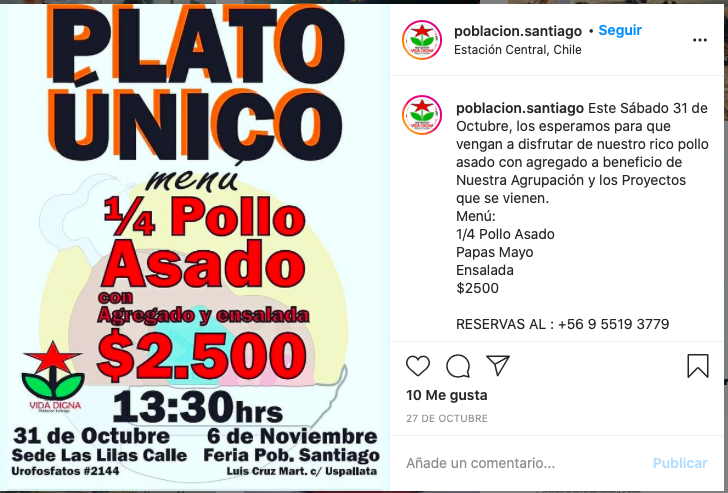
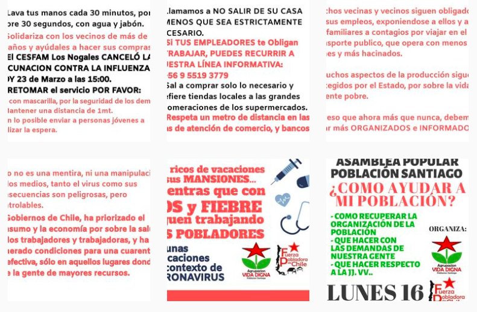
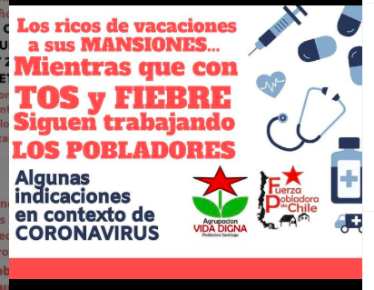
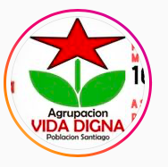

#### FOLIO: ESC4
# Agrupación Vida Digna Población Santiago

[instagram](https://www.instagram.com/poblacion.santiago/)
[facebook](https://www.facebook.com/profile.php?id=100036579343737)
<vida.digna.santiago@gmail.com>

---

### Representantes
#### 
No señalan tener representantes

---
### Interacciones frecuentes
#### 
* Fuerza pobladora de chile

### Redes sociales
#### ¿Para qué se utiliza la red social?
| Instagram | Facebook | 
|---|---|
|Difusión de información y actividades. Activismo.|Videos en vivo|

### **Instagram**
| seguidores | seguidos | publicaciones | hashtag 
|---|---|---|---|
|187|172|81| 0

---

* **Actividad:**   
* Primera Publicación IG: 27/01/2020

---
### Frecuencia de publicación.
* Publicaciones: semanal (2/3)
* Actividades: semanal

---
### Ubicación
* plaza uspallata con luis cruz martinez

---
### Describir temas de interés y/o trabajo
* Apropiación del espacio publico
* Colaboración y apoyo mutuo
* "Resistencia ante el desgobierno"

---
### Describir la imagen ideal por la cual se trabaja.
#### (El horizonte hacia el cual se quiere avanzar.)
* La vida digna para el poblador y la pobladora. Derechos sociales garantizados.

---
### ¿Que se hace?
#### (Manifestaciones, marchas, intervenciones, actividades culturales, conversatorios, intercambio de saberes, actividades solidarias o de apoyo mutuo, abastecimiento, contra información, emplazamiento a autoridades etc.)
* Activismo y muralismo
* Campañas en contra del plebiscito *yo no voto, me organizo*
* Asambleas informativas
* Actividades de conmemoracion con muralismo y protesta
* Regeneración del espacio publico
* Plato unico (2 versiones)

* Olla popular
    * Preparación y entrega de alimentos
* Muralismo popular
* Comparsas de aniversario
* Venta de empanadas a beneficio
* Jornadas de agitacion y propaganda
* Manifestaciones
    * Cacerolazos
    * Barricadas
    * Funa a alcaldia [link](https://www.instagram.com/p/CCe9NCHpsZV/)
* Emplazamiento autoridades locales
* Red de abasteciiento popular
* Declaraciones publicas y acciones colectivas
* Boletines informativos y jornadas solidarias de información *el sanguchito, lo que pasa en la pobla*
* INFOGRAFÍAS COVID
    * ¿Cómo ayudar a mi población con el covid?
    

    

---
### Describir y distinguir demandas más reivindicativas de espacios sin relación con lo contencioso o con lo político mas prefigurativo
#### (lo contencioso; demanda al Estado, a alguna autoridad, privados, etc), (prefigurativo, transformación desde lo cotidiano, etc.).
* Hacia los vecinos para que se organicen
> Unión, conciencia y organización

* Emplaza a las autoridades nacionales pero más aún a las locales, emplazan directamente al alcalde de est central [link](https://www.instagram.com/p/CBmMQX8pj9T/)

---
### Tipo de organización interna.
#### 
Podrían tener vocerias o comisiones de trabajo, lo más probable es que provengan de otra organizacion como **fuerza pobladora de chile** porque son parte.

---
### Describir los temas / imágenes- iconos / conceptos mas habitualmente presentes en sus publicaciones. Describir cambios/ transformaciones en los contenidos desde Octubre.
Su contenido ha variado segun los acontecimientos en la comuna y la situacion sociosanitaria.
Parten como extension de otra organizacion más nacional y ellos van conformando su repertorio de resistencia y disputa segun demandas sociales del territorio en particular. 

**Iconos:**

**Diseño estético:**
Utilizan colores rojos y negros. No tienen un diseño estetico fijo, sino que utilizan los mismos colores casi siempre. Tambien comparten fotografias y videos.

---
### Percepciones que se tiene del Estado
#### (Aparato burocrático)
> Tienen una posicion anti autoridades y partidos politicos, no confian en sus intenciones y señalan que siempre irán a beneficiar al empresariado. Por lo mismo, llamaban a no participar del plebiscito constituyente del 25/10.

| Declaraciones | infografía | 
|---|---|
|Anotar los comunicados | [Link]() |
|PROPAGANDA MARZO 2020 [link](https://www.instagram.com/p/B84tvulHeny/) |  |

---
### Percepciones que se tiene de las Fuerzas de Orden
#### (Aparato represivo)
> no señalan posicion.

| Declaraciones | infografía | 
|---|---|
|Anotar los comunicados | [Link]() |

---
### Incorporar aca notas, citas textuales, links, etc. extra a los ya incorporados, que sean de interés para comprender tanto la forma como los contenidos asociados a la organización.
