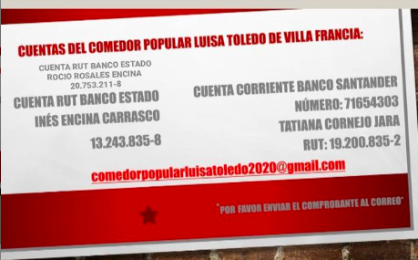
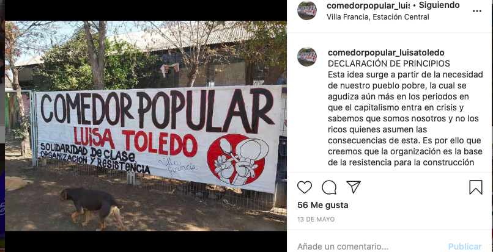
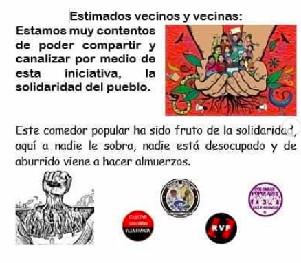

#### FOLIO: ESC5
# Comedor Popular Luisa Toledo

[instagram](https://www.instagram.com/comedorpopular_luisatoledo/)
[facebook](https://www.facebook.com/comedorpopular.luisatoledo.5)
<comedorpopularluisatoledo2020@gmail.com>

---

### Representantes
#### 
No señala tener representantes.

---
### Interacciones frecuentes
#### 
* Radio villa francia
* Asamblea villa francia

### Redes sociales
#### ¿Para qué se utiliza la red social?
| Instagram | Facebook |
|---|---|
|Difusión de actividades e informaciones| Es un perfil cerrado|

### **Instagram**
| seguidores | seguidos | publicaciones | hashtag 
|---|---|---|---|
|1038|48|45| 0

---

* **Actividad:**   
* Primera Publicación IG: 13/05/2020. Están inactivas en instagram desde el 08/08 que hicieron una caravana por el dia del niño. **En facebook siguen activos**.

---
### Frecuencia de publicación.
* Publicaciones:
* Actividades:

---
### Ubicación
* calle las estepas, villa francia

---
### Describir temas de interés y/o trabajo
* Alimentación
* Solidaridad de clases y entre vecinos

---
### Describir la imagen ideal por la cual se trabaja.
#### (El horizonte hacia el cual se quiere avanzar.)
> Esta idea surge a partir de la necesidad de nuestro pueblo pobre, la cual se agudiza aún más en los periodos en que el capitalismo entra en crisis y sabemos que somos nosotros y no los ricos quienes asumen las consecuencias de esta. Es por ello que creemos que la organización es la base de la resistencia para la construcción del poder popular. 

---
### ¿Que se hace?
#### (Manifestaciones, marchas, intervenciones, actividades culturales, conversatorios, intercambio de saberes, actividades solidarias o de apoyo mutuo, abastecimiento, contra información, emplazamiento a autoridades etc.)
* Olla común
    * Entrega de alimentos
    * Preparacion de alimentos
* Campañas de donaciones monetarias
* Difusión de protesta popular
* Campañas de ventas de poleras para recaudar fondos
* Acciones por el día del niño y niña

---
### Describir y distinguir demandas más reivindicativas de espacios sin relación con lo contencioso o con lo político mas prefigurativo
#### (lo contencioso; demanda al Estado, a alguna autoridad, privados, etc), (prefigurativo, transformación desde lo cotidiano, etc.).
* Hacia los vecinos de villa francia
> lo nuestro es una articulación que se fundamenta en la fraternidad, horizontalidad, transversalidad y sobretodo en la solidaridad de clase, solo el pueblo ayuda verdadera y des interesadamente al pueblo.

---
### Tipo de organización interna.
#### 
horizontalidad, podrian haber comisiones de trabajo para la preparacion de la comida y su entrega.

cuentas para donar:

---
### Describir los temas / imágenes- iconos / conceptos mas habitualmente presentes en sus publicaciones. Describir cambios/ transformaciones en los contenidos desde Octubre.
Su contenido solo se enfoca en la alimentación, a veces difunde otro tipo de contenido pero muy pocas veces.

**Iconos:**
No tienen icono, su foto es un mural que ellos hicieron en el lugar donde reparten y cocinan el alimento.

**Diseño estético:**
No suben muchas imagenes diseñadas, las que suben no les pertenecen. Suben fotos mayoritariamente.

---
### Percepciones que se tiene del Estado
#### (Aparato burocrático)
> no señalan percepciones

| Declaraciones | infografía | 
|---|---|
|Anotar los comunicados | [Link]() |

---
### Percepciones que se tiene de las Fuerzas de Orden
#### (Aparato represivo)
> Represores del pueblo, quienes solo defienden a los poderosos y a este sistema salvaje.

| Declaraciones | infografía | 
|---|---|
|REPRESIÓN EN VILLA FRANCIA | [Link](https://www.instagram.com/p/CCKlQHzpuyx/) |

---
### Incorporar aca notas, citas textuales, links, etc. extra a los ya incorporados, que sean de interés para comprender tanto la forma como los contenidos asociados a la organización.
* seria muy interesante mirar el facebook y analizarlo, siento que por la brecha de edad entre quienes usan facebook e instagram las personas se deben sentir mas comoda utilizando la otra red social.