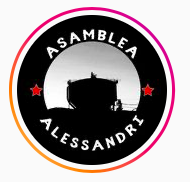

#### FOLIO: ESC6
# Asamblea Villa Alessandri Desperto

[instagram](https://www.instagram.com/alessandridesperto/)
[facebook](https://www.facebook.com/Asamblea-Villa-Alessandri-Desperto-101940658198015)

---

### Representantes
#### 
No señalan tener representantes.

---
### Interacciones frecuentes
#### 
* Cordón territorial las rejas
* Colectivo de mujeres enraizadas
* Panaderia popular elefante blanco

### Redes sociales
#### ¿Para qué se utiliza la red social?
| Instagram | Facebook | 
|---|---|
|Difusión de informaciones y actividades|Difusion de infromacion, actividades y videos en vivo|

### **Instagram**
| seguidores | seguidos | publicaciones | hashtag 
|---|---|---|---|
|604|631|186| 0

---

* **Actividad:**   
* Primera Publicación IG: 04/02/2020

---
### Frecuencia de publicación.
* Publicaciones: semanal (1/2)
* Actividades: semanal

---
### Ubicación
* plaza del colo / calle luis infante cerda

---
### Describir temas de interés y/o trabajo
* Organización vecinal
> Vecinos/as que se reunen a conversar, discutir y deliberar problemas locales en el territorio común

---
### Describir la imagen ideal por la cual se trabaja.
#### (El horizonte hacia el cual se quiere avanzar.)
* Organizacion vecinal y territorial para un mejor vivir, soñar el territorio y la vida que deseamos para el futuro [link](https://www.instagram.com/p/CHyu7eoJ9Sx/)

---
### ¿Que se hace?
#### (Manifestaciones, marchas, intervenciones, actividades culturales, conversatorios, intercambio de saberes, actividades solidarias o de apoyo mutuo, abastecimiento, contra información, emplazamiento a autoridades etc.)
* Actividades conmemorativas
    * Acto politicos culturales de conmemoracion
* Campaña de redistribucion de mercaderia *apañando a la pobla*
* Rifas solidarias y de autogestion
* Olla común 
    * Entrega y preparacion de alimentos
    * Recolección de mercaderia [link](https://www.instagram.com/p/CDPcQo8J2SF/)

* Jornadas de apoyo al sindicato de colegios lecaros 
* Jornadas de agitación y propaganda
* Emplazamiento a la alcaldia de estacion central
* Manifestaciones
    * Cacerolazos
    * barricadas
    * Concentraciones
    * Marchas territoriales
* Jornadas de reflexion sobre *lo que queremos* para la asamblea
* Boletín informativos de la pobla para la pobla
* Protesta y cacerolazos contra la justicia patriarcal
* Lanzamientos de documentales
* Conversatorios en la población alessandri
    * Charlas estallido social y proceso constituyente
    * Jornadas culturales
    * Actividades para niños

---
### Describir y distinguir demandas más reivindicativas de espacios sin relación con lo contencioso o con lo político mas prefigurativo
#### (lo contencioso; demanda al Estado, a alguna autoridad, privados, etc), (prefigurativo, transformación desde lo cotidiano, etc.).
* Hacia los vecinos porque la organizacion y la participación es importante para la transformación de la vida. Apoyo y colaboracion de la pobla hacia la pobla

* Interpelan a las autoridades locales y policias que están en la población.

---
### Tipo de organización interna.
#### 
Asambleismo y horizontalidad. Deben trabajar por comisiones como la olla común, actividades, etc.

---
### Describir los temas / imágenes- iconos / conceptos mas habitualmente presentes en sus publicaciones. Describir cambios/ transformaciones en los contenidos desde Octubre.
Su contenido ha variado porque se focalizaron en el funcionamiento de la olla común. Cabe señalar que no dejan de lado actividades de solidaridad y de organizacion territorial.

**Iconos:**

**Diseño estético:**
No tienen un diseño estético fijo, sin embargo, tienen esto como historias destacadas. 

---
### Percepciones que se tiene del Estado
#### (Aparato burocrático)
> Gobierno criminal que no le interesa el pueblo, solo mandar a reprimir.

| Declaraciones | infografía | 
|---|---|
|Anotar los comunicados | [Link]() |

---
### Percepciones que se tiene de las Fuerzas de Orden
#### (Aparato represivo)
> Accionar criminal. "A ola de delincuencia desclasada y el excesivo uso de la fuerza por el aparato represivo del estado"

| Declaraciones | infografía | 
|---|---|
|CACEROLAZO POR EL DERECHO A VIVIR EN PAZ | [Link](https://www.instagram.com/p/B_h6y3VpLdg/) |

---
### Incorporar aca notas, citas textuales, links, etc. extra a los ya incorporados, que sean de interés para comprender tanto la forma como los contenidos asociados a la organización.
* Registroo de carabineros destuyendo las cintas que se pegaron en las afueras de la comisaria [link](https://www.instagram.com/p/CE-XHaSJs2S/)