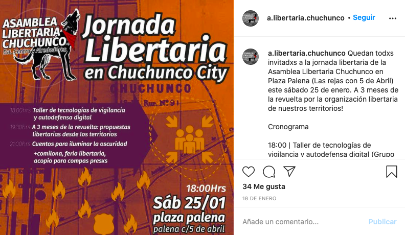
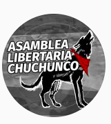
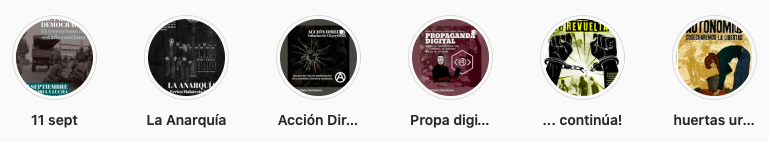
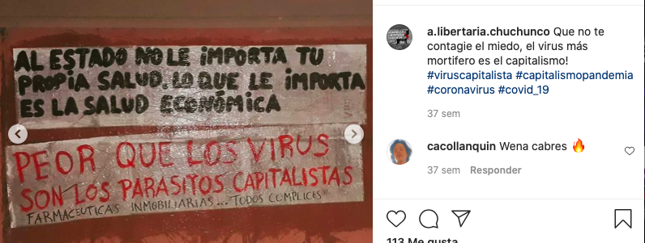

#### FOLIO: ESC7
# Asamblea Libertaria Chuchunco

[instagram](https://www.instagram.com/a.libertaria.chuchunco/)
[facebook](https://www.facebook.com/a.libertaria.chuchunco)
[Pagina web](https://linktr.ee/a.libertaria.chuchunco)
<asamblealibertariachuchunco@riseup.net>
---

### Representantes
#### 
No señalan tener representantes

---
### Interacciones frecuentes
#### 
* Asamblea anarquista autoconvocada estacion central y alrededores
* Coordinadora Asambleas territoriales
* Asamblea libertaria cordillera

### Redes sociales
#### ¿Para qué se utiliza la red social?
| Instagram | Facebook | Pag web |
|---|---|---|
|Difusión de información y actividades|Informacion, actividades y videos en vivo| Material de interés sobre la asamblea|

### **Instagram**
| seguidores | seguidos | publicaciones | hashtag 
|---|---|---|---|
|1630|309|67| 0

---

* **Actividad:**   
* Primera Publicación IG: 03/12/2019

---
### Frecuencia de publicación.
* Publicaciones: semanal (1/2)
* Actividades: semanal

---
### Ubicación
* palena c/ 5 de abril

---
### Describir temas de interés y/o trabajo
* Organizacion anarquista
* Apoyo mutuo

---
### Describir la imagen ideal por la cual se trabaja.
#### (El horizonte hacia el cual se quiere avanzar.)
>  la asamblea se plantea como una herramienta de la comunidad en lucha, un espacio que nos permita organizarnos sin mediación de líderes, dirigentes ni partidos políticos, desde lxs principios e ideas anarquistas, es decir, a partir de la horizontalidad, autonomía, el apoyo mutuo y la autogestión.

---
### ¿Que se hace?
#### (Manifestaciones, marchas, intervenciones, actividades culturales, conversatorios, intercambio de saberes, actividades solidarias o de apoyo mutuo, abastecimiento, contra información, emplazamiento a autoridades etc.)
* Asamblea libertaria chuchunco (4 versiones)
    * Conversatorios y talleres
    * Comilona comunitaria
    * Feria libertaria
* Pasacalles
* Jornadas de agitación
* Jornadas libertarias en chuchunco city

* Asamblea abierta de formacion anarquista *ciclos de autoformación*
* Difusión de congreso anarquista
* Jornadas reflexivas sobre el proceso constituyente
* Actividades conmemorativas
* Manuales de activismo digital seguro
* Difusión de contrainformación anarquista, manuales para usar redes sociales [link](https://www.instagram.com/p/CABXRhKJ7It/)
* Difusión de informaciones varias sobre activismo
* Huerto comunitario
* Panaderia comunitaria
* Boletín chuchunco city [link](https://www.instagram.com/p/CCRKT59JneA/)

---
### Describir y distinguir demandas más reivindicativas de espacios sin relación con lo contencioso o con lo político mas prefigurativo
#### (lo contencioso; demanda al Estado, a alguna autoridad, privados, etc), (prefigurativo, transformación desde lo cotidiano, etc.).
* Hacia los vecinos y la población en general, que se organicen contra el Estado. Potenciando la independencia de las asambleas territoriales y su poder transformador.

---
### Tipo de organización interna.
####
Horizontalidad. Se declaran anarquistas y trabajan a la par con otra organizacion ubicada en el sur de santiago.

---
### Describir los temas / imágenes- iconos / conceptos mas habitualmente presentes en sus publicaciones. Describir cambios/ transformaciones en los contenidos desde Octubre.
El contenido se transforma porque no se puedne juntar de forma presencial. Siempre realizan acciones de propaganda en el sector y comienzan a realizar inforgrafias informativas con contenido que les hace sentido desde su *perpectiva anarquista*.

**Iconos:**

**Diseño estético:**
No tienen un diseño estetico fijo, sin embargo,utilizan colores similares siempre (rojo/negro). Por otra parte, ordenan sus actividades en las historias destacadas.

---
### Percepciones que se tiene del Estado
#### (Aparato burocrático)
> Gobierno criminal y asesino.

| Declaraciones | infografía | 
|---|---|
|PROPAGANDA |  |

---
### Percepciones que se tiene de las Fuerzas de Orden
#### (Aparato represivo)
> Opresores y asesinos.

| Declaraciones | infografía | 
|---|---|
|PROPAGANDA |  |

---
### Incorporar aca notas, citas textuales, links, etc. extra a los ya incorporados, que sean de interés para comprender tanto la forma como los contenidos asociados a la organización.
