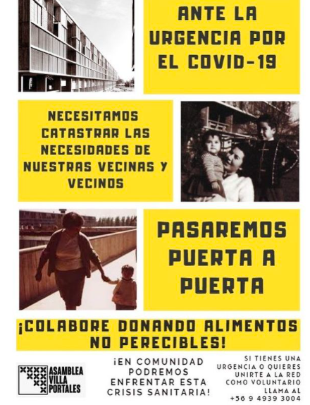
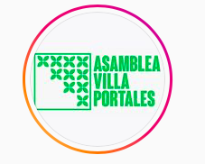

#### FOLIO: ESC8
# Asamblea Villa Portales

[instagram](https://www.instagram.com/asambleavillaportales/)
[facebook](https://www.facebook.com/asamblea.villaportales.cl)
<villaportalesasamblea@gmail.com>
---

### Representantes
#### 
No señalan tener representantes

---
### Interacciones frecuentes
#### 
* Coordinadora de Organizaciones Sociales
* Radio 31 de enero
* JJVV Villa Portales
* Cordón poniente
* CALF : Coordinadora Asambleas La Florida
* Cordón Grecia
* Block feminista villa portales

### Redes sociales
#### ¿Para qué se utiliza la red social?
| Instagram | Facebook | 
|---|---|
|difusión de actividades e informaciones |difusión de actividades e informaciones|

### **Instagram**
| seguidores | seguidos | publicaciones | hashtag 
|---|---|---|---|
|1531|230|197| 0

---

* **Actividad:**   
* Primera Publicación IG: 06/11/2019

---
### Frecuencia de publicación.
* Publicaciones: semanal (3/4)
* Actividades: semanal

---
### Ubicación
* las encinas c/el arrayan / Villa portales

---
### Describir temas de interés y/o trabajo
* Articulación vecinal
* Colaboración y apoyo mutuo

---
### Describir la imagen ideal por la cual se trabaja.
#### (El horizonte hacia el cual se quiere avanzar.)

---
### ¿Que se hace?
#### (Manifestaciones, marchas, intervenciones, actividades culturales, conversatorios, intercambio de saberes, actividades solidarias o de apoyo mutuo, abastecimiento, contra información, emplazamiento a autoridades etc.)
* Talleres de metodologias participativas
* Asambleas abiertas de conversacion politica
* Actividades para niñas y niños
    * Talleres
    * Juegos futbol calle
    * Confeccion de pancartas
* Actividad: solo el pueblo salva al pueblo
* Operativo de terapias complementarias
* Manifestaciones
    * Cacerolazos
    * Barricadas
    * Marchas familiares
    * Concentraciones
    * Pasacalle territorial
    * Cicletadas
* Talleres abiertos para la comunidad
    * Taller sobre ciberdefensa
* Recuperacion del block 20 con huerta comunitaria
* Conversatorios y dialogos sobre tematias diversas como discapacidad, primeros auxilios, etc.
* Peliculas + conversatorios en la villa
* Intervencion de un violador en tu camino STGOAMIL
* Muralismo y serigrafia
* Comisión de abastecimiento / Comprando juntes
* Actividades conmemorativas politico social
* Jornadas feministas
* Catastro block o plaza situación covid

* Programa de radio 31 de enero
* Frente al covid, en comunidad nos cuidamos: Red solidaria villa portales [link](https://www.instagram.com/p/CAGKG_PJ2Wt/)
* Jornadas de profesionales a la ayuda del pueblo
* Lucazo por la villa
* Difusión de infografías de interes
* Campañas solidarias de alimentacion
    * REcolecion de alimentos, articulos de aseo e higiene
    * Olla común block 12
    * acopio solidario para la toma violeta parra
* Huerto comunitario / Jornadas de huerto comunitario
* Persa y feria de la portales
* Jornadas de agitacion por la liberacion de lxs presxs politicxs

---
### Describir y distinguir demandas más reivindicativas de espacios sin relación con lo contencioso o con lo político mas prefigurativo
#### (lo contencioso; demanda al Estado, a alguna autoridad, privados, etc), (prefigurativo, transformación desde lo cotidiano, etc.).
* Hacia los vecinos para que participen de la organizacion y creen una red de colaboración.

* Hacia las autoridades y las policias, las emplazan a que dejen de reprimir al pueblo y que tomen decisiones que le beneficien a la población.

---
### Tipo de organización interna.
#### 
Asambleismo y horizontalidad. Trabajan en comisiones.

---
### Describir los temas / imágenes- iconos / conceptos mas habitualmente presentes en sus publicaciones. Describir cambios/ transformaciones en los contenidos desde Octubre.
Su contenido se focaliza en la organizacion territorial y en el apoyo a los vecinos. Se organizan en torno a la ayuda alimentaria y apoyo a quienes tienen menos movilidad. Por otra parte, se reapropian del espacio publico y realizan actividades para toda la comunidad.

**Iconos:**

**Diseño estético:**
No tienen diseño estético fijo. Comparten imagenes propias, fotos/videos e imagenes de otras organizaciones.

---
### Percepciones que se tiene del Estado
#### (Aparato burocrático)
> cULPA DEL GOBIERNO DEL ACTUAR CRIMINAL QUE TENEN LAS POLICIAS. Exigen su salida. Rechazo a las politicas represivas del Estado

| Declaraciones | infografía | 
|---|---|
|Anotar los comunicados | [Link]() |

---
### Percepciones que se tiene de las Fuerzas de Orden
#### (Aparato represivo)
> Represion por manifestarse en la villa, ataque con perdigones. 

| Declaraciones | infografía | 
|---|---|
|VIOLENCIA POLICIAL EN LA VILLA | [Link](https://www.instagram.com/p/B6WvzAfJtyB/) |
|VIOLENCIA POLICIAL EN LA VILLA | [Link](https://www.instagram.com/p/B6WvmFMpQ3T/) |

---
### Incorporar aca notas, citas textuales, links, etc. extra a los ya incorporados, que sean de interés para comprender tanto la forma como los contenidos asociados a la organización.
