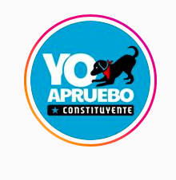
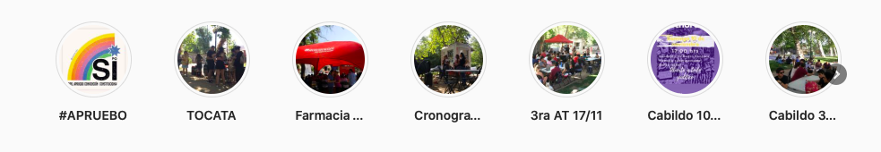

#### FOLIO: HCH1
# HUECHURABA DESPIERTA

[instagram](https://www.instagram.com/huechurabadespierta/)
[facebook](https://www.facebook.com/huechurabadespierta)
[spotify](https://open.spotify.com/show/4hmwfIPFZqR88czMWNuBOg)

---

### Representantes
#### No señalan tener representantes.

---
### Interacciones frecuentes
#### 
* Huechuraba sorora
* Fontova se mueve

### Redes sociales
#### ¿Para qué se utiliza la red social?
| Instagram | Facebook | Spotify
|---|---|---|
|Difusión de información y actividades|Difusión de información, actividades y videos en vivo| Para entretenimiento y conversación de diversos temas|

### **Instagram**
| seguidores | seguidos | publicaciones | hashtag 
|---|---|---|---|
|871|194|45| 0

---

**Actividad:**   
* Primera Publicación IG: se reactivó el 20/10/2019 ytuvieron un receso de diciembre 2019 a marzo 2020.

---
### Frecuencia de publicación.
Publicaciones: mensualmente
Actividades: mensualmente / alto nivel de actividades el 2019, baja en pandemia y se retoma en noviembre.

---
### Ubicación
* Rotonda El Carmen // Bandejon central pedro fontova

---
### Describir temas de interés y/o trabajo
* Dialogo y debate 
* Construcción popular de un mejor vivir

---
### Describir la imagen ideal por la cual se trabaja.
#### (El horizonte hacia el cual se quiere avanzar.)
* Movimiento y acción por huechuraba y para el bienestar de los vecinos y vecinas

---
### ¿Que se hace?
#### (Manifestaciones, marchas, intervenciones, actividades culturales, conversatorios, intercambio de saberes, actividades solidarias o de apoyo mutuo, abastecimiento, contra información, emplazamiento a autoridades etc.)
* Manifestaciones pacificas
    * Cacerolazos
* Actividades culturales y familiares
    * Festivales "fontova suena"
    * Feria libre y jornada cultural
* Acciones solidarias como rifas
* Jornadas de cabildos y asambleas
* Transparencia de resultados de los cabildos
* Difusión de información del proceso constituyente
* Talleres e información sobre feminismo
* Infografías sobre informacion variadas
* Podcast *no somos huechuraba*

---
### Describir y distinguir demandas más reivindicativas de espacios sin relación con lo contencioso o con lo político mas prefigurativo
#### 
* Se dirige a los vecinos para que participen, participación como centro de las transformaciones sociales. 

---
### Tipo de organización interna.
#### 
Horizontalidad. 

---
### Describir los temas / imágenes- iconos / conceptos mas habitualmente presentes en sus publicaciones. Describir cambios/ transformaciones en los contenidos desde Octubre.
Organizacion comienza las publicaciones en el 2016, donde después de un largo receso, vuelve la actividad el 20/10/2019, ahi comienzan a levantar actividades de discusion y debate como cabildos. Luego tienen un receso de diciembre 2019 a marzo 2020.

**Iconos:**
Su icono es sobre la postura del proceso constituyente

Su logo

**Diseño estético:**
No tienen diseño estetico fijo, sin embargo, en su instagram tienen secciones de los cabildos que han tenido.

---
### Percepciones que se tiene del Estado
#### (Aparato burocrático)
> No señalan postura. Solicitan que renuncie piñera.

| Declaraciones | infografía | 
|---|---|
|Anotar los comunicados |  |

---
### Percepciones que se tiene de las Fuerzas de Orden
#### (Aparato represivo)
> No señalan postura.

| Declaraciones | infografía | 
|---|---|
|Anotar los comunicados |  |

---
### Incorporar aca notas, citas textuales, links, etc. extra a los ya incorporados, que sean de interés para comprender tanto la forma como los contenidos asociados a la organización.
* Trabajan con Fontova se Mueve quienes suben información sobre lo que sucede en huechuraba pero no funcionan como asamblea [link](https://www.instagram.com/FONTOVASEMUEVE/)