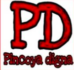
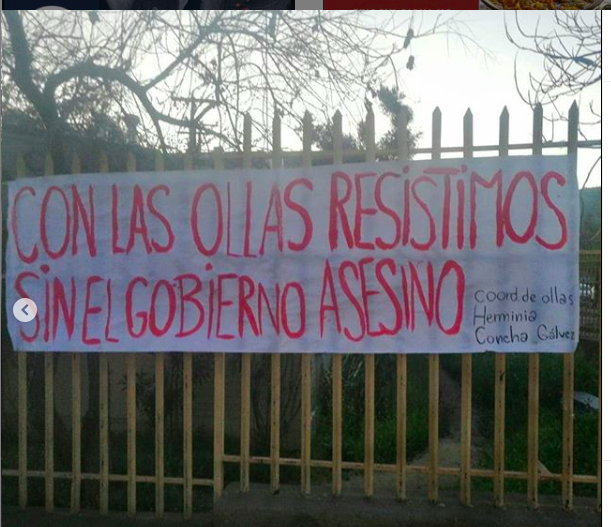
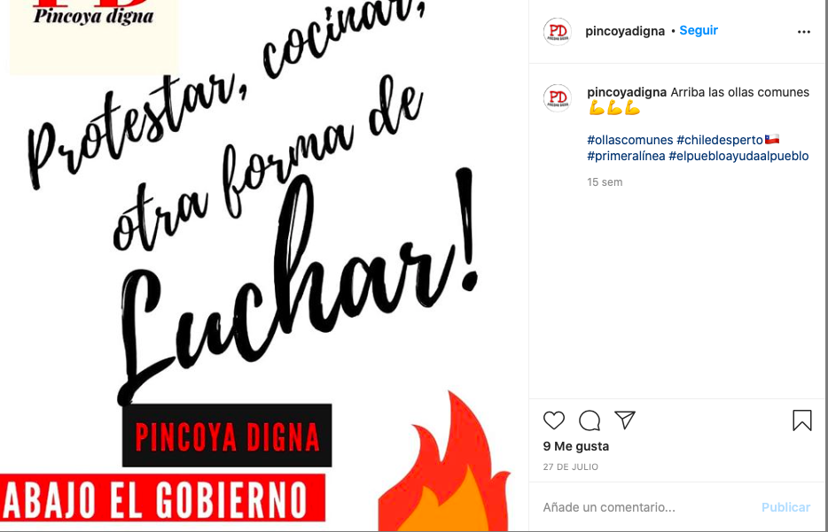
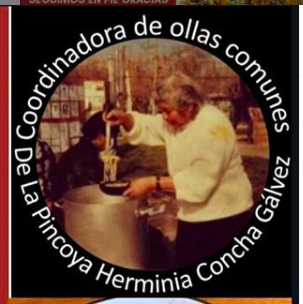
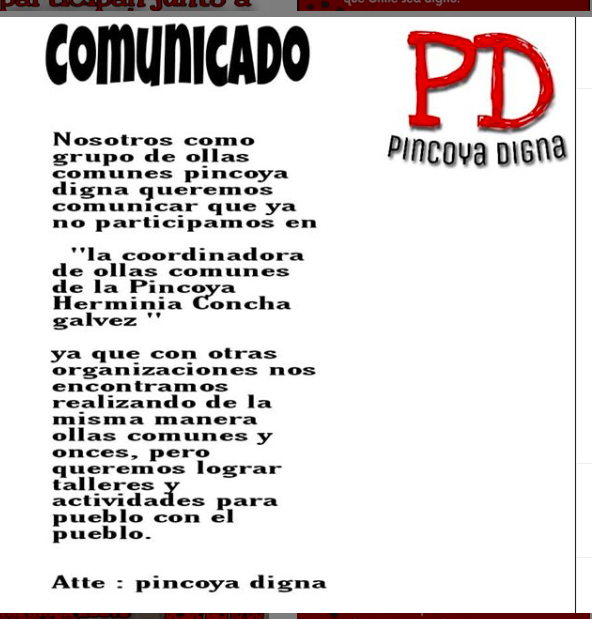
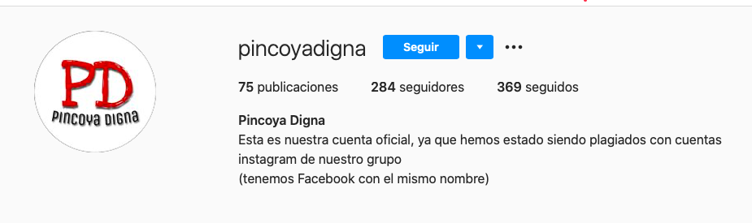

#### FOLIO: HCH2
# PINCOYA DIGNA

[instagram](https://www.instagram.com/pincoyadigna/)
[facebook](https://www.facebook.com/pincoya.digna)

---

### Representantes
#### No señalan tener representantes.

---
### Interacciones frecuentes
####
* Organizaciones populares de la pincoya
* Olla pincolla común

### Redes sociales
#### ¿Para qué se utiliza la red social?
| Instagram | Facebook | 
|---|---|
|Difusión de actividades e información|Tienen muchos facebooks, todos de fechas diferentes y con muchos contactos|

### **Instagram**
| seguidores | seguidos | publicaciones | hashtag 
|---|---|---|---|
|284|369|75| 0

---

* **Actividad:**   
* Primera Publicación IG: 27/07/2020 (señalan que le han cerrado la cuenta un par de veces)

---
### Frecuencia de publicación.
Publicaciones: Semanalmente
Actividades: Semanalmente

---
### Ubicación
* premio nobel con jardin bettemburgo

---
### Describir temas de interés y/o trabajo
* Alimentación
* Cooperacion y colaboración barrial

---
### Describir la imagen ideal por la cual se trabaja.
#### (El horizonte hacia el cual se quiere avanzar.)
* Para vivir el mañana, hay que pelear el ahora
* Con las ollas resistimos un gobierno asesino

---
### ¿Que se hace?
#### (Manifestaciones, marchas, intervenciones, actividades culturales, conversatorios, intercambio de saberes, actividades solidarias o de apoyo mutuo, abastecimiento, contra información, emplazamiento a autoridades etc.)
* Olla común
* Rifas solidarias
* Actividades culturales 
    * Halloween
    * Estallido cultural e la pincoya
* Once común
* Difusión de actividades sobre el proceso constituyente
* Información sobre los presos politicos de la revuelta
* Apoyo mutuo entre ollas comunes
* Solicitud de donaciones y enseres
* Celebración del dia del niño

---
### Describir y distinguir demandas más reivindicativas de espacios sin relación con lo contencioso o con lo político mas prefigurativo
#### (lo contencioso; demanda al Estado, a alguna autoridad, privados, etc), (prefigurativo, transformación desde lo cotidiano, etc.).
* Hacia los vecinos para recibir alimentación y por organizarse *"los que luchan son los mismos que estamos en las ollas comunes" *
* Hacia las autoridades por no hacerse cargo de la situación de crisis alimentaria 

---
### Tipo de organización interna.
#### (Vocerías, asambleísmo, horizontalidad, etc.; *se entiende que esta dimensión es más difícil de captar vía análisis de redes sociales, pero quizás se puede vislumbrar a través de roles/cargos*)

---
### Describir los temas / imágenes- iconos / conceptos mas habitualmente presentes en sus publicaciones. Describir cambios/ transformaciones en los contenidos desde Octubre.

**Iconos:**
Su logo e icono están presente en la mayoria de sus publicaciones

**Diseño estético:**
Utilizan los colores rojo y negro, tienen un diseño estetico similar, a veces tienen imagenes en muy baja calidad.

---
### Percepciones que se tiene del Estado
#### (Aparato burocrático)
> Gobierno no se ha hecho responsable de la crisis alimentaria. Son complices y quieren que la gente *muera*.

| Declaraciones | infografía | 
|---|---|
|Lienzo |   |
|Infografía |   |

---
### Percepciones que se tiene de las Fuerzas de Orden
#### (Aparato represivo)
> No hay postura.

| Declaraciones | infografía | 
|---|---|
|Anotar los comunicados |  |

---
### Incorporar aca notas, citas textuales, links, etc. extra a los ya incorporados, que sean de interés para comprender tanto la forma como los contenidos asociados a la organización.
* Trabajan con una coordinadora de ollas comunes que no he podido ubicar en ninguna red social

* Salida de la coordinadora de ollas comunes

* Tienen muchos facebooks y le han plageado su cuenta de instagram

