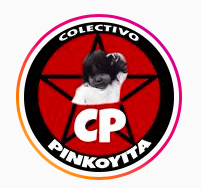
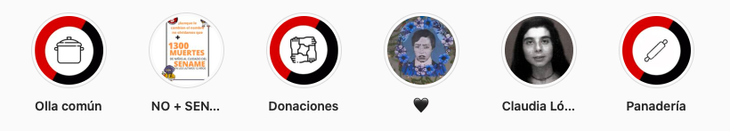
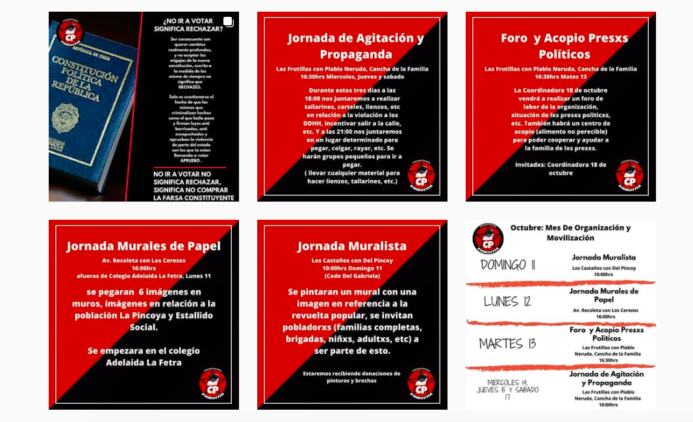

#### FOLIO: HCH3
# Colectivo Pinkoyita

[instagram](https://www.instagram.com/colectivo_pinkoyita/)

---

### Representantes
#### 
No señalan tener representantes.

---
### Interacciones frecuentes
#### 
* Colectiva kuyen

### Redes sociales
#### ¿Para qué se utiliza la red social?
| Instagram | 
|---|
|Difusión de información y actividades|

### **Instagram**
| seguidores | seguidos | publicaciones | hashtag 
|---|---|---|---|
|1093|42|109| 0

---
* **Actividad:**   
* Primera Publicación IG: 28/03/2020

---
### Frecuencia de publicación.

Publicaciones: Semanalmente
Actividades: Semanalmente

---
### Ubicación
* LOS CASTAÑOS / CANCHA DE LA FAMILIA LAS FRUTILLAS CON PABLO NERUDA

---
### Describir temas de interés y/o trabajo
* Alimentación
* Contrainformación
* Formación politica

---
### Describir la imagen ideal por la cual se trabaja.
#### (El horizonte hacia el cual se quiere avanzar.)
* Colaboracion y apoyo mutuo territorial
> Seguiremos en la lucha como hermanxs seguiremos hasta que la dignidas se haga costumbre

---
### ¿Que se hace?
#### (Manifestaciones, marchas, intervenciones, actividades culturales, conversatorios, intercambio de saberes, actividades solidarias o de apoyo mutuo, abastecimiento, contra información, emplazamiento a autoridades etc.)
* Manifestaciones
    * Cacerolazos
    * Jornadas de protesta
* Jornadas de propaganda y agitación
* Olla común "LA DORITA"
* Olla común "LOS PATIPELADOS"
* Panaderia popular "SANDY"
* Información sobre el acontecer nacional
* Acopio solidario para vecinos
* Material de formacion politica en cuarentena
* Colectas solidarias para la olla comun
* Actividades de conmemoración
* Jornadas muralistas
* Llamados a no votar en el plebiscito 
* Campaña cena familiar

---
### HACIA QUIÉN SE DIRIGE Describir y distinguir demandas más reivindicativas de espacios sin relación con lo contencioso o con lo político mas prefigurativo
#### (lo contencioso; demanda al Estado, a alguna autoridad, privados, etc), (prefigurativo, transformación desde lo cotidiano, etc.).
* Hacia los vecinos, organizacion y resistencia territorial ante la crisis. Desconfiar de los procesos institucionales

---
### Tipo de organización interna.
#### 
Horizontalidad y asambleismo. Se organizan por olla común y el colectivo. 

---
### Describir los temas / imágenes- iconos / conceptos mas habitualmente presentes en sus publicaciones. Describir cambios/ transformaciones en los contenidos desde Octubre.
Partió como formación politica y se empezó a transformar en una organizacion ligada a la alimentación popular, apoyo mutuo y colaboración entre vecinos.

**Iconos:**
Es rojo con negro, letras blancas y una fotografia en blanco y negro de un niño.

**Diseño estético:**
Tienen un diseño estetitico fijo, utilizan colores rojos y negros. En la mayoria de sus publicaciones sale su logo. También tienen ciertas actividades que han realizado en sus historias destacadas.

---
### Percepciones que se tiene del Estado
#### (Aparato burocrático)
> Gobierno criminal, han hecho que el pueblo tenga que vivir precarizado.

| Declaraciones | infografía | 
|---|---|
|Anotar los comunicados |  |

---
### Percepciones que se tiene de las Fuerzas de Orden
#### (Aparato represivo)
> Policia represora.

| Declaraciones | infografía | 
|---|---|
|Anotar los comunicados |  |

---
### Incorporar aca notas, citas textuales, links, etc. extra a los ya incorporados, que sean de interés para comprender tanto la forma como los contenidos asociados a la organización.
* Tienen menús de lunes a viernes. Reciben donaciones de otras organizaciones o de comercio local. 