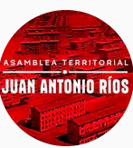
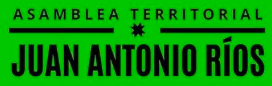
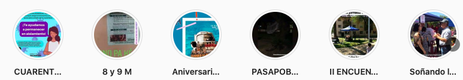
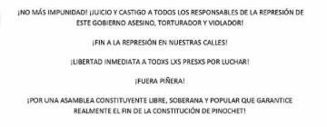
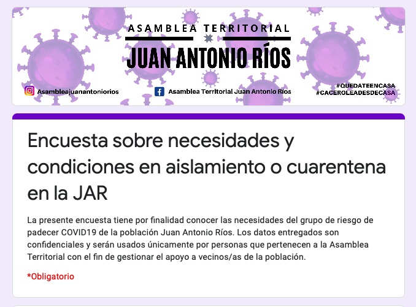
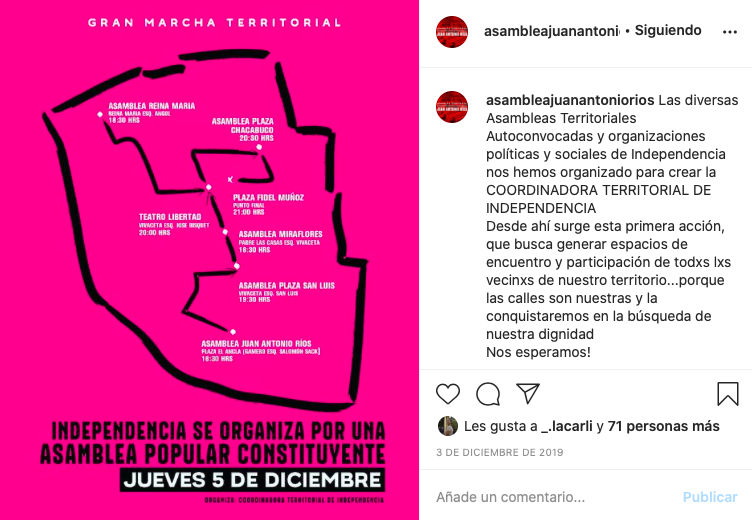

#### FOLIO: IND1
# Asamblea Territorial Juan Antonio Ríos

[instagram](https://www.instagram.com/asambleajuanantoniorios/)
[facebook](https://www.facebook.com/AsambleaTerritorialJuanAntonioRios/)
<asambleajar@gmail.com>
---

### Representantes
#### 
Tienen voceria ante la CAT: Leonor Benitez Aldunate.

---
### Interacciones frecuentes
#### 
* Asamblea popular plaza chacabuco
* Coordinadora de asambleas territoriales
* asamblea plaza san luis
* asamblea territorial reina maria

### Redes sociales
#### ¿Para qué se utiliza la red social?
| Instagram | Facebook |
|---|---|
|Difusión de informacion y actividades| Difusión de informacion, actividades e informacion de otras comisiones de la asamblea|

### **Instagram**
| seguidores | seguidos | publicaciones | hashtag 
|---|---|---|---|
|1938|331|205| 0

---

* **Actividad:**   
* Primera Publicación IG: 27/10/2019

---
### Frecuencia de publicación.
* Publicaciones: Semanal (3/4)
* Actividades: Semanal 

---
### Ubicación
* Población Juan antonio ríos / Plaza el ancla

---
### Describir temas de interés y/o trabajo
* Colaboración y apoyo mutuo vecinal
* Derechos sociales
* Organizacion territorial
* Apropiacion de espacio publico

---
### Describir la imagen ideal por la cual se trabaja.
#### (El horizonte hacia el cual se quiere avanzar.)
> El río se sienta a conversar, compartir y luchar
* Bienestar social y la garantizacion de derechos sociales minimos para la vida digna

---
### ¿Que se hace?
#### (Manifestaciones, marchas, intervenciones, actividades culturales, conversatorios, intercambio de saberes, actividades solidarias o de apoyo mutuo, abastecimiento, contra información, emplazamiento a autoridades etc.)
* Actividades conmemorativas
* Asambleas territoriales abiertas
* Once comunitaria
* Manifestaciones   
    * Marchas territoriales
    * Velatones
    * Jornadas de movilización social
    * Velatones
    * Cacerolazos
* Pasacalles culturales 
    * obras de teatro
    * Cines al aire libre
* Talleres socioeducativos para la comunidad
* Talleres sobre el proceso constituyente
* Talleres feministas
    * Jornadas de movilizacion feministas
* Aniversario de la población
* Infografias sobre tematicas de interes como PSU, 10%, AFP, etc
* actividades solidarias
    * completadas
    * rifas
    * campañas de conación de alimentos
* Infografias sobre medidas de autocuidado por covid
* Conversatorios sobre politica, historia, nutrición, etc.
* Emplazamiento a autoridades por declaraciones
* Red de abastecimiento comunitario

---
### Describir y distinguir demandas más reivindicativas de espacios sin relación con lo contencioso o con lo político mas prefigurativo
#### (lo contencioso; demanda al Estado, a alguna autoridad, privados, etc), (prefigurativo, transformación desde lo cotidiano, etc.).
* Hacia los vecinos para que se organicen en pos al bienestar comunitario
> Somos una organización de vecines de la población que trabaja solidariamente con y para la comunidad, exigiendo los derechos del pueblo.
* Emplaza a las autoridades municipales y locales 
[link](https://www.instagram.com/p/B6GsUc3pkVm/)

---
### Tipo de organización interna.
#### 
Asambleismo y horizontalidad. Trabajan con comisiones.

---
### Describir los temas / imágenes- iconos / conceptos mas habitualmente presentes en sus publicaciones. Describir cambios/ transformaciones en los contenidos desde Octubre.
Su contenido se ha ajustado a la actualidad nacional. Se focalizan en trabajar en conjunto como comunidad barrial pero tambien con otros sectores de independencia y conchalí. Ultimamente sus acciones se vinculan a apoyo mutuo y cacerolazos por el 2do retiro afp.

**Iconos:**
El primero es su icono de instagram y el segundo el logo que utilizan en las infografias o imagenes de difusión.

**Diseño estético:**
No tienen un diseño estetico fijo pero se nota que los hace alguien que sabe. Utilizan colores negro, rojo, morado para sus imagenes. Su instagram se compone por imagenes creadas, fotografías y declaraciones.

Tienen ordenadas algunas actividades en sus historias destacadas.

---
### Percepciones que se tiene del Estado
#### (Aparato burocrático)
> Gobierno violador de ddhh que no se preocupa por el pueblo. Verdad y justicia ante quienes han torturado y matado por culpa del Estado.

| Declaraciones | infografía | 
|---|---|
|Postura |  |

---
### Percepciones que se tiene de las Fuerzas de Orden
#### (Aparato represivo)
> No hay posturas explicitas, solo hablan de los asesinados por los carabineros

| Declaraciones | infografía | 
|---|---|
|Anotar los comunicados | [Link]() |

---
### Incorporar aca notas, citas textuales, links, etc. extra a los ya incorporados, que sean de interés para comprender tanto la forma como los contenidos asociados a la organización.
* Levantamiento de información sobre el estado de la comunidad por la crisis sociosanitaria

* Interpelan a la ciudadania, el estado y la cut por las decisiones ante la crisis sociosanitaria
|Declaración pública frente a pandemia covid-19 | [Link](https://www.instagram.com/p/B-vZ3w2JpWz/) |

* Mapas de marchas territoriales

