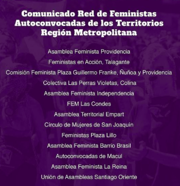
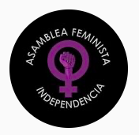
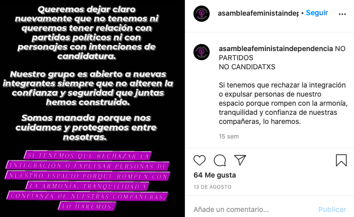

#### FOLIO: IND2
# Asamblea Feminista Indepencia

[instagram](https://www.instagram.com/asambleafeministaindependencia/)
[facebook](https://www.facebook.com/Asamblea-Feminista-Independencia-111863893708423/)

---

### Representantes
#### 
No señalan tener representantes

---
### Interacciones frecuentes
#### 
* Feministas zona norte
* Coordinadora Feminista 8M
* Red de feministas autoconvocadas

### Redes sociales
#### ¿Para qué se utiliza la red social?
| Instagram | 
|---|
|Difusión de información y actividades|

### **Instagram**
| seguidores | seguidos | publicaciones | hashtag 
|---|---|---|---|
|1111|573|84| 0

---

* **Actividad:**   
* Primera Publicación IG: 02/02/2020

---
### Frecuencia de publicación.
* Publicaciones: Mensual (2 x mes)
* Actividades: Mensual

---
### Ubicación
* Independencia / Domingo Santa maria

---
### Describir temas de interés y/o trabajo
* Feminismo
* organizacion entre mujeres 
* colaboracion territorial

---
### Describir la imagen ideal por la cual se trabaja.
#### (El horizonte hacia el cual se quiere avanzar.)
* Organizacion feminista para construir un espacio seguro para manifestarse y apoyarse.

---
### ¿Que se hace?
#### (Manifestaciones, marchas, intervenciones, actividades culturales, conversatorios, intercambio de saberes, actividades solidarias o de apoyo mutuo, abastecimiento, contra información, emplazamiento a autoridades etc.)
* Infografías con tematicas de feminismo
* Encuentros feministas
* Manifestaciones
    * Marchas territoriales
    * Funas
    * Jornadas de protestas
    * Velatones
    * Intervenciones publicas
* Creacion de lienzos
* Talleres feminista
* Actividades de apoyo mutuo
    * Campañas solidarias con los presos de la revuelta
    * Acopio solidario
    * Rifas solidarias para integrantes en problemas economicos
    * acopio personas en situacion de calle
* Coordinación entre vecinas por grupos de whatsapp

---
### Describir y distinguir demandas más reivindicativas de espacios sin relación con lo contencioso o con lo político mas prefigurativo
#### (lo contencioso; demanda al Estado, a alguna autoridad, privados, etc), (prefigurativo, transformación desde lo cotidiano, etc.).
* Hacias las mujeres de independencia
> Coordinación, apoyo, acción y difusión. Haciendo feminismo desde el territorio. Espacio abierto para todas nuestras compañeras.

* Hacia las autoridades, emplazandolas ante la violencia de género

---
### Tipo de organización interna.
#### 
Asambleismo y horizontalidad.

---
### Describir los temas / imágenes- iconos / conceptos mas habitualmente presentes en sus publicaciones. Describir cambios/ transformaciones en los contenidos desde Octubre.
Bajó la actividad y el contenido con la pandemia. Su contenido se enmarca en la agenda feminista y en situaciones politicas actuales que sean de relevancia como el cambio de ministra o los presos politicos. 

**Iconos:**

**Diseño estético:**
No tienen un diseño estetico fijo, sin embargo, utilizan colores como el negro y el morado. Suben contenido creado por ellas mismas y contenido de otras organizaciones, sumado a imagenes y videos.

---
### Percepciones que se tiene del Estado
#### (Aparato burocrático)
> #RenunciaMañalich 
#RenunciaPiñera 
#ElHambreNoSeReprime Repudian el gobierno de sebastian piñera.

| Declaraciones | infografía | 
|---|---|
|Anotar los comunicados | [Link]() |

---
### Percepciones que se tiene de las Fuerzas de Orden
#### (Aparato represivo)
> Violaron a quienes debian proteger. 

| Declaraciones | infografía | 
|---|---|
|Anotar los comunicados | [Link]() |

---
### Incorporar aca notas, citas textuales, links, etc. extra a los ya incorporados, que sean de interés para comprender tanto la forma como los contenidos asociados a la organización.

* Conflicto con partidos politicos y sus posibles intereses

