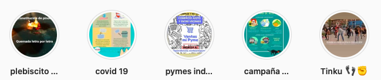

#### FOLIO: IND3
# Asamblea Popular Plaza Chacabuco

[instagram](https://www.instagram.com/asambleaplazachacabuco/)
[facebook](https://www.facebook.com/Asamblea-Popular-Plaza-Chacabuco-104435211213859)

---

### Representantes
#### 
No señalan tener representantes.

---
### Interacciones frecuentes
#### 
* Asamblea plaza san luis
* asamblea juan antonio rios
* Coordinadora de asambleas territoriales

### Redes sociales
#### ¿Para qué se utiliza la red social?
| Instagram | Facebook | 
|---|---|
|Difusión de informacion y actividades| Difusión de informacion y actividades|

### **Instagram**
| seguidores | seguidos | publicaciones | hashtag 
|---|---|---|---|
|1035|150|141| 0

---

* **Actividad:**   
* Primera Publicación IG: 11/11/2019

---
### Frecuencia de publicación.
* Publicaciones: Semanal (2/3)
* Actividades: Mensual

---
### Ubicación
* Plaza Chacabuco

---
### Describir temas de interés y/o trabajo
* Colaboración vecinal
* Organizacion territorial

---
### Describir la imagen ideal por la cual se trabaja.
#### (El horizonte hacia el cual se quiere avanzar.)
* Bienestar para el pueblo. garantizar derechos sociales.

---
### ¿Que se hace?
#### (Manifestaciones, marchas, intervenciones, actividades culturales, conversatorios, intercambio de saberes, actividades solidarias o de apoyo mutuo, abastecimiento, contra información, emplazamiento a autoridades etc.)
* Manifestaciones
    * Cacerolazos
    * marchas territoriales
    * velatones
    * intervenciones publicas
* actividades de conmemoracion
* actividades solidarias
    * acopio solidario
    * apoyo olla común
* Talleres virtuales sobre salud
* Manifestaciones virtuales por el 10% / 
* Asambleas virtuales y presenciales
* Jornadas de agitacion y protesta 
* Retiro de medicamentos para adultos mayores de la comunidad
* Talleres de compostaje y huerto
* Infografias sobre actualidad nacional
* Trawun constituyente
* Ferias de las pulgas
* ACtividades navideñas y de año nuevo 
    * quema del mono
    * once comunitarias
* difusion de emprendimientos

---
### Describir y distinguir demandas más reivindicativas de espacios sin relación con lo contencioso o con lo político mas prefigurativo
#### (lo contencioso; demanda al Estado, a alguna autoridad, privados, etc), (prefigurativo, transformación desde lo cotidiano, etc.).
* Hacia los vecinos para que participen, se conozcan y se movilicen
* hacia la autoridades haciendolas responsables de las crisis y de los asesinatos

---
### Tipo de organización interna.
#### 
Asambleismo y horizontalidad

---
### Describir los temas / imágenes- iconos / conceptos mas habitualmente presentes en sus publicaciones. Describir cambios/ transformaciones en los contenidos desde Octubre.
Su contenido se ha ajustado a la actualidad nacional. Ejecutan muchas actividades para la comunidad en pos a su bienestar y apoyo mutuo. 

**Iconos:**

**Diseño estético:**
No tienen un diseño estetico fijo. Siempre utilizan el logo para sus publicaciones.

Estructuran su instagram desde historias destacadas.

---
### Percepciones que se tiene del Estado
#### (Aparato burocrático)
> Gobierno asesino y criminal. persecucion a los oprimidos.

| Declaraciones | infografía | 
|---|---|
|Racismo en la araucania | [Link](https://www.instagram.com/p/CDZiIKYpN_W/) |

---
### Percepciones que se tiene de las Fuerzas de Orden
#### (Aparato represivo)
> Cientos de personas asesinadas por las fuerzas de orden. 

| Declaraciones | infografía | 
|---|---|
|Anotar los comunicados | [Link]() |

---
### Incorporar aca notas, citas textuales, links, etc. extra a los ya incorporados, que sean de interés para comprender tanto la forma como los contenidos asociados a la organización.
