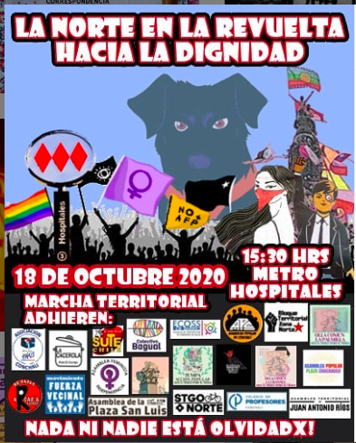
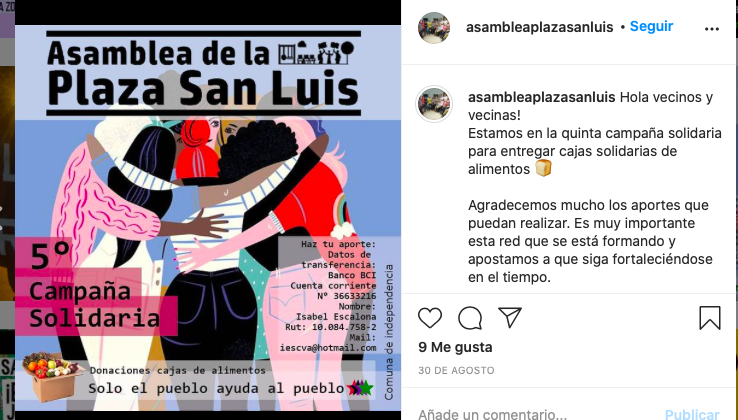
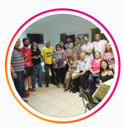
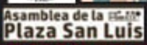

#### FOLIO: IND4
# Asamblea plaza san luis

[instagram](https://www.instagram.com/asambleaplazasanluis/)
[facebook](https://www.facebook.com/Asamblea-Plaza-San-Luis-101263474691692)
<asambleaplazasanluis@gmail.com>
---

### Representantes
#### 
No señala tener representantes.

---
### Interacciones frecuentes
#### 
* asamblea territorial reina maria
* asamblea plaza chacabuco
* asamblea juan antonio rios
* Muchas más...

### Redes sociales
#### ¿Para qué se utiliza la red social?
| Instagram | Facebook |
|---|---|
|Información y actividades|Actividades, difusión y videos en vivo|

### **Instagram**
| seguidores | seguidos | publicaciones | hashtag 
|---|---|---|---|
|583|69|70| 0

---

* **Actividad:**   

* Primera Publicación IG: 27/11/2019

---
### Frecuencia de publicación.

* Publicaciones: Semanal (1/2 veces)
* Actividades: Mensuales

---
### Ubicación
* Cancha plaza san luis (san luis/vivaceta)

---
### Describir temas de interés y/o trabajo
* Participación y dialogo comunitario
* Organizacion territorial
* Derechos sociales

---
### Describir la imagen ideal por la cual se trabaja.
#### (El horizonte hacia el cual se quiere avanzar.)
* Apoyo mutuo y colaboración barrial
* Bienestar social desde la garantizacion de derechos sociales

---
### ¿Que se hace?
#### (Manifestaciones, marchas, intervenciones, actividades culturales, conversatorios, intercambio de saberes, actividades solidarias o de apoyo mutuo, abastecimiento, contra información, emplazamiento a autoridades etc.)
* Asambleas territoriales
* Ferias de oficiosy quehaceres
* Conversatorios autoformacion
* campañas de solidarias de acopio
    * Cajas de alimentos
    * Productos de higiene
    * Olla común
* Onces comunitarias
    * Once comunitaria y reflexiva [link](https://www.instagram.com/p/B5aEnCdF7e_/)
* Talleres de tejido del lienzo [link](https://www.instagram.com/p/B69XW7spUxI/)

* jornadas culturales
    * batucacerolazo
    * pintatones
    * tardes de arte en el barrio
* Actividades conmemorativas
* Dialogos constituyentes
* Emplazamiento a autoridades por los presos politicos
* Difusión iniciativas de otras organizaciones [link](https://www.instagram.com/p/CG3DAfup2HZ/)

---
### Describir y distinguir demandas más reivindicativas de espacios sin relación con lo contencioso o con lo político mas prefigurativo
#### (lo contencioso; demanda al Estado, a alguna autoridad, privados, etc), (prefigurativo, transformación desde lo cotidiano, etc.).
* Hacia los vecinos para que se unan, dialoguen y participen
* Emplazando autoridades locales y nacionales ante la crisis sociosanitaria. 

---
### Tipo de organización interna.
#### 
Asambleismo y horizontalidad.

---
### Describir los temas / imágenes- iconos / conceptos mas habitualmente presentes en sus publicaciones. Describir cambios/ transformaciones en los contenidos desde Octubre.
Su contenido se ha ajustado en linea a la actualidad nacional. Enfoca su contenido reciente (pandemia) a iniciativas solidarias, hicieron 5.

**Iconos:**
Su icono es una fotografía y tienen un logo con su nombre.

**Diseño estético:**
No tienen un diseño estetico fijo, aportan contenido propio, de otras organizaciones y videos. 

---
### Percepciones que se tiene del Estado
#### (Aparato burocrático)
> Exigimos la libertad de nuestrxs compañerxs presxs políticxs, por luchar por mayor dignidad para el pueblo.

| Declaraciones | infografía | 
|---|---|
|06/10/2020 | [Link](https://www.instagram.com/p/CGAOKDLptg1/) |

---
### Percepciones que se tiene de las Fuerzas de Orden
#### (Aparato represivo)
> Criminales y complices del estado.

| Declaraciones | infografía | 
|---|---|
|Anotar los comunicados | [Link]() |

---
### Incorporar aca notas, citas textuales, links, etc. extra a los ya incorporados, que sean de interés para comprender tanto la forma como los contenidos asociados a la organización.
* Son muy activistas. La asamblea se compone por perosnas de diversas edades [link](https://www.instagram.com/p/B5ZASQLlM6J/)
* tienen una vision muy comunitaria de la solidaridad y el apañe. sus acciones se vinculan de gran manera con el arte. Conversan constantente qué país quieren construir.
