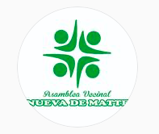

#### FOLIO: IND5
# Asamblea territorial nueva de matte

[instagram](https://www.instagram.com/territorial_nuevadematte/)

---

### Representantes
#### 
No señalan tener representantes.

---
### Interacciones frecuentes
#### 
* Asamblea plaza chacabuco
* asamblea plaza san luis
* asamblea territorial reina maria

### Redes sociales
#### ¿Para qué se utiliza la red social?
| Instagram |
|---|
|difusión de informacion y actividades|

### **Instagram**
| seguidores | seguidos | publicaciones | hashtag 
|---|---|---|---|
|373|186|77|

---

* **Actividad:**   

* Primera Publicación IG: 31/10/2019. Tienen un amplio periodo de inactividad entre junio 2020 a octubre 2020. La ultima publicacion la hicieron en octubre.

---
### Frecuencia de publicación.
* Publicaciones: Mensual 
* Actividades: Mensual

---
### Ubicación
* nueva de matte/nueva 1

---
### Describir temas de interés y/o trabajo
* Colaboracion entre vecinos

---
### Describir la imagen ideal por la cual se trabaja.
#### (El horizonte hacia el cual se quiere avanzar.)
* Construir comunidad y un nuevo chile más justo

---
### ¿Que se hace?
#### (Manifestaciones, marchas, intervenciones, actividades culturales, conversatorios, intercambio de saberes, actividades solidarias o de apoyo mutuo, abastecimiento, contra información, emplazamiento a autoridades etc.)
* Manifestaciones
    * velatones
    * concentraciones
    * cacerolazos
    * marchas territoriales
* Cabildos abiertos
* Talleres del proceso constituyente
* Festivales populares
    * Actividades para la familia
    * Feria libre
* Difusión actividades de otras organizaciones de independencia
* Campañas de donacion de sangre para vecinos
* Compras colaborativas
* Campañas solidarias de donacion
* Olla común
    * Entrega de alimentos
    * Preparación de alimentos
    * Acopio de donaciones
* Difusión de emprendimientos y negocios del sector

---
### Describir y distinguir demandas más reivindicativas de espacios sin relación con lo contencioso o con lo político mas prefigurativo
#### (lo contencioso; demanda al Estado, a alguna autoridad, privados, etc), (prefigurativo, transformación desde lo cotidiano, etc.).
* Hacia los vecinos, apoyo mutuo y colaboracion ante las crisis.

---
### Tipo de organización interna.
#### 
asambleismo. horizontalidad.

---
### Describir los temas / imágenes- iconos / conceptos mas habitualmente presentes en sus publicaciones. Describir cambios/ transformaciones en los contenidos desde Octubre.
Comenzaron como una organizacion focalizada en accion territorial como cabildos y encuentros, por crisis sociosanitaria se focalizaron en hacer una olla común para el territorio.

**Iconos:**

**Diseño estético:**
No tienen un diseño estético fijo. suben infografias propias, de otras organizaciones y fotografias/videos de las actividades que realizan.

---
### Percepciones que se tiene del Estado
#### (Aparato burocrático)
> No señalan postura

| Declaraciones | infografía | 
|---|---|
|Anotar los comunicados | [Link]() |

---
### Percepciones que se tiene de las Fuerzas de Orden
#### (Aparato represivo)
> No señalan postura

| Declaraciones | infografía | 
|---|---|
|Anotar los comunicados | [Link]() |

---
### Incorporar aca notas, citas textuales, links, etc. extra a los ya incorporados, que sean de interés para comprender tanto la forma como los contenidos asociados a la organización.
