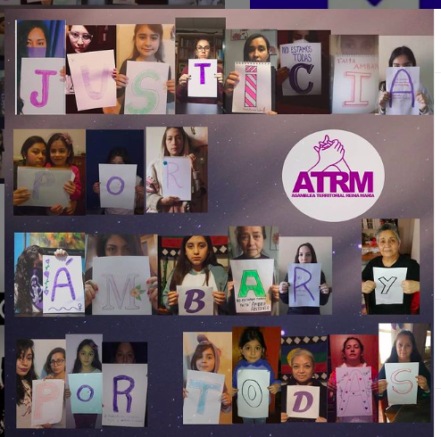
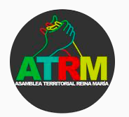
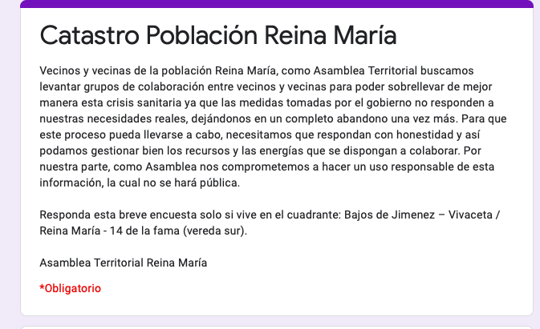

#### FOLIO: IND6
# Asamblea Territorial Reina Maria

[instagram](https://www.instagram.com/asambleaterritorialreinamaria/)
[facebook](https://www.facebook.com/ATPRM/)
<asambleaterritorialreinamaria@gmail.com>
---

### Representantes
#### 
No señalan tener representantes

---
### Interacciones frecuentes
#### 
* asamblea plaza san luis
* asamblea juan antonio rios
* asamblea popular plaza chacabuco
* Carpitenro negro de independencia
* Acción popular

### Redes sociales
#### ¿Para qué se utiliza la red social?
| Instagram | Facebook | 
|---|---|
|Difusión de actividades, informaciones y videos en vivo|Difusión de actividades, informaciones y videos en vivo|

### **Instagram**
| seguidores | seguidos | publicaciones | hashtag 
|---|---|---|---|
|682|334|109| 0

---

* **Actividad:**   
* Primera Publicación IG: 27/11/2019. Inactiva desde el 23/08/2020 (en instagram). En facebook la ultima publicacion fue en noviembre.

---
### Frecuencia de publicación.
* Publicaciones: semanal (2/3)
* Actividades: mensuales

---
### Ubicación
* bajos de jimenez/reina maria

---
### Describir temas de interés y/o trabajo
* Organizacion territorial
* Apoyo mutuo y colaboración entre vecinos

---
### Describir la imagen ideal por la cual se trabaja.
#### (El horizonte hacia el cual se quiere avanzar.)
* Unidad permanente de las vecinas y vecinos para un mejor vivir. [link](https://www.instagram.com/p/B4Iq39pAlhu/)

---
### ¿Que se hace?
#### (Manifestaciones, marchas, intervenciones, actividades culturales, conversatorios, intercambio de saberes, actividades solidarias o de apoyo mutuo, abastecimiento, contra información, emplazamiento a autoridades etc.)
* Manifestaciones
    * Cacerolazos
    * Velatones
    * Marchas territoriales
* Cabildos abiertos
* Asambleas virtuales
* Actividades conmemorativas
* Manifestaciones virtuales

* Compras en comunidad
* Acopios solidarios
    * Campaña de invierno
    * Catastro de necesidades de los vecinos
    * Puntos de acopio en negocios para alimentos no perecibles
* Jornadas informativas de beneficios sociales [link](https://www.instagram.com/p/CBMUkr8JSIN/)
* Jornadas de sanitizacion y propaganda
* Difusión de emprendimientos vecinals
* Difusión de informacion sobre covid19
* Actividades culturales
    * Biblioteca comunitaria
    * Ciclos de cine
    * Talleres ecomuralismo
    * Tardes recreativas y familiares
* Emplazamiento a autoridades y fuerzas de orden
* jornadas contra la violencia de género
    * intervencion las tesis
* Onces comunitarias

---
### Describir y distinguir demandas más reivindicativas de espacios sin relación con lo contencioso o con lo político mas prefigurativo
#### (lo contencioso; demanda al Estado, a alguna autoridad, privados, etc), (prefigurativo, transformación desde lo cotidiano, etc.).
* Hacia los vecinos para que participen y se organicen
* Hacia las autoridades, emplazandolas a dar soluciones acorde a las demandas del pueblo

---
### Tipo de organización interna.
#### 
Asambleismo y horizontalidad. Deben trabajar en comisiones porque hay muchas publicaciones ligadas a trabajo feminista y con niñez.

---
### Describir los temas / imágenes- iconos / conceptos mas habitualmente presentes en sus publicaciones. Describir cambios/ transformaciones en los contenidos desde Octubre.
El contenido varia segun los acontecimientos nacionales y la situacion vecinal. Se preocupan por el bienestar de los vecinos y generan redes de colaboración. Paran sus publicaciones en agosto en instagram y en noviembre en su facebook.

**Iconos:**

**Diseño estético:**
No tienen un diseño estético fijo.

---
### Percepciones que se tiene del Estado
#### (Aparato burocrático)
> Estado ha reforzado el legado de dictadura. el Gobierno criminal y asesino actua como en dictadura.

| Declaraciones | infografía | 
|---|---|
|Declaracion 27/10/2019 | [Link](https://www.instagram.com/p/B4Iq39pAlhu/) |

---
### Percepciones que se tiene de las Fuerzas de Orden
#### (Aparato represivo)
> Una institución que está manchada con la sangre de nuestro pueblo y que durante la dictadura de Pinochet y la de Piñera desde octubre de 2019 nos ha demostrado que se formó para proteger los intereses de unos pocos, sin importar si a nosotrxs nos torturan, violan, mutilan y matan.

| Declaraciones | infografía | 
|---|---|
|Día de los *asesinos de Chile* | [Link](https://www.instagram.com/p/B_fg86bJEyd/) |
|Anotar los comunicados | [Link](https://www.instagram.com/p/B76-xHsJVeg/) |

---
### Incorporar aca notas, citas textuales, links, etc. extra a los ya incorporados, que sean de interés para comprender tanto la forma como los contenidos asociados a la organización.
* Catastro vecinal por crisis covid19

* Declaraciones en contra dichos del alcalde. Señalan que no estan a favor de seguir con las politicas neoliberales implementadas por la derecha y la ex nueva mayoria [link](https://www.instagram.com/p/B4fPrvXgK0Z/)

* Postura ante la situacion socio sanitaria del país [link](https://www.instagram.com/p/B-FU43uJNMk/)