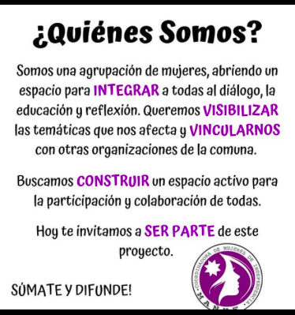
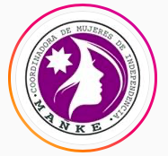

#### FOLIO: IND7
# Coordinadora de mujeres Independencia

[instagram](https://www.instagram.com/coordinadoramujeresindepe/)
[facebook](https://www.facebook.com/Coordinadora-de-Mujeres-de-Independencia-110806653722012)
<coordinadoramujeresindepe@gmail.com>
---

### Representantes
#### 
No señalan tener representantes.

---
### Interacciones frecuentes
#### 
* Coordinadora 8M Zona norte
* Asamblea feminista independencia
* Asamblea plaza chacabuco

### Redes sociales
#### ¿Para qué se utiliza la red social?
| Instagram | Facebook | 
|---|---|
|Difusión de información y actividades|Difusión de informaciones y actividades|

### **Instagram**
| seguidores | seguidos | publicaciones | hashtag 
|---|---|---|---|
|603|534|174| 0

---

* **Actividad:**   
* Primera Publicación IG: 23/11/2019

---
### Frecuencia de publicación.

* Publicaciones: Semanal (2/3 veces)
* Actividades: Semanal 

---
### Ubicación
* 2 norte/gamero / Plaza fidel muñoz / Plaza chacabuco

---
### Describir temas de interés y/o trabajo
* Feminismo
* Organizacion entre mujeres

---
### Describir la imagen ideal por la cual se trabaja.
#### (El horizonte hacia el cual se quiere avanzar.)
* Sociedad libre de violencia para las mujeres y que garantice derechos sociales

---
### ¿Que se hace?
#### (Manifestaciones, marchas, intervenciones, actividades culturales, conversatorios, intercambio de saberes, actividades solidarias o de apoyo mutuo, abastecimiento, contra información, emplazamiento a autoridades etc.)
* Asambleas abiertas presenciales
* Manifestaciones en plaza dignidad (Ex plaza italia)
* Emplazamiento a autoridades nacionales
* Acciones de protesta virtual
* Actividades conmemorativas
* Manifestaciones
    * Cacerolazos
    * Intervenciones publicas
* Difusion de informaciones relevantes para las mujeres
* Campañas de acopio solidario para NNA
    * Campaña por un litro de leche [link](https://www.instagram.com/p/CA5gzbSJH7I/)
* Emporio virtual
    * Talleres
    * emprendimientos
* Difusión campaña VIF

---
### Describir y distinguir demandas más reivindicativas de espacios sin relación con lo contencioso o con lo político mas prefigurativo
#### (lo contencioso; demanda al Estado, a alguna autoridad, privados, etc), (prefigurativo, transformación desde lo cotidiano, etc.).
* Hacia las mujeres de independencia, para que participen y sean parte de la organizacion

* Emplazan a las autoridades de la cartera de género y mujeres, a las fuerzas de orden y al gobierno.

---
### Tipo de organización interna.
#### 
Horizontalidad y asambleismo.

---
### Describir los temas / imágenes- iconos / conceptos mas habitualmente presentes en sus publicaciones. Describir cambios/ transformaciones en los contenidos desde Octubre.
Su contenido habitual trata tematicas vinculadas con las mujeres y su bienestar. Realizan camapañas por crisis sociosanitaria para ayudar a NNA, son activistas en contra la violencia de género y emplazan autoridades.

**Iconos:**

**Diseño estético:**
No tienen un diseño estetico fijo pero utilizan siempre los colores morado, fucsia, negro y blanco. 

---
### Percepciones que se tiene del Estado
#### (Aparato burocrático)
> Gobierno criminal que expone a los trabajadores. Tambien crea politicas represivas contra el pueblo que está cansado.

| Declaraciones | infografía | 
|---|---|
|Carcel para mañalich | [Link](https://www.instagram.com/p/CAts_HaJ-NW/) |
|Declaracion 01/04/2020 | [Link](https://www.instagram.com/p/B-dTcuApTM7/) |

---
### Percepciones que se tiene de las Fuerzas de Orden
#### (Aparato represivo)
> Policia opresora y complices de la violencia.

| Declaraciones | infografía | 
|---|---|
|Declaracion 01/04/2020 | [Link](https://www.instagram.com/p/B-dTcuApTM7/) |

---
### Incorporar aca notas, citas textuales, links, etc. extra a los ya incorporados, que sean de interés para comprender tanto la forma como los contenidos asociados a la organización.
