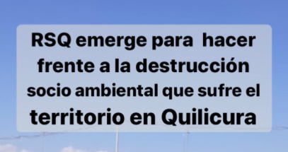
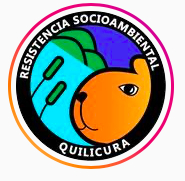
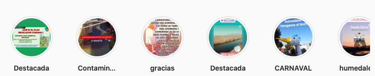

#### FOLIO: QUI1
# Resistencia Socio Ambiental Quilicura

[instagram](https://www.instagram.com/rs_quilicura/)
[facebook](https://www.facebook.com/resistenciasocioambiental)
<rsocioambientalquilicura@gmail.com>
---

### Representantes
#### 
No señalan tener representantes

---
### Interacciones frecuentes
#### 
* Coordinadora asamblea quilicura
* Asamblea las torres
* no + afp quilicura

### Redes sociales
#### ¿Para qué se utiliza la red social?
| Instagram | Facebook | 
|---|---|
|Difusión de actividaes e informacion|Difusión de actividaes e informacion|

### **Instagram**
| seguidores | seguidos | publicaciones | hashtag 
|---|---|---|---|
|1854|249|81| 0

---

* **Actividad:**   

* Primera Publicación IG: 21/12/2019

---
### Frecuencia de publicación.

* Publicaciones: Semanal (2/3 veces)
* Actividades: Mensual (2 veces)

---
### Ubicación
* Humedal camino bernardo ohiggins con san ignacio

---
### Describir temas de interés y/o trabajo
* Medioambiente
* Humedales
* Conscientización socioambiental

---
### Describir la imagen ideal por la cual se trabaja.
#### (El horizonte hacia el cual se quiere avanzar.)
* SALVAR LOS HUMEDALES 
> Nuestro deseo de una comuna sustentable y amigable con el medio ambiente, en donde se consideren al momento de planificar la expansión urbana, el cuidado y respeto de lo que va quedando de uno de los ecosistemas más importantes del planeta.

---
### ¿Que se hace?
#### (Manifestaciones, marchas, intervenciones, actividades culturales, conversatorios, intercambio de saberes, actividades solidarias o de apoyo mutuo, abastecimiento, contra información, emplazamiento a autoridades etc.)
* Educación medioambiental
* Jornadas de limpieza humedal o'higgins
* Infografías sobre medioambiente
    * Conscientización situacion humedal ohiggins
    * Visibilización de la situación socioambiental de quilicura
* Conversatorios con otras asambleas sobre la defensa de humedales en Quilicura
* Asambleas y reuniones presenciales 
* Marchas territoriales
* Conmemoración del día de los humedales
    * Comparsas
    * Actividades culturales
    * Actividades educativas
* Emplazamiento a autoridades comunales
    * Petitorio socioambiental [Link](https://www.instagram.com/p/CDnAb37pZNb/)

---
### Describir y distinguir demandas más reivindicativas de espacios sin relación con lo contencioso o con lo político mas prefigurativo
#### (lo contencioso; demanda al Estado, a alguna autoridad, privados, etc), (prefigurativo, transformación desde lo cotidiano, etc.).
* Hacia los vecinos y habitantes de quilicura, los interpela para pelear por la preservación de los humedales
> Que el progreso económico no esté por sobre la calidad de vida y el futuro de nuestros hijos e hijas 

---
### Tipo de organización interna.
#### 
> ORGANIZACIÓN AUTÓNOMA, NO PARTIDISTA Y HORIZONTAL.
Asambleismo y horizontalidad. 

---
### Describir los temas / imágenes- iconos / conceptos mas habitualmente presentes en sus publicaciones. Describir cambios/ transformaciones en los contenidos desde Octubre.
Su contenido es similar durante el tiempo, sin embargo, el hecho de ir enlazandose con otras organizaciones conllevó a su apertura a nuevas actividades como carnavales y posicionarse por el apruebo y la convención constitucional.

**Iconos:**

**Diseño estético:**
No tienen un diseño estetico fijo, su instagram se compone de inforgrafias propias, infografias de otras organizaciones y fotos/videos. Ordenan sus actividades en las historias destacadas.

---
### Percepciones que se tiene del Estado
#### (Aparato burocrático)
> Modelo neoliberal y extractivista que no se preocupa del medioambiente ni de las generaciones futuras que vivan en un entorno libre de contaminación.

| Declaraciones | infografía | 
|---|---|
|Anotar los comunicados | [Link]() |

---
### Percepciones que se tiene de las Fuerzas de Orden
#### (Aparato represivo)
> resumen de lo encontrado

| Declaraciones | infografía | 
|---|---|
|Anotar los comunicados | [Link]() |

---
### Incorporar aca notas, citas textuales, links, etc. extra a los ya incorporados, que sean de interés para comprender tanto la forma como los contenidos asociados a la organización.

