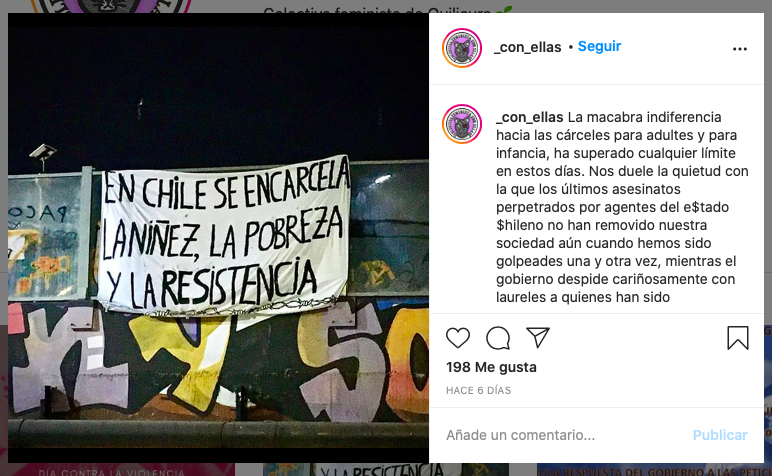
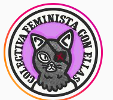

#### FOLIO: QUI2
# Con Ellas - Colectiva feminista de Quilicura

[instagram](https://www.instagram.com/_con_ellas/)

---

### Representantes
#### 
No señalan tener representantes

---
### Interacciones frecuentes
#### 
* Cesantes quilicura
* Colective gatillo

### Redes sociales
#### ¿Para qué se utiliza la red social?
| Instagram | 
|---|
|Difusión de actividades e informacion|

### **Instagram**
| seguidores | seguidos | publicaciones | hashtag 
|---|---|---|---|
|2104|1021|128| 0

---

* **Actividad:**   

* Primera Publicación IG: Se reactivaron 31/10/2019 // Tienen recesos de meses sin publicar, ahora publican agosto 2020 a nov 2020.

---
### Frecuencia de publicación.

* Publicaciones: Mensual
* Actividades: Mensual 

---
### Ubicación
* Plaza las Gemelas (lo marcoleta)

---
### Describir temas de interés y/o trabajo
* Feminismo
* Apoyo de mujeres para mujeres

---
### Describir la imagen ideal por la cual se trabaja.
#### (El horizonte hacia el cual se quiere avanzar.)
* Vivir libres de violencia
> Hemos normalizado la violencia patriarcal en todas sus formas, donde hemos habitado viviendas y barrios indignls, sufrido violencia obstetrica, educación sexista, esclavitud laboral en la casa y violaciones y abusos sexuales tanto antes como en la crisis social.

---
### ¿Que se hace?
#### (Manifestaciones, marchas, intervenciones, actividades culturales, conversatorios, intercambio de saberes, actividades solidarias o de apoyo mutuo, abastecimiento, contra información, emplazamiento a autoridades etc.)
* Cabildos feministas
* Manifestaciones
    * Marchas territoriales
    * Cacerolazos
    * Velatones
* Intervenciones callejeras
* Asambleas feministas
* Minga feminista
    * Actividades familiares
    * Actividades culturales
        * Cine feminista
* Difusión de videos de actividades
* Conversatorios en torno a la memoria feminista de dictadura
* Eventos culturales y familiares pro fondos a las victimas de trauma ocular
* Actividades de agitación y propaganda 8M
* Actividades conmemorativas
* Campañas solidarias de donaciones por covid19
* Talleres y conversatorios en torno a salud sexual

---
### Describir y distinguir demandas más reivindicativas de espacios sin relación con lo contencioso o con lo político mas prefigurativo
#### (lo contencioso; demanda al Estado, a alguna autoridad, privados, etc), (prefigurativo, transformación desde lo cotidiano, etc.).
* hacia las mujeres y disidencias para que se conozcan, articulen y se acompañen dentro y durante la lucha.
* hacia el Estado por encarcelar a la niñez, la pobreza y a la resistencia 

!

---
### Tipo de organización interna.
#### (Vocerías, asambleísmo, horizontalidad, etc.; *se entiende que esta dimensión es más difícil de captar vía análisis de redes sociales, pero quizás se puede vislumbrar a través de roles/cargos*)

---
### Describir los temas / imágenes- iconos / conceptos mas habitualmente presentes en sus publicaciones. Describir cambios/ transformaciones en los contenidos desde Octubre.
Su contenido ha variado en torno a abrir la discusión sobre el feminismo, esta es una organizacion que funcionaba antes del 18O pero que sumo relevancia y transforma sus contenidos hacia las asambleas y acciones colectivas comunitarias.

**Iconos:**

**Diseño estético:**
No tienen un diseño estético fijo, su contenido se basa en infografias, actividades y videos/fotografías.

---
### Percepciones que se tiene del Estado
#### (Aparato burocrático)
> El estado es complice de las violaciones a ddhh. No hay justicia por la violencia contra la mujer.

| Declaraciones | infografía | 
|---|---|
|Anotar los comunicados | [Link]() |

---
### Percepciones que se tiene de las Fuerzas de Orden
#### (Aparato represivo)
> Complices de la violencia estatal 

| Declaraciones | infografía | 
|---|---|
|Anotar los comunicados | [Link]() |

---
### Incorporar aca notas, citas textuales, links, etc. extra a los ya incorporados, que sean de interés para comprender tanto la forma como los contenidos asociados a la organización.
