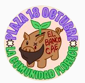

#### FOLIO: QUI3
# Plaza 18 de Octubre

[instagram](https://www.instagram.com/plaza.18deoctubre/)
[whatsapp](https://chat.whatsapp.com/GQsZWrIUCnXLDWIc1XHvRJ)
---

### Representantes
#### 
No señalan tener representantes.

---
### Interacciones frecuentes
#### 
* Cabildo abierto Quilicura
* Asamblea socioambiental quilicura

### Redes sociales
#### ¿Para qué se utiliza la red social?
| Instagram | Whatsapp | 
|---|---|
|Difusión informacion y actividades |Mercado online|

### **Instagram**
| seguidores | seguidos | publicaciones | hashtag 
|---|---|---|---|
|1495|969|145| 0

---

* **Actividad:**   

* Primera Publicación IG: 02/12/2019

---
### Frecuencia de publicación.

* Publicaciones: Mensual
* Actividades: Mensual

---
### Ubicación
* Plaza 18 octubre / matta av ohiggins

---
### Describir temas de interés y/o trabajo
* Actividades para la comunidad
* Difusión de actividades

---
### Describir la imagen ideal por la cual se trabaja.
#### (El horizonte hacia el cual se quiere avanzar.)
> La comunidad florece

---
### ¿Que se hace?
#### (Manifestaciones, marchas, intervenciones, actividades culturales, conversatorios, intercambio de saberes, actividades solidarias o de apoyo mutuo, abastecimiento, contra información, emplazamiento a autoridades etc.)
* Intervenciones culturales
* Cabildos abiertos
* Campañas solidarias
* Mercado online quilicura
* Difusión actividades de otras organizaciones de quilicura
    * Proceso constituyente
    * feminismo
    * derechos humanos
* Infografías sobre derechos laborales
* Manifestaciones
    * Cacerolazos
    * Marchas territoriales
* Festivales culturales
    * Cine
    * Jazz
    * Taller de malabares
    * pasacalle
    * Feria de las pulgas
* Jornadas de limpieza de la plaza 18 oct

---
### Describir y distinguir demandas más reivindicativas de espacios sin relación con lo contencioso o con lo político mas prefigurativo
#### (lo contencioso; demanda al Estado, a alguna autoridad, privados, etc), (prefigurativo, transformación desde lo cotidiano, etc.).
* Hacia los vecinos, los insta a participar de las actividades y conocerse entre ellos.

---
### Tipo de organización interna.
#### 
Asambleismo. Trabajan a la par con el cabildo abierto quilicura. Esta cuenta debe ser una "comision" del cabildo.

---
### Describir los temas / imágenes- iconos / conceptos mas habitualmente presentes en sus publicaciones. Describir cambios/ transformaciones en los contenidos desde Octubre.
Es una organizacion muy similar al cabildo abierto quilicura. Su contenido varia segun la actualidad nacional. 

**Iconos:**

**Diseño estético:**
No tiene un diseño estetico fijo.

---
### Percepciones que se tiene del Estado
#### (Aparato burocrático)
> resumen de lo encontrado

| Declaraciones | infografía | 
|---|---|
|Anotar los comunicados | [Link]() |

---
### Percepciones que se tiene de las Fuerzas de Orden
#### (Aparato represivo)
> No señalan postura

| Declaraciones | infografía | 
|---|---|
|Anotar los comunicados | [Link]() |

---
### Incorporar aca notas, citas textuales, links, etc. extra a los ya incorporados, que sean de interés para comprender tanto la forma como los contenidos asociados a la organización.
