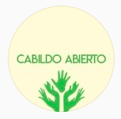

#### FOLIO: QUI4
# Cabildo Abierto Quilicura

[instagram](https://www.instagram.com/cabildoquilicura/)
[whatsapp](https://chat.whatsapp.com/GQsZWrIUCnXLDWIc1XHvRJ)

---

### Representantes
#### 
No señalan tener representantes

---
### Interacciones frecuentes
#### 
* Asamblea las torres
* asamblea socioambiental
* Colectiva con ellas

### Redes sociales
#### ¿Para qué se utiliza la red social?
| Instagram | Whatsapp |
|---|---|
|Difusión de actividades e informaciones| Mercado vecinal|

### **Instagram**
| seguidores | seguidos | publicaciones | hashtag 
|---|---|---|
|993|707|107|

---

* **Actividad:**   

* Primera Publicación IG: 25/10/2019
Hubo un receso en el contenido durante octubre 2020.

---
### Frecuencia de publicación.

* Publicaciones: Mensual (4 a 5 publicaciones) 
* Actividades: Mensual

---
### Ubicación
* Centro cultural quilicura // Plaza 18 de oct (ex banco estado)

---
### Describir temas de interés y/o trabajo
* Autoeducación
* Debate y reflexión 

---
### Describir la imagen ideal por la cual se trabaja.
#### (El horizonte hacia el cual se quiere avanzar.)
* Trabajar por las demandas y necesidades el pueblo. Estado que garantice justicia y derechos sociales [link](https://www.instagram.com/p/B5ISuJ_JxLg/)

---
### ¿Que se hace?
#### (Manifestaciones, marchas, intervenciones, actividades culturales, conversatorios, intercambio de saberes, actividades solidarias o de apoyo mutuo, abastecimiento, contra información, emplazamiento a autoridades etc.)
* Cabildos abiertos presenciales y virtuales
* Jornadas culturales y familiares
    * Cineclub
    * Charlas educativas
    * Feria de las pulgas
* Conversaciones sobre el proceso constituyente
* Mercado online quilicura
* Campañas solidarias
* Difusión de actividades de otras organizaciones
* Manifestaciones
    * Cacerolazos
* Infografias sobre derechos laborales, 10%, etc.
* Talleres de verano
    * Malabares
    * Danza afro
    * Boxeo popular

---
### Describir y distinguir demandas más reivindicativas de espacios sin relación con lo contencioso o con lo político mas prefigurativo
#### (lo contencioso; demanda al Estado, a alguna autoridad, privados, etc), (prefigurativo, transformación desde lo cotidiano, etc.).
* Hacia los vecinos y población en general
> Es nuestra responsabilidad, llegó la hora de organizarnos

---
### Tipo de organización interna.
#### 
Asableismo.

---
### Describir los temas / imágenes- iconos / conceptos mas habitualmente presentes en sus publicaciones. Describir cambios/ transformaciones en los contenidos desde Octubre.
El contenido varia según las necesidades de los vecinos. Cabildos virtuales y jornadas de acopio de alimentos para ellos. También se crearon iniciativas como un mercado online.

**Iconos:**

**Diseño estético:**
No tienen un diseño estetico fijo. Suben infografias de muchas organizaciones, sumadas a las propias y a fotografías. 

---
### Percepciones que se tiene del Estado
#### (Aparato burocrático)
> No señalan postura

| Declaraciones | infografía | 
|---|---|
|Anotar los comunicados | [Link]() |

---
### Percepciones que se tiene de las Fuerzas de Orden
#### (Aparato represivo)
> No señalan postura

| Declaraciones | infografía | 
|---|---|
|Anotar los comunicados | [Link]() |

---
### Incorporar aca notas, citas textuales, links, etc. extra a los ya incorporados, que sean de interés para comprender tanto la forma como los contenidos asociados a la organización.
