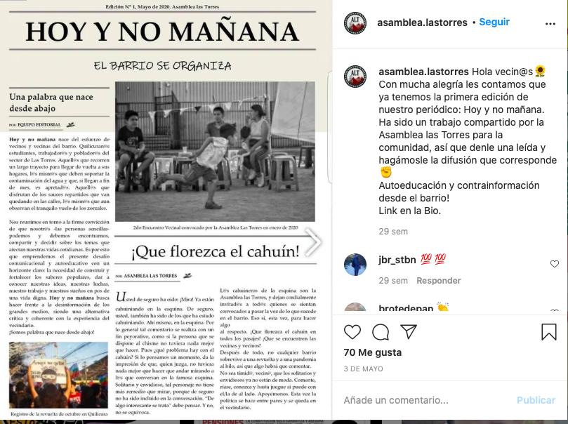
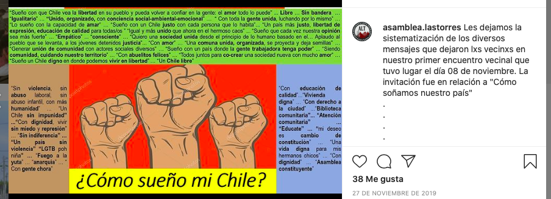
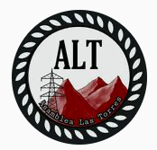

#### FOLIO: QUI5
# Asamblea Las Torres Quilicura

[instagram](https://www.instagram.com/asamblea.lastorres/)
[facebook](https://www.facebook.com/asamblealastorresquilicura)
<asamblea.lastorres@gmail.com>
---

### Representantes
#### 
No señala tener representantes

---
### Interacciones frecuentes
#### 
* Comunal No+AFP Quilicura
* Cooperativa de abastecimiento el curro
* Organizaciones sociales y vecinos de Quilicura
> Como Asamblea Las Torres adherimos al llamado de organizaciones sociales y vecin@s de Quilicura para proteger el medio ambiente

### Redes sociales
#### ¿Para qué se utiliza la red social?
| Instagram | Facebook |
|---|---|
|Difusión de información y actividades |Difusión de fotografias y videos, actividades e información|

### **Instagram**
| seguidores | seguidos | publicaciones | hashtag 
|---|---|---|---|
|1150|1636|50| 0

---

* **Actividad:**   

* Primera Publicación IG: 20/11/2019

---
### Frecuencia de publicación.

* Publicaciones: Mensual (4/5 por mes)
* Actividades: Mensual (1 o 2 por mes)

---
### Ubicación
* Skatepark las torres

---
### Describir temas de interés y/o trabajo
* Autoeducación
* Proceos constituyente
* Colaboración y apoyo mutuo vecinal

---
### Describir la imagen ideal por la cual se trabaja.
#### (El horizonte hacia el cual se quiere avanzar.)
> ¡Desde el barrio nos autorganizamos!
> Nuestros sueños son el motor de la transformación!

---
### ¿Que se hace?
#### (Manifestaciones, marchas, intervenciones, actividades culturales, conversatorios, intercambio de saberes, actividades solidarias o de apoyo mutuo, abastecimiento, contra información, emplazamiento a autoridades etc.)
* Jornadas culturales familiares
* Asambleas abiertas
* Talleres civico-educativos sobre el proceso constituyente
* Red de abastecimiento comunitario
* Manifestaciones
    * Cacerolazos
    * Velatones
    * Marchas territoriales
* Encuentros vecinales culturales
    * Pasacalles
    * Musica
    * Muralismo
* Difusión de contrainformación
* Periodico barrial *hoy y no mañana*

* Acopios solidarios 
* Jornadas de agitación y propaganda

---
### Describir y distinguir demandas más reivindicativas de espacios sin relación con lo contencioso o con lo político mas prefigurativo
#### (lo contencioso; demanda al Estado, a alguna autoridad, privados, etc), (prefigurativo, transformación desde lo cotidiano, etc.).
* Hacia los vecinos, crear comunidad y soñar en construir un mejor país desde la participación de todxs

>La Asamblea comienza a tomar forma.
Con decisión, lucha y organización.
> !A fortalecer la iniciativa popular!
¡Desde abajo construimos comunidad organizada!

---
### Tipo de organización interna.
#### 
Asambleismo y horizontalidad.

---
### Describir los temas / imágenes- iconos / conceptos mas habitualmente presentes en sus publicaciones. Describir cambios/ transformaciones en los contenidos desde Octubre.
Su contenido se ha ajustado al contexto sociosanitario actual. Se manifiestan ante los hechos que ocurren dia a dia en Chile.

**Iconos:**

**Diseño estético:**
No tienen un diseño estetico fijo, sin embargo, utilizan una imagen similar cada vez que llaman a asambleas abiertas con la comunidad.

---
### Percepciones que se tiene del Estado
#### (Aparato burocrático)
> A 47 años del Golpe de Estado orquestado por la derecha chilena junto a las fuerzas represivas. 
¡No olvidamos!
Criminalizan y maltratan de manera violenta e inhumana hacia quienes de manifiestan.

| Declaraciones | infografía | 
|---|---|
|Anotar los comunicados | [Link]() |

---
### Percepciones que se tiene de las Fuerzas de Orden
#### (Aparato represivo)
> Fuerzas represivas del estado.

| Declaraciones | infografía | 
|---|---|
|Anotar los comunicados | [Link]() |

---
### Incorporar aca notas, citas textuales, links, etc. extra a los ya incorporados, que sean de interés para comprender tanto la forma como los contenidos asociados a la organización.
