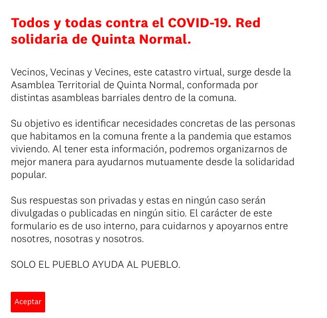
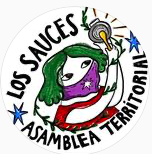
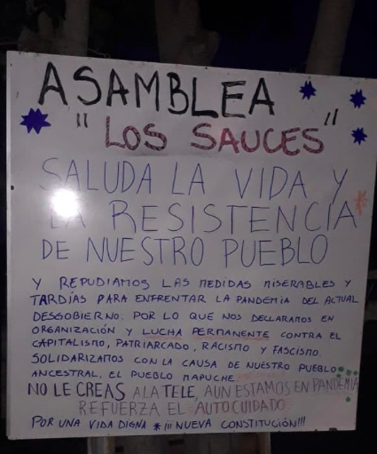

#### FOLIO: QNO1
# asamblea territorial los sauces

[instagram](https://www.instagram.com/asamblea.lossauces/)
---

### Representantes
#### 
No señala tener representantes.

---
### Interacciones frecuentes
#### 
* Asamblea quinta normal

### Redes sociales
#### ¿Para qué se utiliza la red social?
| Instagram | 
|---|
| difusión de actividades e informaciones|

### **Instagram**
| seguidores | seguidos | publicaciones | hashtag 
|---|---|---|---|
|582|103|9| 0

---

* **Actividad:**   
* Primera Publicación IG: 02/02/2020

---
### Frecuencia de publicación.
* Publicaciones: mensual
* Actividades: semestral

---
### Ubicación
* Los sauces/Samuel izquierdo

---
### Describir temas de interés y/o trabajo
* Organización territorial
* Mujeres organizadas

---
### Describir la imagen ideal por la cual se trabaja.
#### (El horizonte hacia el cual se quiere avanzar.)
* Por una vida digna desde una nueva constitución

---
### ¿Que se hace?
#### (Manifestaciones, marchas, intervenciones, actividades culturales, conversatorios, intercambio de saberes, actividades solidarias o de apoyo mutuo, abastecimiento, contra información, emplazamiento a autoridades etc.)
* Manifestaciones
    * Barricadas
    * Cacerolazos
    * Velatones
* Actividades de conmemoración
* Jornadas de confección de capuchas
* Catastro covid quinta normal
    * Red solidaria de quinta normal
* Declaración de informaciones a los vecinos
* Taller popular de arpillera
* ESpacios constituyentes: Jornadas de conversatorios

---
### Describir y distinguir demandas más reivindicativas de espacios sin relación con lo contencioso o con lo político mas prefigurativo
#### (lo contencioso; demanda al Estado, a alguna autoridad, privados, etc), (prefigurativo, transformación desde lo cotidiano, etc.).
* Hacia los vecinos, que se organicen y desconfien del gobierno, que se autocuiden y sean responsables.

---
### Tipo de organización interna.
#### 
Asambleismo y horizontalidad.

---
### Describir los temas / imágenes- iconos / conceptos mas habitualmente presentes en sus publicaciones. Describir cambios/ transformaciones en los contenidos desde Octubre.
Dentro del poco contenido que tienen, este se ha acomodado a la actualidad nacional. Todo desde una perspectiva feminista que está implicita. 

**Iconos:**

**Diseño estético:**
No tienen un diseño estético fijo. 

---
### Percepciones que se tiene del Estado
#### (Aparato burocrático)
> Desgobierno que no tiene medidas dignas para la población ante la pandemia

---
### Percepciones que se tiene de las Fuerzas de Orden
#### (Aparato represivo)
> No señalan posición

| Declaraciones | infografía | 
|---|---|
|Anotar los comunicados | [Link]() |

---
### Incorporar aca notas, citas textuales, links, etc. extra a los ya incorporados, que sean de interés para comprender tanto la forma como los contenidos asociados a la organización.
* Catastro virtual de las asambleas de QN [LINK](https://es.surveymonkey.com/r/RedsolidariaQN)
