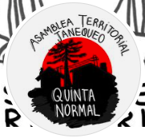
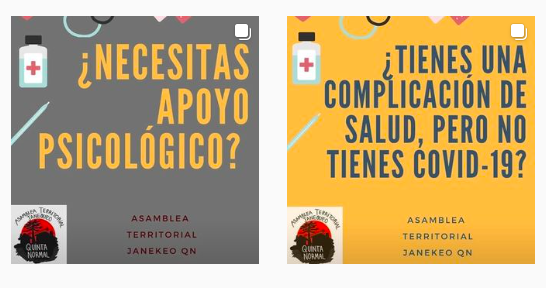
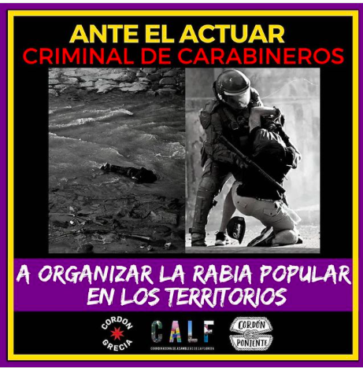

#### FOLIO: QNO2
# Asamblea Territorial Janequeo

[instagram](https://www.instagram.com/a.territorialjanequeoqn/)
[facebook](https://www.facebook.com/asambleaterritorial.quintanormal.1)
[youtube](https://www.youtube.com/channel/UCCQyDGghbeS1Byu6y2TqZHg)

---

### Representantes
#### 
No señalan tener representantes.

---
### Interacciones frecuentes
#### 
* Asamblea los sauces
* Asamblea alcerreca
* Asamblea frontis popular QN
* Asamblea popular lo besa
* Asamblea villa portales
* Asamblea Barrio Lourdes

### Redes sociales
#### ¿Para qué se utiliza la red social?
| Instagram | Facebook | Youtube | 
|---|---|---|
|Difusión de actividades e informaciones|Difusión de actividades e informaciones|Videos en vivo|

### **Instagram**
| seguidores | seguidos | publicaciones | hashtag 
|---|---|---|---|
|1520|400|204| 0

---

* **Actividad:**   
* Primera Publicación IG: 10/11/2019

---
### Frecuencia de publicación.
* Publicaciones: Semanal (3/4)
* Actividades: Semanal

---
### Ubicación
* Plaza Garín

---
### Describir temas de interés y/o trabajo
* Organizacion territorial
* Colaboracion y apoyo mutuo

---
### Describir la imagen ideal por la cual se trabaja.
#### (El horizonte hacia el cual se quiere avanzar.)
> ¡Todo el poder a los territorios!
* Construir un nuevo país desde los territorios
> Asumiendo la organización de base y popular para enfrentar la transformación que buscamos!. La lucha continúa!

---
### ¿Que se hace?
#### (Manifestaciones, marchas, intervenciones, actividades culturales, conversatorios, intercambio de saberes, actividades solidarias o de apoyo mutuo, abastecimiento, contra información, emplazamiento a autoridades etc.)
* Difusión de oficios territoriales / emprendimientos
* Jornadas de conmemoración
    * Memoria y resistencia anticarcelaria
    * Día del joven combatiente / 11 de septiembre
    * Aniversario 18O
    * Aniversario asamblea
* Asambleas abiertas presenciales y virtuales
* Participan de red de abastecimiento popular y solidario *hambre de rebeldia quinta normal*
* Jornadas feministas
* Conversatorios y dialogos sobre el rol de las asambleas territoriales
* Manifestaciones
    * Cacerolazos
    * Cicletadas
    * Jornadas de agitación
    * Barricadas
    * Concentraciones
    * Marchas territoriales
* Recuperación de memoria barrial [link](https://www.instagram.com/p/CFANw6ZJFpN/)
* Emplazamiento a autoridades locales y nacionales
* Difusión documental *janaqueo 5707* [link](https://www.instagram.com/p/CCmrpiUpAvU/)
* Talleres para aplicar en la casa
* Campañas solidarias
    * Rifa solidaria
    * Lucazos solidarios
    * Acopio solidario para personas mayores
* Conversatorios y dialogos sobre educacion, feminismo, derechos humanos, etc.
* Difusión de convocatorias de participacion asambleista
* Acciones por libertad a lxs presxs politicos
* Difusión de contrainformación
* Catastro COVID red solidaria
* Jornadas culturales familiares [LINK](https://www.instagram.com/p/B6ntjTWp6UU/)
* Jornadas de debates populares

---
### Describir y distinguir demandas más reivindicativas de espacios sin relación con lo contencioso o con lo político mas prefigurativo
#### (lo contencioso; demanda al Estado, a alguna autoridad, privados, etc), (prefigurativo, transformación desde lo cotidiano, etc.).
* Hacia los vecinos, organizarse para un mejor vivir
> Todo el poder a las asambleas *la lucha sigue!!*
* Hacia las autoridades, las emplazan a hacerse responsables de la crisis, pensando en la gente

---
### Tipo de organización interna.
#### 
Asambleismo y horizontalidad. Deben trabajar en comisiones.

---
### Describir los temas / imágenes- iconos / conceptos mas habitualmente presentes en sus publicaciones. Describir cambios/ transformaciones en los contenidos desde Octubre.
Contenido varia segun el contexto nacional. Desde el comienzo de la pandemia se enfocaron en realizar acciones de apoyo mutuo y colaboración vecinal a quienes han estado más afectados por la crisis. 

**Iconos:**

**Diseño estético:**
No tiene un diseño estético fijo, sin embargo, utilizan una plataforma llamada canva para hacerlas.

---
### Percepciones que se tiene del Estado
#### (Aparato burocrático)
> Gobierno criminal y asesino.

| Declaraciones | infografía | 
|---|---|
|Anotar los comunicados | [Link]() |

---
### Percepciones que se tiene de las Fuerzas de Orden
#### (Aparato represivo)
> Criminales. Fuera Rozas. Represión excesiva por parte de los carabineros.

| Declaraciones | infografía | 
|---|---|
|12/11/2019 | [Link](https://www.instagram.com/p/B4xankVH1mS/) |
|Represión |  |

---
### Incorporar aca notas, citas textuales, links, etc. extra a los ya incorporados, que sean de interés para comprender tanto la forma como los contenidos asociados a la organización.
* Declaraciones por casos de abusos sexuales hacia mujeres en QN [Link](https://www.instagram.com/p/B9eWDhqpbOp/) [Link](https://www.instagram.com/p/CFfgdpVJxAh/)
