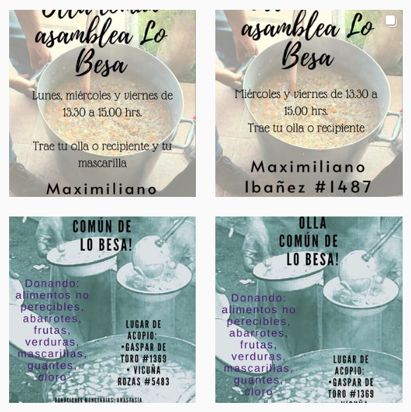
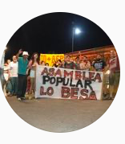

#### FOLIO: QNO3
# Asamblea Popular Lo Besa

[instagram](https://www.instagram.com/asambleapopularlobesa/)
[facebook](https://www.facebook.com/asamblea.lobesa/)

---

### Representantes
#### 
No señala tener representantes

---
### Interacciones frecuentes
#### 
* Asamblea terriorial pudahuel sur
* Asambleas autoconvocadas de quinta normal
* Cordón poniente

### Redes sociales
#### ¿Para qué se utiliza la red social?
| Instagram | Facebook |
|---|---|
|Difusión de información y actividades|Difusión de información y actividades|

### **Instagram**
| seguidores | seguidos | publicaciones | hashtag 
|---|---|---|---|
|1209|738|133| 0

---

* **Actividad:**   
* Primera Publicación IG: 28/11/2019

---
### Frecuencia de publicación.
* Publicaciones: Semanal (2/3)
* Actividades: Semanal

---
### Ubicación
* Plaza Besa / gaspar de toro con tránsito

---
### Describir temas de interés y/o trabajo
* Colaboración y organizacion territorial
* Apoyo mutuo entre vecinos

---
### Describir la imagen ideal por la cual se trabaja.
#### (El horizonte hacia el cual se quiere avanzar.)
* Colaboración y apoyo mutuo por y para los vecinos

---
### ¿Que se hace?
#### (Manifestaciones, marchas, intervenciones, actividades culturales, conversatorios, intercambio de saberes, actividades solidarias o de apoyo mutuo, abastecimiento, contra información, emplazamiento a autoridades etc.)
* Campañas solidarias
    * Bingo a beneficio
    * Completadas solidarias
    * Campaña de recoleccion de alimentos y utiles de aseo
    * Recoleccion de materiales para la construcción
    * 
* Manifestaciones
    * Cacerolazos
    * Intervenciones publicas
    * Jornadas de protestas
    * Cicletadas
* Actividades conmemorativas
* Asambleas abiertas 
* Actividades culturales y familiares
    * Jornada de slaud comunitaria
    * Jornadas culturales para NNA
* Talleres de deporte en verano
    * Jornadas de verano en la plaza
* Olla común
    * Entrega y preparacion de alimentos
    * Donaciones para la olla

* Onces comunitarias [link](https://www.instagram.com/p/CBd00eKpt9U/)
* Jornadas de reflexion comunitarias virtuales
* Participacion en red de abastecimiento territorial quinta normal *hambre ne rebeldía*
* Huerto comunitario

---
### Describir y distinguir demandas más reivindicativas de espacios sin relación con lo contencioso o con lo político mas prefigurativo
#### (lo contencioso; demanda al Estado, a alguna autoridad, privados, etc), (prefigurativo, transformación desde lo cotidiano, etc.).
* Hacia los vecinos para que se organicen y participen de la asamblea
* Emplazan las autoridades comunales para que se hagan cargo de la población que está viviendo la crisis

---
### Tipo de organización interna.
#### 
Asambleismo y horizontalidad.

---
### Describir los temas / imágenes- iconos / conceptos mas habitualmente presentes en sus publicaciones. Describir cambios/ transformaciones en los contenidos desde Octubre.
El contenido ha variado segun el contexto social que está viviendo Chile. Focalizan su trabajo en ollas comunes y alimentacion.

**Iconos:**
No tienen icono ni logo, su icono es una fotografía de los participantes de la asamblea.

**Diseño estético:**
No tienen diseño estético fijo. Suben fotografias, imagenes propias y de otras organizaciones con las que trabajan.

---
### Percepciones que se tiene del Estado
#### (Aparato burocrático)
> Miles de presxs, personas muertas, heridas, mutiladas, violadas y desaparecidas.
No nos pidan tranquilidad cuando lo que tenemos es rabia. Va a caer todo el sistema capitalista y las instituciones que lo sustentan.
Aguante lxs compañerxs!

| Declaraciones | infografía | 
|---|---|
|PP 10/12/2019 | [Link](https://www.instagram.com/p/B56oAzkJOBp/) |

---
### Percepciones que se tiene de las Fuerzas de Orden
#### (Aparato represivo)
> Excesiva represion hacia el pueblo. 

| Declaraciones | infografía | 
|---|---|
|Anotar los comunicados | [Link]() |

---
### Incorporar aca notas, citas textuales, links, etc. extra a los ya incorporados, que sean de interés para comprender tanto la forma como los contenidos asociados a la organización.
