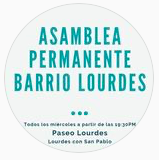
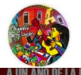
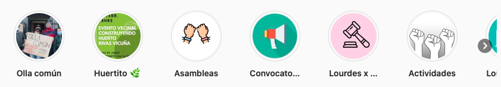
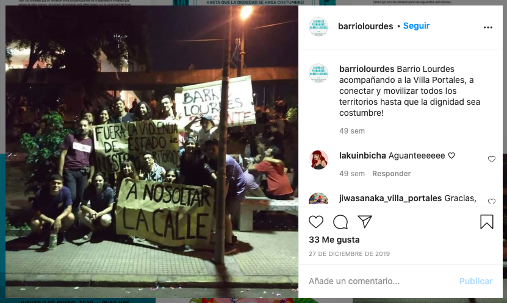

#### FOLIO: QNO4
# Asamblea Barrio Lourdes

[instagram](https://www.instagram.com/barriolourdes/)
[facebook](https://www.facebook.com/asambleabarrio.lourdes.7)

---

### Representantes
#### 
No señalan tener representantes.

---
### Interacciones frecuentes
#### 
* comision de genero barrio lourdes
* asamblea territorial quinta normal
* Cordón poniente

### Redes sociales
#### ¿Para qué se utiliza la red social?
| Instagram | Facebook | 
|---|---|
|Difusión de actividades e información|Difusión de actividades e información. Es un perfil privado|

### **Instagram**
| seguidores | seguidos | publicaciones | hashtag 
|---|---|---|---|
|630|359|62| 0

---

* **Actividad:**   
* Primera Publicación IG: 23/11/2019

---
### Frecuencia de publicación.
* Publicaciones: semanal (1/2)
* Actividades: semanal

---
### Ubicación
* Babosa esq. Edison

---
### Describir temas de interés y/o trabajo
* Organizacion territorial
* Colaboracion y apoyo mutuo entre vecinos

---
### Describir la imagen ideal por la cual se trabaja.
#### (El horizonte hacia el cual se quiere avanzar.)
> Busca las transformaciones sociales mediante la autoformacion, articulacion y reflexion constante con el fin de consolidar el poder territorial+
[Link](https://www.instagram.com/p/B8rubcJpC6s/)

---
### ¿Que se hace?
#### (Manifestaciones, marchas, intervenciones, actividades culturales, conversatorios, intercambio de saberes, actividades solidarias o de apoyo mutuo, abastecimiento, contra información, emplazamiento a autoridades etc.)
* Manifestaciones
    * marchas
    * intervenciones publicas: las tesis
    * cacerolazos
    * cicletadas
    * jornadas de protesta [link](https://www.instagram.com/p/CH8ycfIpapA/)
* Declaración de principios de la asamblea
* Asambleas abiertas territoriales y virtuales
* Actividades conmemorativas
    * aniversario asamblea
    * aniversario 18o
    * 11 de sept
* Difusión de contrainformacion del gobierno
* Campañas solidarias
    * Cajas femiliares
    * Campañas de juguetes 
    * Donaciones de ayuda permanente *solo el pueblo ayuda al pueblo*
    * Rifa solidaria
    * Completadas solidarias
* Olla común
    * Entrega y preparacion de alimentos
    * Donacion de alimentos para la olla
* Catastro para red solidaria de quinta normal
* Muralismo
* Huerto comunitario
* Eventos vecinales
    * Fiestas alieligenas de la asamblea
* Talleres de verano constituyente
* Navidad constituyente
* Jornadas de adopcion y salud digna

---
### Describir y distinguir demandas más reivindicativas de espacios sin relación con lo contencioso o con lo político mas prefigurativo
#### (lo contencioso; demanda al Estado, a alguna autoridad, privados, etc), (prefigurativo, transformación desde lo cotidiano, etc.).
* Hacia los vecinos para que se sumen a participar de la asamblea
* Hacia las autoridades, las emplazan a hacerse responsable de la crisis.

---
### Tipo de organización interna.
#### 
Asambleismo y horizontalidad. Deben trabajar en comisiones.

---
### Describir los temas / imágenes- iconos / conceptos mas habitualmente presentes en sus publicaciones. Describir cambios/ transformaciones en los contenidos desde Octubre.
Su contenido se vincula con el contexto nacional. Su actividades y acciones se comenzaron a focalizar en el apoyo mutuo para el barrio.

**Iconos:**
La primera imagen es un foto de instagram y la segunda es el logo que ponen en sus fotografias.

**Diseño estético:**
No tienen un diseño estético fijo. Sin embargo, ordenan sus historias destacadas segun las actividades y acciones que han realizado.

---
### Percepciones que se tiene del Estado
#### (Aparato burocrático)
> Tienen al pueblo con hambre. 
*Nos manifestamos en contra de este gobierno que nos quiere ver empobrecidos y reprimidos!*
¡ABAJO EL GOBIERNO CRIMINAL DE PIÑERA!
¡QUE LXS ASESINXS DE NUESTRO PUEBLO PAGUEN!

| Declaraciones | infografía | 
|---|---|
|Negligencia del gobierno | [Link](https://www.instagram.com/p/CFkJn93pvV3/) |

---
### Percepciones que se tiene de las Fuerzas de Orden
#### (Aparato represivo)
> Los territorios somos enfáticos ¡Fuera Rozas!¡Fuera Piñera! y que se siga levantando resistencia y organización, ellxs tienen las armas pero nosotrxs tenemos la razón ¡Y no vamos a parar!

| Declaraciones | infografía | 
|---|---|
|"Accidentes" de carabineros | [Link](https://www.instagram.com/p/CF5LGl7JYgv/) |
|Violencia policial | [Link](https://www.instagram.com/p/B9ZOrrLJa8N/) |

---
### Incorporar aca notas, citas textuales, links, etc. extra a los ya incorporados, que sean de interés para comprender tanto la forma como los contenidos asociados a la organización.
* Transparentan las actas de las asambleas, dando a conocer acuerdos y ejes de trabajo. [link](https://www.instagram.com/p/B658PSEjuo-/)

* Vinculos territoriales con organizaciones de otras comunas

