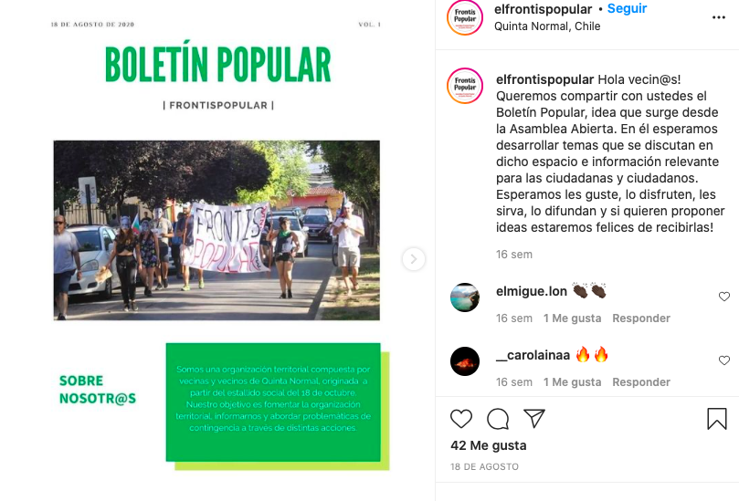
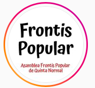
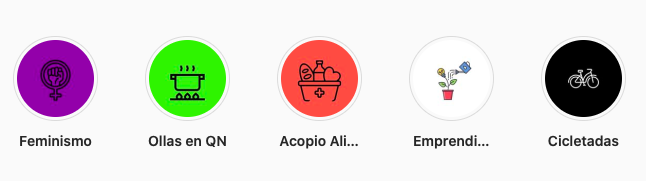
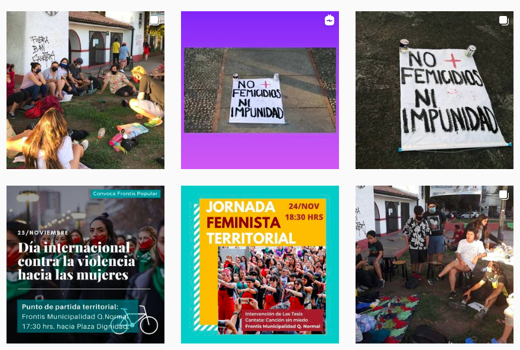

#### FOLIO: QNO5
# Asamblea Territorial Frontis Popular Quinta Normal

[instagram](https://www.instagram.com/elfrontispopular/)
[facebook](https://www.facebook.com/asambleafrontispopular)
---

### Representantes
#### 
No señalan tener representantes.

---
### Interacciones frecuentes
#### 
* asamblea popular lo besa
* asamblea barrio lourdes
* ollas comunes de quinta normal

### Redes sociales
#### ¿Para qué se utiliza la red social?
| Instagram | Facebook | 
|---|---|
|Difusión de actividades e información|Difusión de actividades e información. Es un perfil privado

### **Instagram**
| seguidores | seguidos | publicaciones | hashtag 
|---|---|---|---|
|1220|1129|117| 0

---

* **Actividad:**   
* Primera Publicación IG: 29/11/2019

---
### Frecuencia de publicación.
* Publicaciones: semanal (2/3)
* Actividades: semanal

---
### Ubicación
* Carrascal / radal

---
### Describir temas de interés y/o trabajo
* Organizacion territorial
* Colaboracion y apoyo mutuo

---
### Describir la imagen ideal por la cual se trabaja.
#### (El horizonte hacia el cual se quiere avanzar.)
>  Con el fin de informarnos y generar acciones colectivas con carácter político y social.

---
### ¿Que se hace?
#### (Manifestaciones, marchas, intervenciones, actividades culturales, conversatorios, intercambio de saberes, actividades solidarias o de apoyo mutuo, abastecimiento, contra información, emplazamiento a autoridades etc.)
* Biblioteca popular digital [link](https://www.instagram.com/p/CDKQOKqJ9Hx/)
* Asambleas abiertas presencials y virtuales
* Manifestaciones
    * Cacerolazos
    * Cicletadas
    * Marchas
    * concentraciones en el frontis de la municipalidad de QN
    * Intervenciones publicas [Link](https://www.instagram.com/p/CICekGyJh7A/)
* Campañas solidarias
    * Colecta de fin de año
    * campaña recoleccion toallas higienicas y pañales
    * Cajas de alimentos para los vecinos
* Campaña por el apruebo y la convencion constitucional
* Dialogos y conversatorios constituyentes
* Actividades conmemorativas
* Jornadas de agitación feministas
* Actividades culturales familiares
    * noche de peliculas
    * talleres de tejido
* Circulos de hombres [link](https://www.instagram.com/p/B9RsZhPjV72/)
* Difusión de emprendimientos
* Catastro quinta normal *todxs contra el covid19*
* Jornadas de agitacion y propaganda 
* Difusión de ollas comunes de QN
* Boletín popular

---
### Describir y distinguir demandas más reivindicativas de espacios sin relación con lo contencioso o con lo político mas prefigurativo
#### (lo contencioso; demanda al Estado, a alguna autoridad, privados, etc), (prefigurativo, transformación desde lo cotidiano, etc.).
* Hacia los vecinos y vecinas, que participen y creen redes comunitarias de colaboracion y apoyo mutuo
* Hacia las autoridades policiales, sobreslaiendo la violencia policial en la protesta social

---
### Tipo de organización interna.
#### 
Asambleismo y horizontalidad. deben trabajar en comisiones.

---
### Describir los temas / imágenes- iconos / conceptos mas habitualmente presentes en sus publicaciones. Describir cambios/ transformaciones en los contenidos desde Octubre.
Su contenido se ajusta al contexto social vivido por el país. Realizan una diversidad de acciones, ultimamente se focalizan en realizar acciones de apoyo y colaboracion para los vecinos que están complicados por la crisis.

**Iconos:**

**Diseño estético:**
No tienen diseño estético fijo. Sin embargo, ordenan sus acciones en historias destacadas.

---
### Percepciones que se tiene del Estado
#### (Aparato burocrático)
> Gobierno criminal que no protege a los trabajadores. Crea acciones para reprimir al pueblo que se manifiesta.

| Declaraciones | infografía | 
|---|---|
|Anotar los comunicados | [Link]() |

---
### Percepciones que se tiene de las Fuerzas de Orden
#### (Aparato represivo)
>  Rechazan la violencia excesiva de la institucion de carabineros.

| Declaraciones | infografía | 
|---|---|
|Violencia familia 19/11/2020 | [Link](https://www.instagram.com/p/CHyBWy1p6Kf/) |

---
### Incorporar aca notas, citas textuales, links, etc. extra a los ya incorporados, que sean de interés para comprender tanto la forma como los contenidos asociados a la organización.
* Acciones feministas

