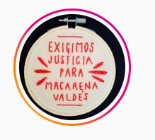
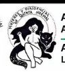

#### FOLIO: QNO6
# Mujeres y disidencias Quinta Normal

[instagram](https://www.instagram.com/asambleamujeresydisidencias.qn/)

---

### Representantes
#### 
No señala tener representantes.

---
### Interacciones frecuentes
#### 
* Asamblea frontis popular
* asamblea territorial janaqueo quinta normal
* asamblea los sauces
* asamblea popular lo besa

### Redes sociales
#### ¿Para qué se utiliza la red social?
| Instagram |
|---|
|Difusión de actividades e información|

### **Instagram**
| seguidores | seguidos | publicaciones | hashtag 
|---|---|---|---|
|1375|277|127| 0

---

* **Actividad:**   
* Primera Publicación IG: 25/10/2019

---
### Frecuencia de publicación.
* Publicaciones: semanal (1/2)
* Actividades: semanal

---
### Ubicación
* Quinta normal en general

---
### Describir temas de interés y/o trabajo
* Feminismo
* Organización, colaboracion y apoyo mutuo entre mujeres y disidencias
> Vecinas y vecines de quinta normal, organizades en contra de toda opresión 🔥✊🏾

---
### Describir la imagen ideal por la cual se trabaja.
#### (El horizonte hacia el cual se quiere avanzar.)
* Una sociedad feminista que respete a las mujeres y disidencias, donde puedan vivir libres y sin miedo

---
### ¿Que se hace?
#### (Manifestaciones, marchas, intervenciones, actividades culturales, conversatorios, intercambio de saberes, actividades solidarias o de apoyo mutuo, abastecimiento, contra información, emplazamiento a autoridades etc.)
* Jornadas de mujeres y disidencias
* Encuentros territoriales de QN
* Talleres feministas
    * Apostasía colectiva
    * Talleres de astronomia
* Manifestaciones
    * Cacerolazos
    * Intervencion publica: las tesis
    * Ciclietadas
    * Marchas territoriales
* Huelga y marchas feministas 8M 9M
* Jornadas de agitacion y propaganda feministas
* Asamblea feminista abierta de quinta normal
* Participan del catastro de red solidaria quinta normal
* Acciones politicas por los presos [link](https://www.instagram.com/p/B-0h6CyJyo2/)
* Campañas solidarias
    * Lucazo solidario
    * Acopio menstrual
    * Alimentos para amigues de cuatro patitas
* Talleres de autodefensa feminista
* PArticicipan de la red de abastecimiento quinta normal *hambre de rebeldia*
* Actividades conmemorativas a las victimas de violencia
    * Jornadas de memoria y resistencia anticarcelaria [link](https://www.instagram.com/p/CIV2CHvJ-jc/)

---
### Describir y distinguir demandas más reivindicativas de espacios sin relación con lo contencioso o con lo político mas prefigurativo
#### (lo contencioso; demanda al Estado, a alguna autoridad, privados, etc), (prefigurativo, transformación desde lo cotidiano, etc.).
* Hacia las mujeres y disidencias, que participen y se sientan parte de una red de personas que colaboran y son red
* Hacia las autoridades para que realicen acciones contra la violencia que ejercen contra mujeres y disidencias

---
### Tipo de organización interna.
#### 
Asambleismo y horizontalidad. 

---
### Describir los temas / imágenes- iconos / conceptos mas habitualmente presentes en sus publicaciones. Describir cambios/ transformaciones en los contenidos desde Octubre.
Su contenido se focaliza en feminismo. Por la contingencia se comienzan a organizar acciones para apoyar a mujeres y disidencias en la crisis y prevenir la violencia de género.

**Iconos:**
El primero es el icono de la pagina, la segunda es su logo.

**Diseño estético:**
No hay un diseño estético fijo. Su contenido varia entre imagenes creadas, informaciones de otras organizaciones y fotografias/videos.

---
### Percepciones que se tiene del Estado
#### (Aparato burocrático)
> No tenemos ministra. Acciones contra macarena santelices. Gobierno criminal que reprime al pueblo. #RenunciaPiñera

| Declaraciones | infografía | 
|---|---|
|EXIGEN SALIDA MINISTRA SERNAMEG | [Link](https://www.instagram.com/p/B_4zs0nJsD1/) |

---
### Percepciones que se tiene de las Fuerzas de Orden
#### (Aparato represivo)
> No señalan explicitamente su percepcion del aparato represivo. Sin embargo, podemos señalar que no resguardan al pueblo, lo reprimen y asesinan.

| Declaraciones | infografía | 
|---|---|
|Anotar los comunicados | [Link]() |

---
### Incorporar aca notas, citas textuales, links, etc. extra a los ya incorporados, que sean de interés para comprender tanto la forma como los contenidos asociados a la organización.
* Manifestaciones por asesinatos de Catrillanca y Macarena Valdés [link](https://www.instagram.com/p/CENl8ezpoBK/)