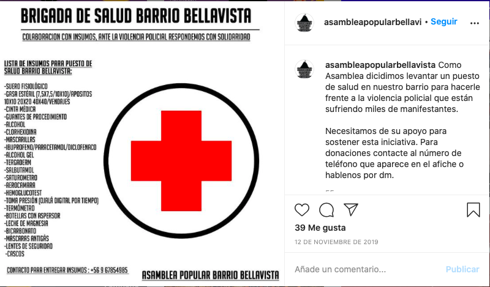

#### FOLIO: REC1
# asamblea popular bellavista

[instagram](https://www.instagram.com/asambleapopularbellavista/)

---

### Representantes
#### 
No señalan tener representantes

---
### Interacciones frecuentes
#### 
* coordinadora de asambleas territoriales
* feliz dignidad / brigada de salud barrio bellavista

### Redes sociales
#### ¿Para qué se utiliza la red social?
| Instagram | Facebook | 
|---|---|
|Difusión de actividades e informaciones |Señalan tener facebook en sus publicaciones en instagram pero no logro encontrarlo|

### **Instagram**
| seguidores | seguidos | publicaciones | hashtag 
|---|---|---|---|
|740|101|45| 0

---

* **Actividad:**   

* Primera Publicación IG: 03/11/2019. INACTIVA desde 10/03/2020.

---
### Frecuencia de publicación.
* Publicaciones: semanales (1/2)
* Actividades: semanal

---
### Ubicación
* Plaza Camilo Mori

---
### Describir temas de interés y/o trabajo
* Organizacion territorial
> Sigamos organizadxs

---
### Describir la imagen ideal por la cual se trabaja.
#### (El horizonte hacia el cual se quiere avanzar.)
> *Porque aun no hemos ganado nada... ¡Hasta que valga la pena vivir*
* Organizarse para construir un país mejor

---
### ¿Que se hace?
#### (Manifestaciones, marchas, intervenciones, actividades culturales, conversatorios, intercambio de saberes, actividades solidarias o de apoyo mutuo, abastecimiento, contra información, emplazamiento a autoridades etc.)
* Feria de los 30 pesos (5 versiones)
    * Olla común
    * Feria de las pulgas
    * Talleres 
    * Espacio para niñes
    * Conversatorios
    * Teatro callejero
* Asambleas abiertas
* Manifestaciones
    * Velatones
    * Cacerolazos
    * Intervenciones publicas
* Actividades conmemorativas
* Brigadas de salud barrio bellavista

* Campaña solidaria a un vecino afectado por la represión de la policia [link](https://www.instagram.com/p/B5dCNAOF2J2/)
* Campañas solidarias por vecinos afectados por incendios
* Difusión actividades CAT
* Jornadas de agitacion y propaganda feminista por el 8M

---
### Describir y distinguir demandas más reivindicativas de espacios sin relación con lo contencioso o con lo político mas prefigurativo
#### (lo contencioso; demanda al Estado, a alguna autoridad, privados, etc), (prefigurativo, transformación desde lo cotidiano, etc.).
* Hacia los vecinos para que se organicen y participen
* Hacia las autoridades, emplazandolas por la excesiva violencia de la policia

---
### Tipo de organización interna.
#### 
Asambleismo y horizontalidad. Podrian haber trabajado en comisiones.

---
### Describir los temas / imágenes- iconos / conceptos mas habitualmente presentes en sus publicaciones. Describir cambios/ transformaciones en los contenidos desde Octubre.
Su contenido apunta a la organizacion, al asambleismo y a la colaboración entre vecinos hacia quienes se manifiestan. Paran sus publicaciones en marzo cuando comienza la crisis sociosanitaria. Es un espacio que se compone por vecinos de recoleta y providencia.

**Iconos:**

Logo:

**Diseño estético:**
No tienen un diseño estético fijo. Su contenido varia entre infografias, difusión de actividades e imagenes como fotografias y videos.

---
### Percepciones que se tiene del Estado
#### (Aparato burocrático)
> Violación sistematica de los ddhh.

| Declaraciones | infografía | 
|---|---|
|Anotar los comunicados | [Link]() |

---
### Percepciones que se tiene de las Fuerzas de Orden
#### (Aparato represivo)
> Uso indiscriminado de gases lacrimogenos, violencia excesiva y represión a los manifestantes. Violadores de dddhh.

| Declaraciones | infografía | 
|---|---|
|Violencia policial en el barrio | [Link](https://www.instagram.com/p/B5F_DtqFtv8/) |

---
### Incorporar aca notas, citas textuales, links, etc. extra a los ya incorporados, que sean de interés para comprender tanto la forma como los contenidos asociados a la organización.
* Funan a alcaldesa de providencia por complice ante la violacion sistematica de los ddhh [link](https://www.instagram.com/p/B7CbQwCpN--/)