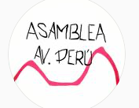
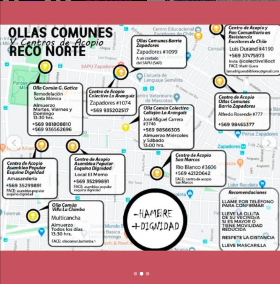

#### FOLIO: REC2
# Asamblea Av Perú

[instagram](https://www.instagram.com/asamblea.avperu/)

---

### Representantes
#### 
No señalan tener representantes

---
### Interacciones frecuentes
#### 
* Frente de salud recoleta por el apruebo

### Redes sociales
#### ¿Para qué se utiliza la red social?
| Instagram | 
|---|
|difusión de actividades e informaciones|

### **Instagram**
| seguidores | seguidos | publicaciones | hashtag 
|---|---|---|---|
|105|78|40| 0

---

* **Actividad:**   
* Primera Publicación IG: 23/01/2020. Está *inactiva* desde el 04/11/2020

---
### Frecuencia de publicación.
* Publicaciones: Mensuales (2/3)
* Actividades: Mensuales

---
### Ubicación
* zapadores con recoleta

---
### Describir temas de interés y/o trabajo
* Proceso constituyente
* Organizacion territorial

---
### Describir la imagen ideal por la cual se trabaja.
#### (El horizonte hacia el cual se quiere avanzar.)
* Nueva constitución
* Organizacion vecinal para el mejor vivir

---
### ¿Que se hace?
#### (Manifestaciones, marchas, intervenciones, actividades culturales, conversatorios, intercambio de saberes, actividades solidarias o de apoyo mutuo, abastecimiento, contra información, emplazamiento a autoridades etc.)
* Difusión informacion sobre ollas comunes
* Propaganda pro apruebo y convencion constitucional    
    * Tren del apruebo
    * Conversatorios del proceso constituyente
    * Caravanas constituyentes
    * Banderazos por el apruebo
* Peña de la dignidad
* Difusión 8M 
* Difusión protestas y caceroleos en el sector
* Olla común avenida perú
    * Centro de acopio
    * Preparacion, retiro y entrega de almuerzos
* Conversatorios abiertos sobre resistencia de los territorios en la RM
* Manifestaciones
    * Cacerolazos
    * Velatones
* Actividades conmemorativas
* Difusión actividades municipales sobre covid19

---
### Describir y distinguir demandas más reivindicativas de espacios sin relación con lo contencioso o con lo político mas prefigurativo
#### (lo contencioso; demanda al Estado, a alguna autoridad, privados, etc), (prefigurativo, transformación desde lo cotidiano, etc.).
* Hacia los vecinos para que se organicen y participen

---
### Tipo de organización interna.
#### 
Asambleismo.

---
### Describir los temas / imágenes- iconos / conceptos mas habitualmente presentes en sus publicaciones. Describir cambios/ transformaciones en los contenidos desde Octubre.
Su contenido se focaliza en el proceso constituyente, en el apruebo y conversar sobre cómo poder aportar a construir un proceso más amplio que les involucre a todas y todos. También comenzaron a aportar a ollas comunes y hacer acopios solidarios para los vecinos. 

**Iconos:**

**Diseño estético:**
No tienen un diseño estetico fijo. su contenido se compone por infografias propias y de otras organizaciones, fotografias y videos.

---
### Percepciones que se tiene del Estado
#### (Aparato burocrático)
> Estado terrorista, cómplice de violaciones de ddhh y criminal.

| Declaraciones | infografía | 
|---|---|
|Solidaridas PPM | [Link](https://www.instagram.com/p/CDhoodanzoV/) |

---
### Percepciones que se tiene de las Fuerzas de Orden
#### (Aparato represivo)
> Policia represiva y brazo armado del gobierno.

| Declaraciones | infografía | 
|---|---|
|Anotar los comunicados | [Link]() |

---
### Incorporar aca notas, citas textuales, links, etc. extra a los ya incorporados, que sean de interés para comprender tanto la forma como los contenidos asociados a la organización.
* Georeferencia de las ollas comunes  centros de acopio del sector norte de recoleta y el salto
[link](https://www.instagram.com/p/CBUGR5Un0z5/)

