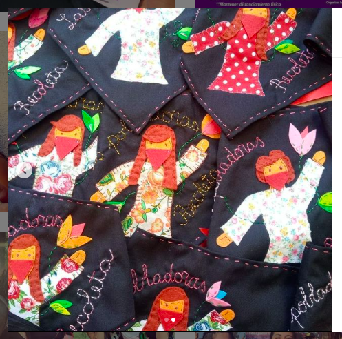
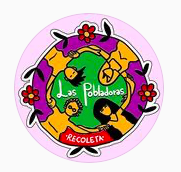
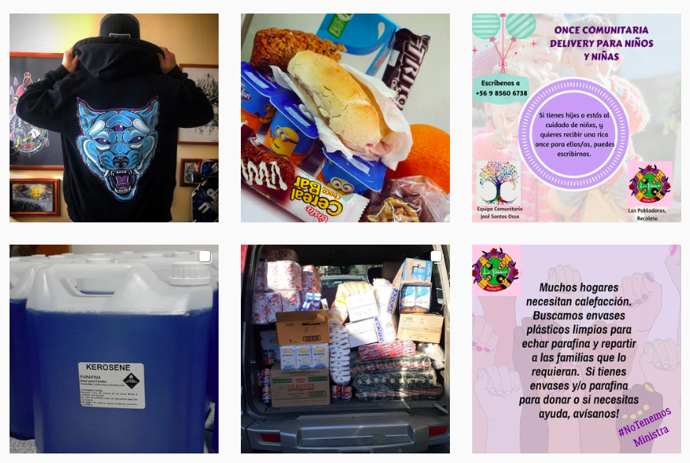

#### FOLIO: REC3
# Las Pobladoras Recoleta

[instagram](https://www.instagram.com/laspobladorasrecoleta/)
[facebook](https://www.facebook.com/Las-Pobladoras-110114867086314)
---

### Representantes
#### 
No señalan tener representantes.

---
### Interacciones frecuentes
#### 
* Radio bellavista

### Redes sociales
#### ¿Para qué se utiliza la red social?
| Instagram | Facebook | 
|---|---|
|Difusion de actividades e informaciones|difusión de actividades, compartir actividades de otras organizaciones e informaciones varias|

### **Instagram**
| seguidores | seguidos | publicaciones | hashtag 
|---|---|---|---|
|582|312|84| 0

---

* **Actividad:**   

* Primera Publicación IG: 06/03/2020

---
### Frecuencia de publicación.

* Publicaciones: Semanal (2/3)
* Actividades: Mensual

---
### Ubicación
* Av. peru con Santos Dumont.

---
### Describir temas de interés y/o trabajo
* Feminismo
* Organizacion y colaboracion entre mujeres

---
### Describir la imagen ideal por la cual se trabaja.
#### (El horizonte hacia el cual se quiere avanzar.)
> Porque nuestros trabajos sostienen la vida, paramos para cambiarlo todo. 

---
### ¿Que se hace?
#### (Manifestaciones, marchas, intervenciones, actividades culturales, conversatorios, intercambio de saberes, actividades solidarias o de apoyo mutuo, abastecimiento, contra información, emplazamiento a autoridades etc.)
* Manifestaciones
    * Cacerolazos
    * Marchas territoriales
* Campañas de acopio solidario
    * Cajas de alimentacion
    * Para ollas comunes
    * PAra la toma violeta parra
* Sanitizacion de barrios
* Conversatorios sobre el proceso constituyente
* Jornada de tejedoras

* Funas
* Manifestaciones contra el SENAME
* Asambleas de mujeres
* Difusion de casos de asesinatos de mujeres

---
### Describir y distinguir demandas más reivindicativas de espacios sin relación con lo contencioso o con lo político mas prefigurativo
#### (lo contencioso; demanda al Estado, a alguna autoridad, privados, etc), (prefigurativo, transformación desde lo cotidiano, etc.).
* Hacia las vecinas, para que se unan, organicen y participen de esta red
* Hacia las autoridades, emplazandolas sobre la situacion del pueblo

---
### Tipo de organización interna.
#### 
Asambleismo y horizontalidad.

---
### Describir los temas / imágenes- iconos / conceptos mas habitualmente presentes en sus publicaciones. Describir cambios/ transformaciones en los contenidos desde Octubre.
Su contenido parte como organizacion para las mujeres de recoleta, mujeres que se reconocen como pobladoras. Su contenido se ajusta a la crisis sociosanitaria y comienza campañas de colaboracion y apoyo mutuo.

**Iconos:**

**Diseño estético:**
No tienen diseño estético fijo, sin embargo, siempre utilizan colores como

---
### Percepciones que se tiene del Estado
#### (Aparato burocrático)
> Violencia policial ejercida por el gobierno de piñera, justicia y reparacion para las victimas. Medidas del gobierno ponen en riesgo a las mujeres trabajadoras. 

| Declaraciones | infografía | 
|---|---|
|exigimos cuarentena para todas | [Link](https://www.instagram.com/p/B-DLTOeJx35/) |
|Declaracion 03/10/2020 | [Link](https://www.instagram.com/p/CF5XzSfpuUw/) |

---
### Percepciones que se tiene de las Fuerzas de Orden
#### (Aparato represivo)
> Represion y vioencia ante los manifestantes. La institucion mas nefasta de Chile.

| Declaraciones | infografía | 
|---|---|
|Declaracion 03/10/2020 | [Link](https://www.instagram.com/p/CF5XzSfpuUw/) |

---
### Incorporar aca notas, citas textuales, links, etc. extra a los ya incorporados, que sean de interés para comprender tanto la forma como los contenidos asociados a la organización.
* Su contenido se vuelca directamente al apoyo a mujeres y sus NNA, donan alimentos no perecibles, colaciones, almuerzos, parafina, entre otras cosas que los hogares debemos necesitar.

