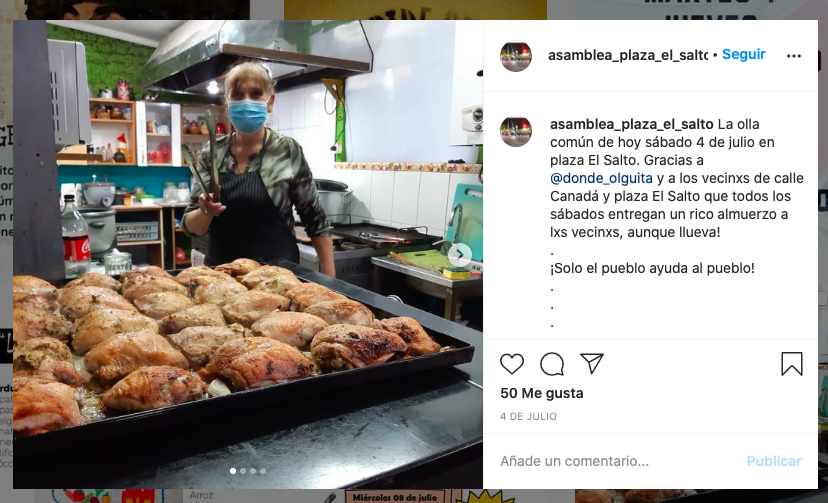
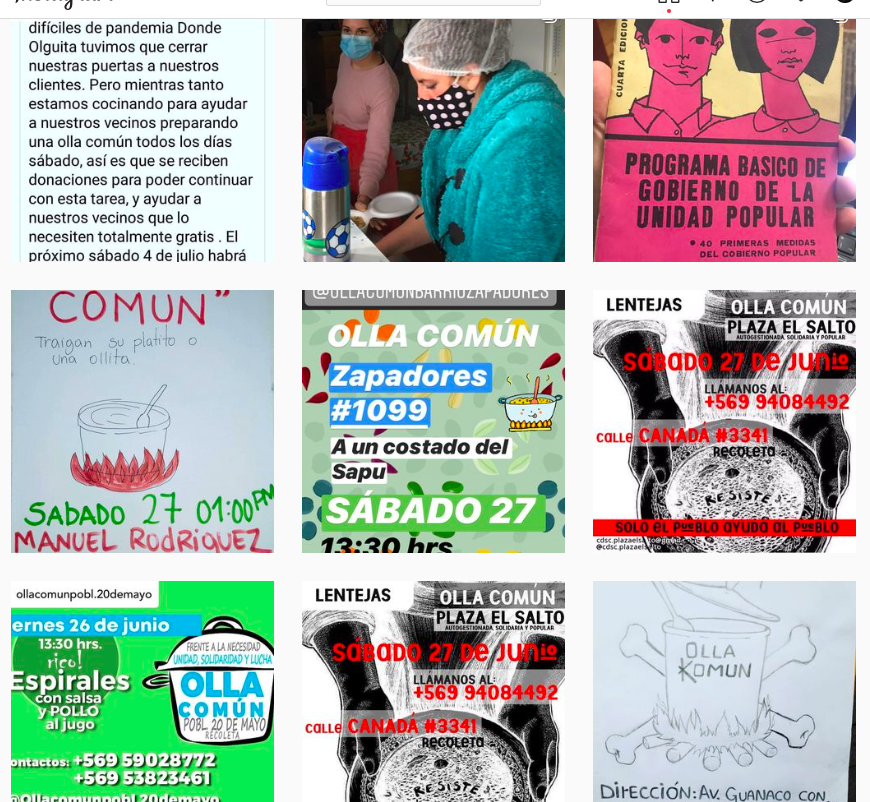
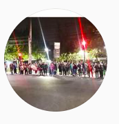

#### FOLIO: REC4
# Asamblea Plaza El Salto

[instagram](https://www.instagram.com/asamblea_plaza_el_salto/)
[facebook](https://www.facebook.com/Asamblea-Plaza-El-Salto-110322007304023/)
<cdsc.plazaelsalto@gmail.com>
---

### Representantes
#### 
No señalan tener representantes

---
### Interacciones frecuentes
#### 
* Colectivc recoelta 18 octubre
* olla comun barrio zapadores
* Circulo feminista 18O

### Redes sociales
#### ¿Para qué se utiliza la red social?
| Instagram | Facebook | 
|---|---|
|Difusion de actividades e informaciones|Difusion de informacion propia y de otras organizaciones, actividades y videos en vivo|

### **Instagram**
| seguidores | seguidos | publicaciones | hashtag 
|---|---|---|---|
|505|456|200| 0

---

* **Actividad:**   
* Primera Publicación IG: 28/05/2020

---
### Frecuencia de publicación.
* Publicaciones: mensuales (2/3)
* Actividades:mensuales

---
### Ubicación
* Plaza El Salto

---
### Describir temas de interés y/o trabajo
* Organizacion territorial
* Colaboracion barrial

---
### Describir la imagen ideal por la cual se trabaja.
#### (El horizonte hacia el cual se quiere avanzar.)
> Nunca más solos, ayudemos a nuestros vecinxs
* Colaboracion y apoyo barrial ante la crisis

---
### ¿Que se hace?
#### (Manifestaciones, marchas, intervenciones, actividades culturales, conversatorios, intercambio de saberes, actividades solidarias o de apoyo mutuo, abastecimiento, contra información, emplazamiento a autoridades etc.)
* Manifestaciones
    * Cacerolazos
    * Velatones
    * Marchas
    * Jornada de protestas
* Olla común
    * preparacion y entrega de alimentos
    * cooperacion con otras ollas comunes
    * pancito comunitario con colectivx reco18oct
    * difusión ollas comunes
* Campañas de acopio solidario
    * Incendios en el salto
    * Día del niño y niña
    * Ollas comunes
    * Para cajas solidaras
    * Insumos de higiene y proteccion ante covid19

* Difusión información relevante para los vecinos como 10% afp / cuarentenas
* Difusión infografias feminismos, disidencias, niñes, etc.
* Abastecimiento comunitario

---
### Describir y distinguir demandas más reivindicativas de espacios sin relación con lo contencioso o con lo político mas prefigurativo
#### (lo contencioso; demanda al Estado, a alguna autoridad, privados, etc), (prefigurativo, transformación desde lo cotidiano, etc.).
* Hacia los vecinos
> *En el camino desde los primeros cacerolazos hacia la organización territorial necesaria para la liberación*

---
### Tipo de organización interna.
#### 
Asambleismo.

---
### Describir los temas / imágenes- iconos / conceptos mas habitualmente presentes en sus publicaciones. Describir cambios/ transformaciones en los contenidos desde Octubre.
Su contenido se ajusta a la actualidad nacional. La organizacion nace en instagram desde el trabajo en la olla común y la difusión de sectores donde se realizan. Tienen saltos temporales grandes al compartir publicaciones. En facebook a veces son mas activos porque comparten informacion secundaria.

**Iconos:**
No tienen icono, es solo una fotografía

**Diseño estético:**
No tienen un diseño estetico fijo, utilizan infografías propias, de otras organizaciones y fotografías/videos para visibilizar su trabajo.

---
### Percepciones que se tiene del Estado
#### (Aparato burocrático)
> Pueblo se organiza ante el desgobierno. Criminal y asesinos.

| Declaraciones | infografía | 
|---|---|
|Anotar los comunicados | [Link]() |

---
### Percepciones que se tiene de las Fuerzas de Orden
#### (Aparato represivo)
> No señalan posturas

| Declaraciones | infografía | 
|---|---|
|Anotar los comunicados | [Link]() |

---
### Incorporar aca notas, citas textuales, links, etc. extra a los ya incorporados, que sean de interés para comprender tanto la forma como los contenidos asociados a la organización.
* Geolocalizacion en google de todas las ollas comunes y centros de acopio del sector El Salto, Recoleta [link](https://www.google.com/maps/d/u/0/viewer?mid=1lihoESj_xPoqPtW8f5u9wFt-BM7d4Iao&ll=-33.39140078991453%2C-70.64010579999999&z=14)