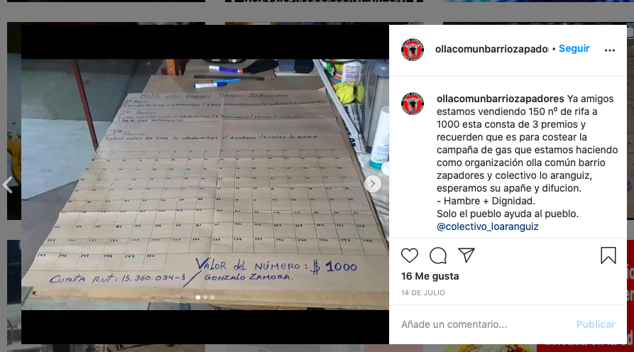
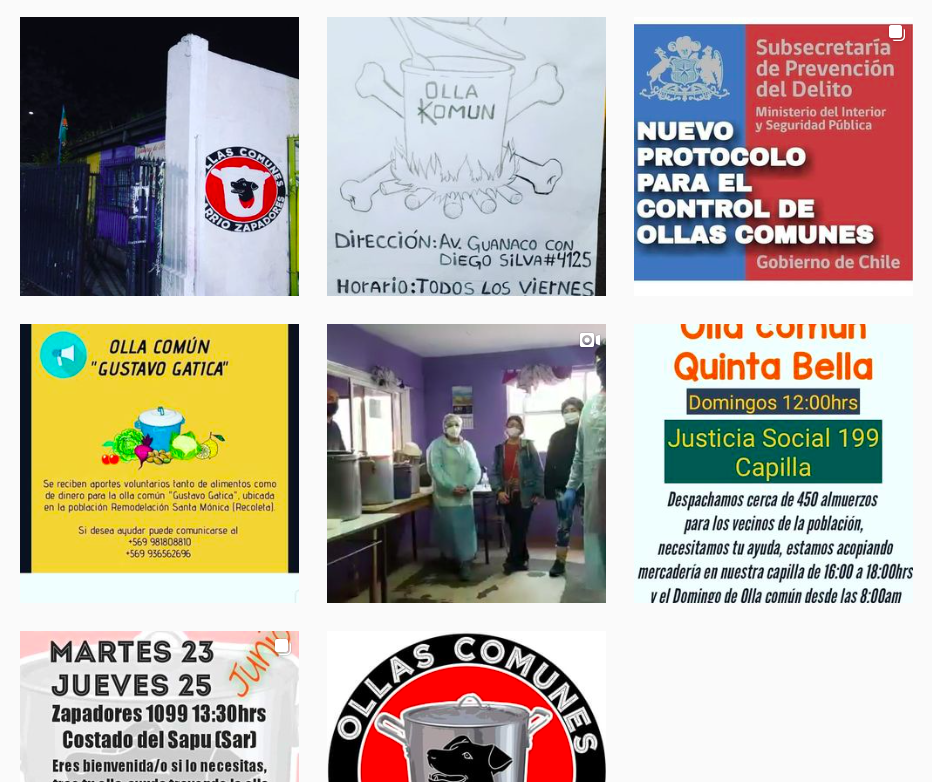
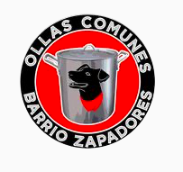
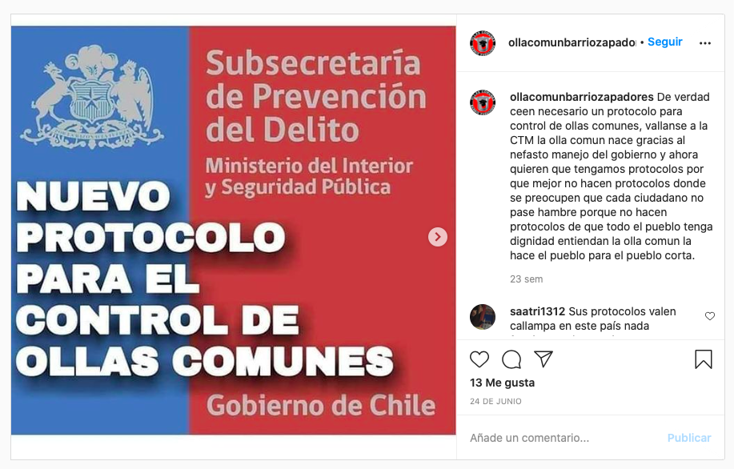

#### FOLIO: REC5
# olla comun barrio zapadores

[instagram](https://www.instagram.com/ollacomunbarriozapadores/)
[facebook](https://www.facebook.com/groups/247777033043739)

---

### Representantes
#### 
No señalan tener representantes.

---
### Interacciones frecuentes
#### 
* Colectivo lo aranguiz
* Olla comun la chimba

### Redes sociales
#### ¿Para qué se utiliza la red social?
| Instagram | Facebook | 
|---|---|
|Difusión de menús, actividades e informaciones varias|Es un grupo privado|

### **Instagram**
| seguidores | seguidos | publicaciones | hashtag 
|---|---|---|---|
|470|436|191| 0

---

* **Actividad:**   
* Primera Publicación IG: 22/06/2020

---
### Frecuencia de publicación.
* Publicaciones: Semanal (2/3)
* Actividades: Semanal

---
### Ubicación
* costado SAPU/SAR zapadores

---
### Describir temas de interés y/o trabajo
* Alimentación
* Cooperación y colaboración entre vecinos
> Solo el pueblo ayuda al pueblo

---
### Describir la imagen ideal por la cual se trabaja.
#### (El horizonte hacia el cual se quiere avanzar.)
* Hacia la dignidad del pueblo que quiere vivir en bienestar

---
### ¿Que se hace?
#### (Manifestaciones, marchas, intervenciones, actividades culturales, conversatorios, intercambio de saberes, actividades solidarias o de apoyo mutuo, abastecimiento, contra información, emplazamiento a autoridades etc.)
* Olla común   
    * preparacion de alimento
    * entrega de alimentos
    * centro de acopio
    * onces solidarias
    * almuerzos
* Difusión ollas comunes de la comuna

* Acopio solidario para otras ollas
* Rifas para sustento de la olla
* Manifestaciones
    * Cacerolazos
    * Protestas
    * Velatones
* Jornadas de acopio solidario para la toma violeta parra

---
### Describir y distinguir demandas más reivindicativas de espacios sin relación con lo contencioso o con lo político mas prefigurativo
#### (lo contencioso; demanda al Estado, a alguna autoridad, privados, etc), (prefigurativo, transformación desde lo cotidiano, etc.).
* Hacia los vecinos
> Para luchar contra el hambre y velar por la dignidad

---
### Tipo de organización interna.
#### 
Horizontalidad. Posibles vocerias, deben trabajar en comisiones.

---
### Describir los temas / imágenes- iconos / conceptos mas habitualmente presentes en sus publicaciones. Describir cambios/ transformaciones en los contenidos desde Octubre.
Su contenido se vincula directamente con las ollas comunes, tanto difusión como funcionamiento. Apoyan otras iniciativas ligadas a la dignidad de la vida como cooperacion entre vecinos y jornadas de protestas. La olla común funciona martes y jueves.

**Iconos:**

**Diseño estético:**
No tienen un diseño estético fijo, utilizan imagenes de otras organizaciones, fotografias/videos e imagenes propias para promocionar los menús.

---
### Percepciones que se tiene del Estado
#### (Aparato burocrático)

| Declaraciones | infografía | 
|---|---|
|Anotar los comunicados | [Link]() |

---
### Percepciones que se tiene de las Fuerzas de Orden
#### (Aparato represivo)
> Asesinos, reprimen al pueblo que se manifiesta.

| Declaraciones | infografía | 
|---|---|
|Anotar los comunicados | [Link]() |

---
### Incorporar aca notas, citas textuales, links, etc. extra a los ya incorporados, que sean de interés para comprender tanto la forma como los contenidos asociados a la organización.
* Se vinculan con los ciclistas, especificamente quienes se han manifestado por los presos politicos [link](https://www.instagram.com/p/CICF7wtJTE9/)