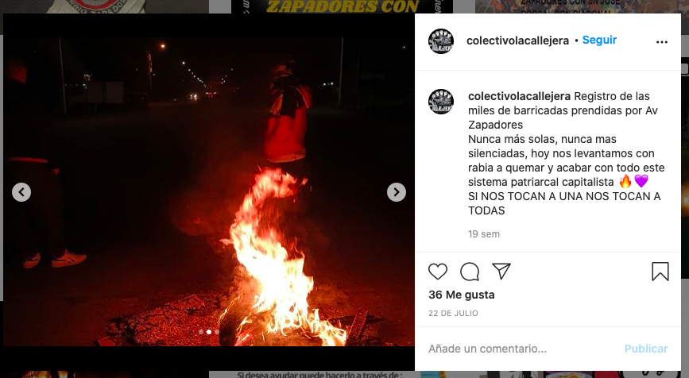

#### FOLIO: REC6
# Colectivo La Callejera

[instagram](https://www.instagram.com/colectivolacallejera/)
---

### Representantes
#### 
No señalan tener representantes.

---
### Interacciones frecuentes
#### 
* Olla común *solo el pueblo ayuda al pueblo*
* Centro de acopio San Marcos de recoleta

### Redes sociales
#### ¿Para qué se utiliza la red social?
| Instagram |
|---|
|Difusion de informaciones y actividades|

### **Instagram**
| seguidores | seguidos | publicaciones | hashtag 
|---|---|---|---|
|470|279|38| 0

---

* **Actividad:**   
* Primera Publicación IG: 19/11/2019. Inactivos desde el 26/10/2020.

---
### Frecuencia de publicación.
* Publicaciones: Semanales (1/2)
* Actividades: Semanales (1 x semana aprox)

---
### Ubicación
* RECOLETA EN GENERAL

---
### Describir temas de interés y/o trabajo
* Ogranizacion y colaboración vecinal

---
### Describir la imagen ideal por la cual se trabaja.
#### (El horizonte hacia el cual se quiere avanzar.)
> Buscamos la recuperación de los espacios y articular les pobladores a fin de una vida más digna.

---
### ¿Que se hace?
#### (Manifestaciones, marchas, intervenciones, actividades culturales, conversatorios, intercambio de saberes, actividades solidarias o de apoyo mutuo, abastecimiento, contra información, emplazamiento a autoridades etc.)
* Manifestaciones
    * Cacerolazos
    * Velatones
    * Barricadas
    * Intervenciones publicas: las tesis
    * Jornadas de protestas

* Actividades conmemorativas
* Olla común *solo el pueblo ayuda al pueblo*
    * Entrega de alimentos
    * Preparacion de alimentos
    * Acopio de alimentos no perecibles
* Iniciativas culturales: la revuelta de octubre en 100 palabras
* Jornadas de solidaridad
    * Centro de acopio an marcos
    * Cajas de alimentación
* funa a la PSU
* Jornadas de cine y actividades familiares
* cicletadas por la resistencia
* Guerras de agua para NNA

---
### Describir y distinguir demandas más reivindicativas de espacios sin relación con lo contencioso o con lo político mas prefigurativo
#### (lo contencioso; demanda al Estado, a alguna autoridad, privados, etc), (prefigurativo, transformación desde lo cotidiano, etc.).
* hacia los vecinos, para que se organicen y participen. de todes depende el futuro y bienestar del pueblo / *solo el pueblo ayuda al pueblo*

---
### Tipo de organización interna.
#### 
Asambleismo, horizontalidad. DEben trabajar en comisiones.

---
### Describir los temas / imágenes- iconos / conceptos mas habitualmente presentes en sus publicaciones. Describir cambios/ transformaciones en los contenidos desde Octubre.
Su contenido ha variado mucho porque no tienen un tema especifico. Realizan jornadas de protesta pero tambien de acopio y de olla común. Sus reflexiones apuntan a la rebeldia y al feminismo.

**Iconos:**

**Diseño estético:**
No tienen diseño estético fijo, suben imagenes propias y de otros, sumado a fotografias y videos. Tienen algun contenido ordenado en historias destacadas.

---
### Percepciones que se tiene del Estado
#### (Aparato burocrático)
> Gobierno criminal y violador de derechos humanos, no se preocupan por el pueblo, solo por los empresarios.

| Declaraciones | infografía | 
|---|---|
|Anotar los comunicados | [Link]() |

---
### Percepciones que se tiene de las Fuerzas de Orden
#### (Aparato represivo)
> Criminales que reprimen al pueblo.

| Declaraciones | infografía | 
|---|---|
|Anotar los comunicados | [Link]() |

---
### Incorporar aca notas, citas textuales, links, etc. extra a los ya incorporados, que sean de interés para comprender tanto la forma como los contenidos asociados a la organización.
* Manifiesto por el dia contra la violencia [link](https://www.instagram.com/p/B6UDdrkFv-H/)